# Modelo de Dados Conceitual — CIAARA-11 Versão 2.1

## Nota de migração (v2.1)

Este documento substitui `Versão 2.0/Fase 1 - Requisitos/05-Modelo-de-Dados-Conceitual.md`. Ele **não descarta** aquele documento: o herda por inteiro e o reinterpreta para a plataforma nova.

A diferença é de natureza, não de grau. O documento da v2.0 descrevia **14 abas de planilha com achados de saneamento** — ele precisava, antes de mais nada, inventariar o que existia e catalogar o que estava errado, porque o Google Sheets não oferece nenhuma garantia estrutural: não há chave estrangeira, não há restrição de unicidade, não há domínio de coluna, não há transação. Tudo o que hoje chamamos de "integridade" naquele modelo era, na prática, **disciplina de código** — uma função de validação que alguém lembrou de chamar antes de gravar.

A v2.1 descreve **entidades, atributos, relacionamentos e cardinalidades** de verdade, porque agora o banco suporta isso. O PostgreSQL do Supabase entrega no motor aquilo que a v2.0 conseguia apenas por convenção documentada (`docs/arquitetura/01-schema.md`, convenções C-01 a C-10). O trabalho da v2.0 não é jogado fora — ele é **promovido**: cada convenção C-* vira uma cláusula DDL, cada validação de código vira uma `CONSTRAINT`, cada domínio documentado vira `ENUM` ou FK para `config_listas`.

**Regra de ouro (BRIEF §0) preservada:** a v2.1 não reinventa o domínio. Todas as entidades abaixo são as mesmas 23 abas da planilha `Banco de dados CIAARA-11 v2.0` já migrada e em produção, com os nomes de tabela fixados no BRIEF §2.1. Nenhuma entidade nova é inventada aqui; as duas que aparecem além do mapa do BRIEF (`turma_disciplina` e `perfil_permissao`) **já existem** — a primeira na planilha ao vivo desde 2026-08-20 (spec `027-liq-automacao`), a segunda como decisão de RBAC do próprio BRIEF §3.

**[REVOGADO — v2.1]** `RNF-PLAT-02` ("o armazenamento permanece em Google Sheets") deixa de valer. Em seu lugar entra o Supabase PostgreSQL (BRIEF §1). Toda decisão de modelagem deste documento que existia *apenas* para contornar limitação de planilha é marcada **[ABSORVIDO PELA PLATAFORMA]**.

---

## 1. Propósito e método

Este documento é o **modelo conceitual** da v2.1: define *quais coisas existem no domínio*, *que atributos as identificam*, *como elas se relacionam* e *com que cardinalidade*. Ele não define tipos físicos, índices, estratégia de particionamento ou o texto das migrations — isso é a Fase 2 (Arquitetura), que deve usar este documento como entrada e produzir o DDL em `supabase/migrations/`.

O levantamento não partiu do zero. Foram lidas integralmente três fontes, nesta ordem de autoridade:

| Fonte | Papel nesta revisão |
|---|---|
| `BRIEF-v2.1.md` §2 e §2.1 | Contrato de nomes, convenções de banco e domínios. Autoridade máxima |
| `docs/arquitetura/01-schema.md` (Fase 2 da v2.0) | Dicionário de dados já auditado contra a base viva, decisões por achado (§6.8) e achados abertos (§7 e §8) |
| `Versão 2.0/Fase 1 - Requisitos/05-Modelo-de-Dados-Conceitual.md` | Modelo conceitual anterior, achados (a)–(o) e volumes |

**Método.** Para cada aba da v2.0, perguntou-se: (i) qual é a *entidade de negócio* que ela representa — não qual é o formato da aba; (ii) qual é sua chave de negócio real, independentemente do `ID_*` gerado; (iii) que restrições o Sheets não podia impor e o PostgreSQL passa a impor; (iv) que colunas eram fórmula de exibição e agora precisam virar coluna derivada ou visão. O resultado é a seção 4.

---

## 2. Do inventário de abas ao modelo relacional

A tabela abaixo resume o salto conceitual. Cada linha é uma classe de problema que a v2.0 resolvia por convenção e a v2.1 resolve por construção.

| Aspecto | Como era na v2.0 (Sheets) | Como passa a ser na v2.1 (PostgreSQL) | Marcação |
|---|---|---|---|
| Identidade da linha | `ID_*` `TEXTO` no padrão `PREFIXO-NNNNNN`, gerado pelo backend (C-04) | `id uuid` como PK técnica **+** `codigo text unique not null` guardando o `ID_*` legado | **[MIGRAÇÃO v2.1]** |
| Chave estrangeira | Texto que *aparentava* apontar para outra aba; nada impedia o valor órfão | `references … (id)` com `on delete restrict` — o motor recusa o órfão | **[ABSORVIDO PELA PLATAFORMA]** |
| Unicidade | Função de validação chamada antes de gravar (RF-DADOS-06) | `UNIQUE (curso_id, cod_disciplina)` — impossível violar, inclusive por escrita concorrente | **[ABSORVIDO PELA PLATAFORMA]** |
| Domínio de valor | Validação de dados nativa do Sheets + `Config_Listas` + confiança | `ENUM` nativo para domínio normativo fechado; FK para `config_listas` no domínio administrável | **[MIGRAÇÃO v2.1]** |
| Contrato de nome de coluna | Aba `_Meta_Colunas` lida por frontend e backend (C-02) | `information_schema` + `lib/tipos/database.ts` gerado pelo Supabase CLI | **[ABSORVIDO PELA PLATAFORMA]** |
| Coluna derivada | `FORMULA` do Sheets, recalculada pela planilha | `GENERATED ALWAYS AS … STORED` quando imutável; `VIEW` quando depende de `now()` ou de agregação | **[MIGRAÇÃO v2.1]** |
| Vigência temporal | Par `Vigente_A_Partir_De`/`Vigente_Ate` + função de resolução em código (C-08) | Mesmo par (`vigente_de`/`vigente_ate`) **+** `EXCLUDE USING gist` que proíbe sobreposição | **[MIGRAÇÃO v2.1]** |
| Atomicidade | Nenhuma. Uma fusão de avaliação com 3 escritas podia falhar no meio | Transação ACID: ou as 3 gravam, ou nenhuma grava | **[ABSORVIDO PELA PLATAFORMA]** |
| Exclusão lógica | `Status` explícito por convenção, nunca inferido de célula vazia (C-05) | `status status_registro not null default 'ativo'` — `NOT NULL` faz o "nunca vazio" ser garantia | **[PRESERVADO]** |
| Segurança do dado | Verificação no servidor por disciplina de código (`RNF-SEG-02`) | RLS: a fronteira é o banco, não a função | **[ABSORVIDO PELA PLATAFORMA]** |

---

## 3. Mapa de entidades

Nomes de tabela **exatamente** conforme BRIEF §2.1. A coluna "Natureza" classifica a entidade para efeito de convenção de auditoria (BRIEF §2: tabela transacional carrega o quarteto completo; tabela de cadastro carrega ao menos o par de edição).

| # | Entidade (v2.1) | Aba de origem (v2.0) | Natureza | Volume | Chave de negócio |
|---|---|---|---|---|---|
| 1 | `cursos` | `Cad_Cursos` | Cadastro | 24 | `codigo` (sigla do curso, ex. `C-Esp-ALH`) |
| 2 | `curso_regime_historico` | `Cad_Cursos_Regime_Historico` | Cadastro versionado | 29 | `curso_id` + `tipo_regime` + `vigente_de` |
| 3 | `horarios_tempos_aula` | `Horarios_Tempos_Aula` | Catálogo | ~40 linhas (despivotado) | `config_codigo` + `tempo_numero` |
| 4 | `turmas` | `Turmas_Ativas` | Cadastro | 29 | `curso_id` + `turma` + `ano_letivo` |
| 5 | `disciplinas` | `Cad_Disciplinas` | Cadastro | 175 | `curso_id` + `cod_disciplina` |
| 6 | `turma_disciplina` | `Turma_Disciplina` | Cadastro de execução | 210 | `turma_id` + `disciplina_id` |
| 7 | `instrutores` | `Cad_Instrutor` | Cadastro | 177 | `nip` (quando presente) |
| 8 | `instrutor_disciplina` | `Instrutor_Disciplina` | Vínculo N:N | 798 | `instrutor_id` + `disciplina_id` |
| 9 | `registros_aula` | `Registro_Aulas_E_Atividades` | **Fato** | 1.566 | — (fato datado) |
| 10 | `avaliacoes` | `Avaliacoes` | **Fato** | 111 | `turma_id` + `disciplina_id` + `tipo_avaliacao` + `data_avaliacao` |
| 11 | `avaliacoes_planejadas` | `Avaliacoes_Planejadas` | Catálogo | 118 | `curso_id` + `nome_disciplina` |
| 12 | `atividades_nao_letivas` | `Eventos_Extracurriculares` | **Fato** | 664 | — (fato datado) |
| 13 | `feriados` | `Eventos_Globais` + `Calendario_Feriados` | Catálogo anual | 26 | `data` + `abrangencia` |
| 14 | `janelas_curso` | `Calendario_Janelas_Curso` | Catálogo anual | por ano | `ano` + `curso_id` + `turma_prevista` |
| 15 | `reservas_proens` | `Calendario_Reservas` | Catálogo anual | por ano | `ano` + `curso_id` + `tipo_reserva` |
| 16 | `planejamento_anual` | `Planejamento_Anual` | **Fato de planejamento** | por geração | `ano_letivo` + `versao` + `curso_id` + `disciplina_id` + `semana_ano` |
| 17 | `responsaveis_curso` | `Responsaveis_Curso` | Cadastro versionado | 2 (sementes) | `curso_id` + `papel_assinatura` + `vigente_de` |
| 18 | `usuarios` | `Usuarios` | Cadastro | 3 | `email`; `auth_user_id` |
| 19 | `usuario_curso` | `Usuario_Curso` | Vínculo N:N | conforme uso | `usuario_id` + `curso_id` |
| 20 | `perfil_permissao` | *(nova — BRIEF §3)* | Configuração | perfis × recursos × ações | `perfil` + `recurso` + `acao` |
| 21 | `config_listas` | `Config_Listas` | Configuração | 13+ | `lista` + `valor` |
| 22 | `config_parametros` | `Config_Parametros` | Configuração | ~12 | `chave` + `ano_vigencia` |
| 23 | `migracao_log` | `_Migracao_Log` | Técnica (append-only) | 717+ | `id` |
| 24 | `arquivo_avaliacoes_v1` | `_Arquivo_Avaliacoes_v1` | Técnica (quarentena) | 186 | `id` |
| — | *(aposentada)* | `_Meta_Colunas` | — | — | — |

**[ABSORVIDO PELA PLATAFORMA]** `_Meta_Colunas` não tem sucessora. Ela existia para dar ao Sheets um contrato de coluna que ele não tinha nativamente (convenção C-02: "backend e frontend leem os nomes de coluna dela, nunca de literais duplicados nos dois lados"). No PostgreSQL o catálogo do próprio banco (`information_schema.columns`) e os tipos TypeScript gerados por `supabase gen types typescript` cumprem esse papel com **garantia do motor e do compilador**: uma coluna renomeada quebra o `tsc --noEmit` antes de chegar a produção. Este é o exemplo canônico de requisito absorvido pela plataforma.

### 3.1 Duas entidades fora do mapa do BRIEF §2.1 — atenção

O BRIEF §2.1 lista 23 abas. A planilha `Banco de dados CIAARA-11 v2.0` **ao vivo** contém uma entidade a mais, criada depois daquele inventário, e o BRIEF §3 exige uma segunda que não é aba nenhuma:

| Entidade | Situação | Encaminhamento |
|---|---|---|
| `turma_disciplina` | Aba `Turma_Disciplina` **aplicada à planilha ao vivo em 2026-08-20** (spec `027-liq-automacao`, T001; 210 linhas; `_Migracao_Log` `LOG-000508`–`LOG-000717`). Decisão de Bernardo registrada em `01-schema.md` §8, achado LIQ-1. Não consta do mapa do BRIEF §2.1 | Modelada aqui como `turma_disciplina`, seguindo o padrão de nome de vínculo já fixado pelo BRIEF (`instrutor_disciplina`, `usuario_curso`). **Requer confirmação de Bernardo para inclusão formal no BRIEF §2.1** |
| `perfil_permissao` | Definida pelo BRIEF §3 ("Matriz de permissões como dado: tabela `perfil_permissao (perfil, recurso, acao, permitido)`"). É **nova na v2.1** — não tem aba de origem | Modelada aqui como entidade de configuração. Sem pendência: o nome já é canônico pelo BRIEF |

---

## 4. Dicionário conceitual por entidade

Convenções que se aplicam a **todas** as entidades abaixo e por isso não são repetidas em cada tabela (BRIEF §2):

- `id uuid primary key default gen_random_uuid()` — PK técnica.
- `codigo text unique not null` — chave de negócio legada, guarda o `ID_*` da v2.0 (`CUR-000001`, `VIN-000123`…). **FKs apontam para `id`, nunca para `codigo`.**
- `origem_migracao_v1 text` em toda tabela migrada.
- `status status_registro not null default 'ativo'` — exclusão lógica universal.
- Auditoria: `criado_por`, `criado_em`, `editado_por`, `editado_em`, preenchidos pela trigger `set_auditoria()` a partir de `auth.uid()`.
- `ENABLE ROW LEVEL SECURITY` em toda tabela.

### 4.1 Núcleo acadêmico

#### `cursos` — o catálogo institucional

Um curso é a unidade normativa do CIAARA: tem currículo aprovado, sigla, classificação e duração. Não tem, por si, calendário — quem tem calendário é a turma.

| Atributo | Papel | Restrição conceitual |
|---|---|---|
| `codigo` | Sigla institucional (`CAHO`, `C-Ap-HN`, `C-Esp-ALH`) | Única. É o identificador que aparece em todo documento oficial |
| `nome_curso` | Denominação por extenso | Obrigatória |
| `classificacao` | Agrupamento de cartões e de escopo de perfil | FK → `config_listas` |
| `limite_turmas_ano` | Quantas turmas o curso pode abrir por ano | Inteiro ≥ 1 |
| `duracao_semanas`, `duracao_dias` | Duração normativa | Inteiros ≥ 1 |
| `modalidade` | Presencial · EAD · Semipresencial | Domínio fechado. Rege RN-MAT-04 |
| `proposito` | Texto descritivo do currículo | Livre |
| `prioridade_alocacao` | Ordem de disputa por espaço no motor preditivo | ENUM. Atende RF-CRONOS-08 |

**[MIGRAÇÃO v2.1]** As sete colunas de regime que a v2.0 manteve fisicamente em `Cad_Cursos` como *fórmula de exibição somente-leitura* (`Regime_Padrao_Tempos`, `TA_Padrao`, `Intervalo_Padrao`, `Config_Horario_Padrao`, `Regime_Excecao`, `Config_Horario_Excecao`, `Limite_Diario_EAD` — ver `01-schema.md` §5.1) **não viram colunas** em `cursos`. Elas viram uma **VIEW** `curso_regime_vigente`, que resolve o regime de hoje a partir de `curso_regime_historico`. O motivo é o mesmo de antes — não criar segunda fonte de verdade —, mas agora o mecanismo é do banco, não da planilha.

#### `curso_regime_historico` — o regime como série temporal

Um curso não tem *um* regime; tem uma **sucessão de regimes**, cada um com data de início de vigência. Uma mudança de regime jamais reinterpreta o passado (RN-2027-09).

| Atributo | Papel | Restrição conceitual |
|---|---|---|
| `curso_id` | → `cursos.id` | Obrigatório |
| `tipo_regime` | `padrao` \| `excecao` | ENUM. Substitui o par de colunas da v1.0 por **duas linhas**, não duas colunas |
| `config_horario_id` | → `horarios_tempos_aula` (config) | Opcional — vazio em curso EAD puro |
| `regime_tempos` | TA por dia | 1–12. **Imutável por norma** (RF-HOR-02) |
| `ta_duracao_min` | 45 ou 50 minutos | **Imutável por norma** (RF-HOR-02) |
| `intervalo_manha_min`, `intervalo_tarde_min` | Intervalos, podendo diferir entre si | Editáveis (RF-HOR-01) |
| `hora_inicio_manha`, `hora_inicio_tarde` | Âncoras do dia; definem a janela de almoço (RF-HOR-04) | Editáveis |
| `limite_diario_ead_horas` | Teto diário de EAD, agora versionável | Opcional |
| `vigente_de` / `vigente_ate` | Vigência. `NULL` em `vigente_ate` = vigente | `vigente_de` obrigatório |
| `fundamento_curricular` | Item do currículo que autoriza o regime (RF-HOR-03) | Opcional |
| `motivo` | Justificativa da mudança (alimenta RF-HOR-09) | Opcional |

**[NOVO — v2.1]** A regra "não pode haver dois regimes do mesmo tipo vigentes ao mesmo tempo para o mesmo curso" era, na v2.0, responsabilidade da função `getRegimeVigente` e da disciplina de quem cadastrava. Na v2.1 ela é uma **constraint de exclusão** — ver §7.5.

#### `horarios_tempos_aula` — o catálogo de posições do dia

Uma linha por Tempo de Aula de cada configuração. A v2.0 já despivotou esta aba (5 linhas × 30 colunas → N linhas × 10 colunas) e corrigiu as chaves órfãs `D`/`E` diagnosticadas em `01-schema.md` §1.1.

| Atributo | Papel | Restrição conceitual |
|---|---|---|
| `config_codigo` | Código imutável e versionado da configuração (`CFG-A1`, `CFG-A1-v2`) | Parte da chave de negócio. Uma config nunca é editada: corrigir horário cria versão nova |
| `nome_config` | Rótulo legível (`8 TA de 50 min — intervalo 10 min`) | Descritivo, nunca chave |
| `tempo_numero` | 1..N | Parte da chave de negócio |
| `periodo` | `manha` \| `tarde` | Permite ao DSA desenhar a janela de almoço sem inferir por horário |
| `tipo_tempo` | `normal` \| `excepcional` | `excepcional` marca o 9º TA. Habilita o **alerta informativo** de RF-HOR-03.1 — nunca bloqueio (BRIEF §9) |
| `hora_inicio`, `hora_fim` | `time` nativo | Obrigatórios |
| `intervalo_apos_min` | Minutos de intervalo após este TA | Inteiro. `NULL` no último TA do dia |

**[ABSORVIDO PELA PLATAFORMA]** As duas células de intervalo corrompidas por coerção de tipo (`1900-03-15`, `1900-01-10` onde deveria haver o inteiro `10`) eram um defeito específico do Sheets, que aceita qualquer coisa em qualquer célula. Uma coluna `integer` em PostgreSQL **recusa a data**. A classe inteira de defeito desaparece.

#### `turmas` — a ocorrência do curso no tempo

| Atributo | Papel | Restrição conceitual |
|---|---|---|
| `curso_id` | → `cursos.id` | Obrigatório |
| `turma` | Rótulo curto (`T1`, `T2`) | Obrigatório |
| `ano_letivo` | Ano de execução | 2020–2099 |
| `nome_completo_curso` | Exibição | **VIEW/coluna gerada** — nunca fonte de verdade |
| `alunos` | Efetivo | Inteiro ≥ 0 |
| `modalidade` | Presencial · EAD · Semipresencial da **turma** | Domínio fechado. Prevalece sobre a do curso (RN-MAT-04) |
| `data_inicio`, `data_termino` | Janela real | `data_termino >= data_inicio` (CHECK) |
| `sala_alocada` | Sala | Opcional. Alimenta a visão de ocupação (RF-CRONOS-09/10) |
| `status` | `planejada` · `ativa` · `concluida` · `cancelada` | ENUM. Ver decisão pendente TURMA-1 (§8.2) |

Unicidade: `curso_id` + `turma` + `ano_letivo`.

#### `disciplinas` — a grade curricular do curso

Uma disciplina pertence a **exatamente um** curso e é definida no nível da **grade**, não da turma. Nomenclatura "Disciplina", nunca "Matéria" (decisão P-14, BRIEF §9).

| Atributo | Papel | Restrição conceitual |
|---|---|---|
| `curso_id` | → `cursos.id` | Obrigatório |
| `cod_disciplina` | Código curricular (`ALH-II`) | **UNIQUE (curso_id, cod_disciplina)** — ver achado (a), §8.1 |
| `nome_disciplina` | Denominação | Obrigatória |
| `carga_horaria_tempos` | CH prevista em TA | **Nome único canônico** — resolve o achado (f) |
| `ordem_sugerida` | Ordem pedagógica sugerida | Inteiro |
| `previsao_inicio`, `previsao_termino` | **Padrão da grade** (semente ao criar turma) | Opcionais. A fonte de verdade por turma é `turma_disciplina` (LIQ-1) |
| `modo_atribuicao_padrao` | `dividido` \| `simultaneo` | ENUM, obrigatório, padrão `dividido`. `simultaneo` nas disciplinas práticas de encerramento (RN-MAT-05) |
| `tecnica_ensino_sugerida`, `local_padrao` | Aditivos aprovados (DISC-1, 2026-08-16) | Opcionais |
| `ch_semanal`, `semanas` | Derivados da janela e da CH | **Colunas geradas**, nunca digitadas |

**[REVOGADO — v2.1]** A coluna `ID_Instrutor` como **lista CSV de instrutores** (achado (i)) deixa de existir nesta forma. Uma lista separada por vírgula dentro de uma célula era a única maneira de o Sheets representar N:N. No PostgreSQL a atribuição é uma **relação** — `turma_disciplina.instrutor_id` para a execução por turma (spec `029`) e `instrutor_disciplina` para a habilitação. A coluna derivada `Instrutores_Selecionados` (fórmula de exibição) vira **VIEW**. Nada se perde; o mecanismo muda e o modelo fica correto.

#### `turma_disciplina` — a execução da grade por turma

**Origem:** achado LIQ-1, aprovado por Bernardo em 2026-08-20 e aplicado à planilha ao vivo. Existe porque quatro cursos rodam **duas turmas no mesmo ano** com janelas completamente distintas (`C-ApA-AuxNav-PR-SP`, `C-ApA-PCN-PR-EAD`, `C-ApA-PrevMe-PR-EAD`, `C-ApA-OcOp-PR-SP`) — uma única `previsao_inicio` por disciplina **não consegue representar as duas turmas**, e a LIQ oficial é organizada por turma, com sufixo `T1`/`T2`.

| Atributo | Papel | Restrição conceitual |
|---|---|---|
| `turma_id` | → `turmas.id` | Obrigatório |
| `disciplina_id` | → `disciplinas.id` | Obrigatório |
| `instrutor_id` | Instrutor efetivamente selecionado **para aquela turma** (spec `029`) | Opcional. Exige habilitação em `instrutor_disciplina` (RN-INST-01) |
| `previsao_inicio`, `previsao_termino` | **Fonte de verdade do período por turma** | Opcionais. Vazio = não informado — é o que a regra de bloqueio da LIQ cobra |
| `ch_prevista_rateada` | CH prevista após rateio multidisciplinar (spec `032`) | Derivada; ver §7.6 |
| `origem_periodo` | `herdado_grade` \| `manual` \| `nao_informado` | ENUM. Separa dado real de ausência, sem adivinhação |

Unicidade: `turma_id` + `disciplina_id`. Cardinalidade verificada na migração: **210 linhas** (29 turmas × disciplinas do curso de cada uma), das quais **89 herdaram** o período da grade e **121 nasceram em branco**.

### 4.2 Corpo docente

#### `instrutores`

O cadastro do docente. É a entidade de maior número de atributos do sistema (42 colunas conferidas na auditoria da LIQ) e a que mais alimenta documentos oficiais (LIQ, OS de Instrutoria, Ficha de Docentes, ROTA).

| Grupo de atributos | Conteúdo | Observação |
|---|---|---|
| Identificação | `nome_completo`, `nome_guerra`, `nip`, `data_nascimento` | `nome_guerra` é o que aparece em assinatura |
| Hierarquia | `posto_graduacao`, `especialidade`, `esp_hab_obs`, `categoria`, `antiguidade_declarada` | `posto_graduacao` deriva a antiguidade (RN-ANT-02); `antiguidade_declarada` é **desempate** dentro do mesmo posto |
| Lotação | `om`, `dep_divisao`, `data_assuncao_setor` | `tempo_setor_anos` é **VIEW** (depende de `now()`) |
| Docência | `data_inicio_docencia_mb`, `data_inicio_docencia_ciaara`, `capacitacao_didatica`, `nivel_escolaridade`, `formacao_principal_secundaria` | Alimenta RF-INSTR-16 (alerta de docência > 1 ano sem capacitação) |
| Vínculo laboral | `regime_trabalho` (20h · 40h · Dedicação Exclusiva) | Rege a faixa normativa de CH docente (BRIEF §9) |
| Carga | `carga_horaria_ministrada_ano`, `carga_horaria_semanal_prevista` | **Sempre calculadas, nunca digitadas** (RN-INST-04). Viram VIEW/função |
| Preferência | `preferencia` (grade semanal de preferências/restrições) | RF-INSTR-06 / 06.1 |
| Ciclo de vida | `status` (`ativo`/`inativo`) | `NOT NULL`. Exclusão lógica (RN-INST-02) |

**[ABSORVIDO PELA PLATAFORMA]** `Instrutor_Completo` — fórmula de exibição que concatenava posto + nome — deixa de ser coluna. Vira o componente `NomeInstrutor` do Design System (RF-DS-05 / RF-INSTR-15) alimentado por uma função pura de `lib/dominio/`. Uma regra de formatação não é um dado.

#### `instrutor_disciplina` — habilitação, não atribuição

Esta é a distinção conceitual mais importante do módulo docente, e ela **não muda** na v2.1 (RN-CRONOS-01): estar *habilitado* a lecionar uma disciplina é diferente de estar *atribuído* a ministrá-la numa turma. A habilitação vive aqui; a atribuição vive em `turma_disciplina`.

| Atributo | Papel | Restrição conceitual |
|---|---|---|
| `instrutor_id` | → `instrutores.id` | Obrigatório |
| `disciplina_id` | → `disciplinas.id` | Obrigatório |
| `modo_atribuicao` | `herdar` \| `dividido` \| `simultaneo` | ENUM, padrão `herdar` (lê `disciplinas.modo_atribuicao_padrao`) — RN-MAT-05 |

Unicidade: `instrutor_id` + `disciplina_id`. Volume: 798 vínculos.

### 4.3 Fatos de execução

Os três fatos abaixo respondem, juntos, à pergunta "o que a turma efetivamente fez". A divisão entre eles é **normativa**, não técnica: o critério é se o lançamento tem disciplina vinculada e que grandeza de carga horária ele compõe.

```
CHT = CHD + AEC + TAD + TR          (Estudo Individual fica fora da soma)
       │     └──────┬──────┘
       │            └─ atividades_nao_letivas
       └─ registros_aula + avaliacoes
```

#### `registros_aula` — a aula efetivamente dada

| Atributo | Papel | Restrição conceitual |
|---|---|---|
| `turma_id` | → `turmas.id` | Obrigatório |
| `disciplina_id` | → `disciplinas.id` | **Obrigatório** — este fato só existe com disciplina |
| `instrutor_id` | → `instrutores.id` | Obrigatório. Exige habilitação (RN-INST-01) |
| `data` | Dia do lançamento | Obrigatória |
| `categoria_normativa` | `aula` \| `atividade_extraclasse` | ENUM. As duas categorias que exigem disciplina |
| `tipo_atividade` | Subtipo operacional (`Aula Teórica`, `Aula Prática`) | FK → `config_listas`. O valor `Avaliação` **deixa de ser aceito** |
| `metodologia` | Técnica de ensino | FK → `config_listas` |
| `ta_inicial`, `tempos_consumidos` | Posição e tamanho do bloco na grade | Inteiros ≥ 1 |
| `conteudo_resumo`, `observacoes`, `local` | Descritivos | Livres |

Validação cruzada obrigatória (RN-MAT-01): a disciplina precisa pertencer ao mesmo curso da turma. **[MIGRAÇÃO v2.1]** No Sheets isso era uma função chamada antes de gravar; no PostgreSQL vira uma trigger de validação ou uma FK composta `(turma_id, curso_id)` × `(disciplina_id, curso_id)` — decisão de Fase 2, mas o *modelo* já exige a garantia.

#### `avaliacoes` — fonte única de agendamento e execução

Modela aplicação e vista de prova como **um único fato preenchido em dois momentos** (RN-AVAL-02): agendamento (só a data prevista, sem consumo de TA) e registro efetivo no DSA (consumo de TA, compondo a CHD — RN-EVT-03).

| Atributo | Papel | Restrição conceitual |
|---|---|---|
| `turma_id`, `disciplina_id` | Contexto | Obrigatórios, com validação cruzada (RN-MAT-01) |
| `tipo_avaliacao` | Prova Escrita · Prática · Trabalho · Apresentação · Recuperação | FK → `config_listas` |
| `data_avaliacao` | Data prevista | Obrigatória |
| `ta_inicial`, `tempos_consumidos`, `local` | Aplicação | Vazios até o registro efetivo no DSA |
| `data_vista_prova`, `ta_inicial_vista`, `tempos_consumidos_vista`, `local_vista` | Vista de prova | Opcionais. Também compõem a CHD |
| `instrutor_responsavel_id` | Aplicador | Obrigatório. **Exige** habilitação (RN-INST-01) |
| `fiscal_id` \| `nome_fiscal_externo` | Fiscal | **Não exige** habilitação (RN-INST-01 delimitada, RF-AVAL-06). Mutuamente exclusivos |
| `status` | `pendente` · `em_andamento` · `concluida` · `atrasada` · `cancelada` | ENUM |
| `item_planejado_id` | → `avaliacoes_planejadas.id` | Opcional — vínculo confirmado em cache |

**[MIGRAÇÃO v2.1]** `Status_Vista` era `FORMULA` no Sheets: *Realizada* se a vista foi registrada; *Atrasada* se `HOJE() - Data_Avaliacao > 7`; senão *Pendente* (RF-AVAL-03). Como depende de `now()`, **não pode** ser `GENERATED ALWAYS AS … STORED` — o PostgreSQL exige imutabilidade nessa cláusula. Vai para uma **VIEW** `avaliacao_situacao_vista`. Este é o tipo de distinção que o modelo conceitual precisa registrar para a Fase 2 não descobrir tarde.

**[PRESERVADO]** `nome_fiscal_externo` mutuamente exclusivo com `fiscal_id` vira `CHECK (num_nonnulls(fiscal_id, nome_fiscal_externo) <= 1)` — uma regra que na v2.0 dependia de o formulário estar correto.

#### `atividades_nao_letivas` — o que não tem disciplina

Contém **exclusivamente** lançamentos sem disciplina vinculada. Atividade Extraclasse *com* disciplina mora em `registros_aula`.

| Atributo | Papel | Restrição conceitual |
|---|---|---|
| `categoria_normativa` | `aec` \| `tad` \| `tr` \| `estudo_individual` | ENUM **estritamente fechado**, sem valor padrão — exigido em todo lançamento (RN-EVT-01) |
| `subtipo` | Detalhe operacional (Palestra, Visita Técnica, Monitoria…) | FK → `config_listas`. **Sugestivo, não restritivo** |
| `tipo_legado_v1` | Valor bruto de `Tipo` na v1.0 | Preservado intacto — torna a recategorização auditável e reversível |
| `escopo` | `global` \| `turma` | ENUM |
| `turma_id` | → `turmas.id` | **Obrigatório se** `escopo = turma`; **NULL se** `escopo = global`. Vira `CHECK` |
| `data`, `descricao`, `tempos_consumidos` | Fato | Obrigatórios |
| `ta_inicial`, `local` | Posição na grade do DSA | Opcionais — resolvem o achado (c) |
| `compoe_cht` | `categoria_normativa <> 'estudo_individual'` | **Coluna gerada** (`GENERATED … STORED`). Materializa `CHT = CHD + AEC + TAD + TR` |

Distribuição pós-migração: Estudo Individual 531 · AEC 62 · TAD 60 · TR 11 = **664** (663 originais + 1 linha `Evento/Cerimônia` transferida de `registros_aula`).

#### `avaliacoes_planejadas` — o catálogo do "dever-ser"

Catálogo estático por curso/disciplina. Correspondência com `avaliacoes` por casamento de **nome normalizado** (RN-AVAL-01) — nunca foi FK e continua não sendo, com o vínculo confirmado guardado em cache em `avaliacoes.item_planejado_id`.

**[PRESERVADO como legado]** `formula_mf` e `carater` permanecem no schema como campos **informativos**, sem leitura por nenhuma regra ativa (decisão D5 da v2.0; achado (k)). Não são removidos — a v2.1 não apaga requisito nem dado (BRIEF §11).

### 4.4 Calendário e planejamento

#### `feriados`

Unifica `Eventos_Globais` (26 linhas da v1.0) e `Calendario_Feriados`. Um feriado só desconta capacidade quando o impacto é dia inteiro (RN-EVT-02).

| Atributo | Papel | Restrição conceitual |
|---|---|---|
| `ano` | Ano de referência | Derivável de `data`; mantido para consulta anual |
| `data`, `descricao` | Fato | Obrigatórios |
| `impacto` | `dia_inteiro` \| `parcial` \| `informativo` | ENUM `impacto_feriado` (BRIEF §2) |
| `abrangencia` | Nacional · local CIAARA | FK → `config_listas` |
| `origem_proens` | Referência ao PROENS do ano | Opcional |

#### `janelas_curso` e `reservas_proens`

As duas entidades que **aposentaram** as constantes `SEMENTES_2027` e `RESERVAS_PROENS` do `Código.gs` (achado (e)).

| `janelas_curso` | | `reservas_proens` | |
|---|---|---|---|
| `ano` | Ano do PROENS | `ano` | Ano do PROENS |
| `curso_id` | → `cursos.id` | `curso_id` | → `cursos.id` |
| `turma_prevista` | Rótulo (`T1`, `T2`) | `tipo_reserva` | `tad` \| `tr` (ENUM `tipo_reserva`) |
| `data_inicio_prevista`, `data_termino_prevista` | Janela oficial | `tempos_reservados` | Inteiro ≥ 0 |
| `origem_proens` | Referência | `criterio`, `origem_proens` | Descritivos |

#### `planejamento_anual` — o resultado do motor preditivo, versionado

Substitui a aba temporária e descartável `Planejamento_2027`. Cada geração do motor cria uma **versão nova**; nada é sobrescrito (RN-2027-07, revertida).

| Atributo | Papel | Restrição conceitual |
|---|---|---|
| `ano_letivo` | Ano simulado | 2020–2099 |
| `versao` | Versão dentro do ano | Inicia em 1; nova geração = `MAX(versao)+1` |
| `status_previa` | `rascunho` \| `salvo` \| `arquivado` | **Invariante: no máximo 1 versão `salvo` por `ano_letivo`** |
| `curso_id` | → `cursos.id` | Obrigatório |
| `turma_prevista_id` \| `rotulo_turma_prevista` | Turma real ou rótulo provisório | Turma vazia enquanto não existir |
| `tipo_linha` | `disciplina` \| `evento_manual` \| `reserva_proens` \| `feriado` \| `licenca_pagamento` | ENUM. `evento_manual` atende RF-2027-05 |
| `disciplina_id` | → `disciplinas.id` | **Obrigatório se** `tipo_linha = disciplina` — vira `CHECK` |
| `semana_ano`, `data_inicio_semana` | Posição temporal | Semana ISO 1–53 |
| `tempos_alocados` | Valor corrente (pode ter sido editado) | Inteiro ≥ 0 |
| `tempos_alocados_motor` | Valor original do motor | Preservado para *diff* motor × humano |
| `origem_linha` | `motor` \| `motor_editado` \| `manual` | Gravado automaticamente quando os dois valores divergem |

**[MIGRAÇÃO v2.1]** O invariante "no máximo 1 versão `salvo` por ano" era, na v2.0, uma sequência de escritas que podia falhar no meio. Na v2.1 é (i) um **índice único parcial** `UNIQUE (ano_letivo) WHERE status_previa = 'salvo'` e (ii) uma **transação**: promover uma versão a `salvo` e arquivar a anterior acontecem juntas ou não acontecem.

### 4.5 Governança, acesso e assinatura

#### `usuarios`

| Atributo | Papel | Restrição conceitual |
|---|---|---|
| `auth_user_id` | → `auth.users(id)` do Supabase Auth, `on delete restrict` | **UNIQUE** — relação 1:1 |
| `email` | Identificação | UNIQUE |
| `nome` | Exibição | Obrigatório |
| `perfil` | ENUM `perfil_usuario`, ~12 perfis organizacionais do documento 01 | Substitui o `Funcao` de 3 valores da v1.0 |
| `escopo_curso` | ENUM `escopo_curso`: `geral` · `regular` · `expedito` · `estagio_qualificacao` · `ead_semipresencial` | Escopo do Operador |
| `instrutor_id` | → `instrutores.id` | Opcional. Liga a conta ao docente (assinatura dinâmica do DSA) |
| `ultimo_acesso` | Auditoria de acesso | `timestamptz` |

**[REVOGADO — v2.1]** A decisão D1 da v2.0 (autenticação exclusivamente por conta Google via `Session.getActiveUser()`, RN-RBAC-01 / RF-AUTH-01) é revertida. Motivo: dependia do runtime Apps Script, que deixa de existir. Em seu lugar: **e-mail/senha criado por convite do Admin**, signup público desabilitado (BRIEF §3, decisão de Bernardo em 25/08/2026). O *requisito* — "só acessa quem o Admin cadastrou" (RF-AUTH-02) — é **preservado**; o mecanismo muda.

#### `usuario_curso`

Vínculo N:N entre usuário e curso, existente para o perfil Encarregado de Curso. Modelar como colunas em `usuarios` limitaria artificialmente o número de cursos por encarregado. Unicidade: `usuario_id` + `curso_id`.

#### `perfil_permissao` — **[NOVO — v2.1]** a matriz de permissões como dado

| Atributo | Papel |
|---|---|
| `perfil` | ENUM `perfil_usuario` |
| `recurso` | Área de dados (`disciplinas`, `instrutores`, `avaliacoes`, `config_parametros`…) |
| `acao` | `ler` \| `criar` \| `editar` \| `inativar` |
| `permitido` | Booleano |

Unicidade: `perfil` + `recurso` + `acao`. As policies RLS consultam esta tabela por função `SECURITY DEFINER STABLE` (`app.pode(recurso, acao)`) — **não se escreve uma policy por perfil**. Trocar uma permissão vira `UPDATE`, não migration.

Esta entidade é a materialização de **RN-RBAC-02** ("a permissão de escrita é definida por área de dados, não globalmente por perfil"), que na v2.0 vivia como *whitelist* em código. É o Princípio VII (parâmetro normativo é dado, nunca constante) aplicado à autorização.

#### `responsaveis_curso` — as assinaturas do DSA impresso

| Atributo | Papel | Restrição conceitual |
|---|---|---|
| `curso_id` | → `cursos.id`, **ou** o literal `GERAL` para assinatura institucional | Evita replicar o Encarregado da Divisão em 24 linhas |
| `ordem` | Posição no rodapé, da esquerda para a direita | Inteiro ≥ 1 |
| `papel_assinatura` | `elaborador` \| `encarregado_divisao` \| `encarregado_curso` \| `chefe_departamento` | ENUM. `elaborador` + `encarregado_divisao` é o par mínimo de RF-DSA-06 |
| `preenchimento` | `fixo` \| `dinamico_usuario_logado` | ENUM. É a coluna que automatiza a assinatura |
| `posto_graduacao`, `especialidade`, `nome_guerra`, `nome_completo`, `nip` | Dados da rubrica | Obrigatórios quando `preenchimento = fixo` (CHECK condicional) |
| `funcao_descricao` | Linha impressa abaixo da rubrica | Obrigatória |
| `instrutor_id`, `usuario_id` | Resolução por vínculo | Opcionais |
| `vigente_de`, `vigente_ate` | **Preserva o histórico de rendição de encarregados** | Um DSA reimpresso hoje referente a março traz quem assinava em março |
| `exibir_no_dsa` | Cadastrar sem imprimir | Booleano |

### 4.6 Configuração

| Entidade | Atributos | Papel |
|---|---|---|
| `config_listas` | `lista`, `valor`, `rotulo_exibicao`, `ordem`, `ativo`, `observacao` | Domínio **operacional administrável**: metodologias, tipos de atividade/avaliação, subtipos, classificações. Formato longo (já normalizado na v2.0). Unicidade `lista` + `valor` |
| `config_parametros` | `chave`, `valor`, `tipo`, `unidade`, `ano_vigencia`, `descricao`, `fundamento_normativo`, `editavel_por` | Parâmetros normativos: tetos AEC 10% / TAD 5% / TR 10%, faixas de CH docente (20h → 8–12 h; 40h → 16–24 h; DE → 16–30 h), limite de TA por dia. Unicidade `chave` + `ano_vigencia` |

**A linha divisória (BRIEF §2):** domínio **normativo fechado** vira `ENUM` nativo (`categoria_normativa`, `tipo_reserva`, `modo_atribuicao`, `perfil_usuario`, `escopo_curso`, `impacto_feriado`, `status_registro`) — mudar exige migration, e isso é correto, porque mudar exige mudança de norma. Domínio **operacional administrável** vive em `config_listas` com FK — o usuário acrescenta um subtipo de palestra sem chamar o desenvolvedor.

### 4.7 Rastro de migração

| Entidade | Papel | Invariante |
|---|---|---|
| `migracao_log` | Evidência auditável linha a linha de que 100% do histórico foi transportado. Campos: `timestamp`, `origem_tabela`, `origem_chave`, `destino_tabela`, `destino_chave`, `acao` (`transportado`/`transformado`/`conciliado`/`arquivado`/`corrigido`), `regra_aplicada`, `valor_antes`, `valor_depois`, `executado_por` | **Append-only.** Nenhuma linha já gravada é reescrita; corrige-se logando novo evento (BRIEF §9). Na v2.1 isso deixa de ser convenção: é policy RLS sem `UPDATE`/`DELETE` para ninguém |
| `arquivo_avaliacoes_v1` | Quarentena consultável das 186 execuções legadas de avaliação, com `avaliacao_destino_id` | Fora da tabela de fatos ativa; nada é apagado |

---

## 5. Relacionamentos e cardinalidades

### 5.1 Diagrama

```mermaid
erDiagram
    cursos ||--o{ turmas : "abre"
    cursos ||--o{ disciplinas : "tem na grade"
    cursos ||--o{ curso_regime_historico : "versiona regime"
    cursos ||--o{ janelas_curso : "janela anual"
    cursos ||--o{ reservas_proens : "reserva anual"
    cursos ||--o{ responsaveis_curso : "assina"
    cursos ||--o{ avaliacoes_planejadas : "catalogo"
    cursos ||--o{ usuario_curso : "encarregado"

    horarios_tempos_aula ||--o{ curso_regime_historico : "configura"

    turmas ||--o{ turma_disciplina : "executa"
    disciplinas ||--o{ turma_disciplina : "e executada em"

    turmas ||--o{ registros_aula : "gera"
    turmas ||--o{ avaliacoes : "gera"
    turmas ||--o{ atividades_nao_letivas : "gera (escopo=turma)"

    disciplinas ||--o{ registros_aula : "e ministrada em"
    disciplinas ||--o{ avaliacoes : "e avaliada em"
    disciplinas ||--o{ instrutor_disciplina : "habilita"

    instrutores ||--o{ instrutor_disciplina : "e habilitado em"
    instrutores ||--o{ registros_aula : "ministra"
    instrutores ||--o{ avaliacoes : "aplica"
    instrutores ||--o{ turma_disciplina : "e atribuido a"

    avaliacoes_planejadas ||--o{ avaliacoes : "corresponde (cache)"

    usuarios ||--o{ usuario_curso : "coordena"
    usuarios ||--o| instrutores : "e docente"

    cursos ||--o{ planejamento_anual : "e simulado em"
    disciplinas ||--o{ planejamento_anual : "aloca"
```



### 5.2 Matriz de cardinalidade

| Origem | Destino | Cardinalidade | Regra que a sustenta | Ação `ON DELETE` |
|---|---|---|---|---|
| `cursos` | `turmas` | 1:N | Uma turma pertence a exatamente um curso | `restrict` |
| `cursos` | `disciplinas` | 1:N | Uma disciplina pertence a exatamente um curso | `restrict` |
| `cursos` | `curso_regime_historico` | 1:N (temporal) | Sucessão de regimes, sem sobreposição por `tipo_regime` | `restrict` |
| `turmas` × `disciplinas` | `turma_disciplina` | N:N com atributos | LIQ-1: período e instrutor são **por turma** | `restrict` |
| `instrutores` × `disciplinas` | `instrutor_disciplina` | N:N | Habilitação, não atribuição (RN-CRONOS-01) | `restrict` |
| `turmas` | `registros_aula` | 1:N | Fato datado da turma | `restrict` |
| `disciplinas` | `registros_aula` | 1:N **obrigatória** | Este fato não existe sem disciplina | `restrict` |
| `turmas` | `avaliacoes` | 1:N | Um fato por avaliação (RN-AVAL-02) | `restrict` |
| `turmas` | `atividades_nao_letivas` | 1:N **condicional** | Obrigatório se `escopo = turma`; nulo se `global` | `restrict` |
| `instrutores` | `registros_aula` / `avaliacoes` | 1:N | Autor do lançamento; exige habilitação (RN-INST-01) | `restrict` |
| `instrutores` | `avaliacoes` (fiscal) | 1:N | Fiscal **não** exige habilitação (RN-INST-01 delimitada) | `set null` |
| `avaliacoes_planejadas` | `avaliacoes` | 1:N (opcional) | Casamento por nome normalizado; FK só guarda o vínculo confirmado | `set null` |
| `usuarios` × `cursos` | `usuario_curso` | N:N | Encarregado de Curso pode ter mais de um curso | `restrict` |
| `usuarios` | `instrutores` | 1:0..1 | Nem todo usuário é docente; nem todo docente tem conta | `set null` |
| `auth.users` | `usuarios` | 1:1 | `auth_user_id unique` | `restrict` |
| `horarios_tempos_aula` | `curso_regime_historico` | 1:N | Uma configuração serve vários regimes | `restrict` |

**`on delete restrict` é a regra geral, e é deliberado.** O sistema pratica exclusão lógica universal (BRIEF §2): nada é apagado, tudo é inativado. Uma FK `cascade` seria a porta pela qual histórico se perderia por acidente — exatamente o que RF-DADOS-05 proíbe. `restrict` transforma "não apague isto" de recomendação em erro do banco.

---

## 6. Domínios e enumerações

| Domínio | Tipo | Valores | Onde vive |
|---|---|---|---|
| `status_registro` | ENUM | `ativo`, `inativo` | Todas as tabelas |
| `categoria_normativa` | ENUM | `aec`, `tad`, `tr`, `estudo_individual` (não letivas); `aula`, `atividade_extraclasse` (letivas) | `atividades_nao_letivas`, `registros_aula` |
| `tipo_reserva` | ENUM | `tad`, `tr` | `reservas_proens` |
| `modo_atribuicao` | ENUM | `herdar`, `dividido`, `simultaneo` | `instrutor_disciplina`, `disciplinas` |
| `perfil_usuario` | ENUM | ~12 perfis do documento 01 | `usuarios`, `perfil_permissao` |
| `escopo_curso` | ENUM | `geral`, `regular`, `expedito`, `estagio_qualificacao`, `ead_semipresencial` | `usuarios` |
| `impacto_feriado` | ENUM | `dia_inteiro`, `parcial`, `informativo` | `feriados` |
| Metodologias / técnicas de ensino | `config_listas` | Administrável | `registros_aula.metodologia` |
| Tipos de avaliação | `config_listas` | Administrável | `avaliacoes.tipo_avaliacao` |
| Subtipos de atividade não letiva | `config_listas` | Administrável, **sugestivo** | `atividades_nao_letivas.subtipo` |
| Classificações de curso | `config_listas` | Administrável | `cursos.classificacao` |

---

## 7. O que a modelagem relacional passa a garantir **[NOVO — v2.1]**

Esta seção existe porque é o coração da diferença entre os dois documentos. A v2.0 documentava *intenções de integridade*; a v2.1 documenta *garantias do motor*. A distinção prática: uma intenção pode ser burlada por um `INSERT` esquecido, um script mal escrito ou uma edição manual; uma garantia não.

### 7.1 Integridade referencial declarativa

Toda relação da §5.2 é uma `FOREIGN KEY` real. Consequências diretas:

- **O vínculo órfão em `Instrutor_Disciplina`** — descoberto pela própria suíte de invariantes da v2.0 (`01-schema.md` §6.8, achados residuais FR-032) e corrigido por script — **deixa de ser possível**. Não há como inserir um vínculo apontando para um instrutor inexistente: o `INSERT` falha.
- O teste de invariante "toda FK resolve para uma linha existente" (§6.7 da v2.0) **continua existindo** na suíte pgTAP, mas muda de papel: era detecção de defeito; passa a ser prova de que a constraint está declarada.
- `on delete restrict` protege o histórico por construção (RF-DADOS-05).

### 7.2 Unicidade

| Regra de negócio | Como era na v2.0 | Como passa a ser |
|---|---|---|
| Código de disciplina único dentro do curso (RF-DADOS-06, achado (a)) | Função de validação genérica chamada em toda gravação | `UNIQUE (curso_id, cod_disciplina)` |
| Uma turma por curso/rótulo/ano | Convenção | `UNIQUE (curso_id, turma, ano_letivo)` |
| Um vínculo instrutor↔disciplina | Convenção | `UNIQUE (instrutor_id, disciplina_id)` |
| Um período por turma×disciplina (LIQ-1) | Verificado por script de migração | `UNIQUE (turma_id, disciplina_id)` |
| No máximo um planejamento `salvo` por ano | Sequência de escritas em código | `UNIQUE (ano_letivo) WHERE status_previa = 'salvo'` (índice parcial) |
| Uma conta Auth por usuário | — | `UNIQUE (auth_user_id)` |
| Rastreabilidade 1:1 com o histórico | `ID_*` gerado pelo backend | `codigo text unique not null` em toda tabela migrada |

### 7.3 Domínios

Um valor fora do domínio deixa de ser detectável apenas por conferência. `ENUM` recusa no `INSERT`; FK para `config_listas` recusa no `INSERT`; `CHECK` recusa no `INSERT`. Os `CHECK` condicionais que o modelo exige:

```sql
-- turma_id é obrigatório se e somente se o escopo for de turma
alter table atividades_nao_letivas
  add constraint ck_escopo_turma check (
    (escopo = 'turma'  and turma_id is not null) or
    (escopo = 'global' and turma_id is null)
  );

-- fiscal interno e fiscal externo são mutuamente exclusivos (RF-AVAL-06)
alter table avaliacoes
  add constraint ck_fiscal_exclusivo check (
    num_nonnulls(fiscal_id, nome_fiscal_externo) <= 1
  );

-- linha de disciplina no planejamento exige a disciplina
alter table planejamento_anual
  add constraint ck_linha_disciplina check (
    (tipo_linha = 'disciplina' and disciplina_id is not null) or
    (tipo_linha <> 'disciplina' and disciplina_id is null)
  );
```

### 7.4 Transações

Três operações do domínio são **inerentemente multi-linha** e, na v2.0, podiam falhar no meio deixando a base inconsistente:

| Operação | Escritas envolvidas | Risco na v2.0 | Garantia na v2.1 |
|---|---|---|---|
| Promover planejamento a oficial (RF-2027-04) | Versão nova → `salvo`; versão anterior → `arquivado` | Duas versões `salvo` simultâneas | Transação + índice único parcial |
| Registrar execução de avaliação (RN-AVAL-02) | Atualiza a linha de `avaliacoes`; recalcula CHD da disciplina | Avaliação executada sem compor CHD | Transação; CHD é visão derivada, sempre coerente |
| Fechar vigência de regime (RN-2027-09) | Fecha `vigente_ate` da linha anterior; abre a nova | Duas vigências abertas ou um buraco entre elas | Transação + `EXCLUDE` (§7.5) |

### 7.5 Vigência temporal por constraint de exclusão

Este é o ganho estrutural mais elegante da migração, e o que a planilha jamais poderia oferecer. A convenção C-08 da v2.0 dizia: *"o par é sempre `Vigente_A_Partir_De` + `Vigente_Ate`; a resolução é sempre pelo maior `Vigente_A_Partir_De` menor ou igual à data do fato"*. A convenção estava certa — mas nada impedia alguém de cadastrar dois regimes vigentes ao mesmo tempo, e a função de resolução simplesmente escolheria um dos dois em silêncio.

Com a extensão `btree_gist`, a proibição vira declaração:

```sql
-- Habilita a combinação de igualdade (btree) com sobreposição de intervalo (gist)
create extension if not exists btree_gist;

-- Nenhum curso pode ter dois regimes do MESMO TIPO vigentes ao mesmo tempo.
-- daterange(vigente_de, vigente_ate, '[)') trata NULL em vigente_ate como "infinito".
alter table curso_regime_historico
  add constraint ex_regime_sem_sobreposicao
  exclude using gist (
    curso_id     with =,
    tipo_regime  with =,
    daterange(vigente_de, vigente_ate, '[)') with &&
  )
  where (status = 'ativo');

-- Mesma proteção para a assinatura do DSA: um papel de assinatura por curso,
-- por vez — é o que impede um DSA reimpresso sair com duas rubricas do mesmo papel.
alter table responsaveis_curso
  add constraint ex_assinatura_sem_sobreposicao
  exclude using gist (
    curso_id          with =,
    papel_assinatura  with =,
    daterange(vigente_de, vigente_ate, '[)') with &&
  )
  where (status = 'ativo');
```

O que isso muda na prática: **RN-2027-09 deixa de ser uma regra que o código precisa lembrar de respeitar e passa a ser uma regra que o banco não deixa violar.** A função de resolução (`regime_vigente_em(curso_id, data)`) continua existindo em `lib/dominio/` — pura, testável, portada quase 1:1 da v2.0 —, mas ela agora opera sobre um conjunto de linhas que o motor garante ser não ambíguo.

### 7.6 O fim das colunas-fórmula como fonte de verdade

No Sheets, uma coluna `FORMULA` é indistinguível de uma coluna de dado para quem lê a aba. O risco é conhecido e está registrado como achado (h) da v2.0: uma propriedade calculada vazou para o formulário genérico e chegou a aparecer como campo editável. A convenção C-04 chegou a congelar PKs que eram fórmula (`ID_Turma`, `ID_Grade`) precisamente porque *"uma PK que se recalcula é uma PK que pode mudar sozinha e orfanar todo o histórico que a referencia"*.

Na v2.1 o derivado é explicitamente derivado, e há **duas** formas corretas — a escolha entre elas não é estilística:

| Coluna-fórmula da v2.0 | Destino na v2.1 | Por quê |
|---|---|---|
| `Compoe_CHT` | `GENERATED ALWAYS AS (categoria_normativa <> 'estudo_individual') STORED` | Depende só da própria linha, e é imutável |
| `CH_Semanal`, `Semanas` | `GENERATED … STORED` | Aritmética imutável sobre colunas da mesma linha |
| `Nome_Completo_Curso` | `GENERATED … STORED` ou VIEW | Concatenação simples |
| `Status_Vista` | **VIEW** | Depende de `now()` — `GENERATED` exige imutabilidade e **rejeitaria** esta expressão |
| `Tempo_Setor_Anos` | **VIEW** | Depende de `now()` |
| `Instrutores_Selecionados` | **VIEW** sobre `turma_disciplina`/`instrutor_disciplina` | Depende de outras tabelas |
| `Carga_Horaria_Ministrada_Ano` | **VIEW** agregada sobre `registros_aula` + `avaliacoes` | Agregação entre tabelas (RN-INST-04: sempre calculada, nunca digitada) |
| `Instrutor_Completo` | **Componente de UI**, não coluna | Formatação de apresentação (RF-INSTR-15 / RF-DS-05) |
| As 7 colunas de regime em `Cad_Cursos` | **VIEW** `curso_regime_vigente` | Resolvem o histórico de vigência |
| `ID_Turma`, `ID_Grade` (eram fórmula na v1.0) | `codigo text unique not null`, valor literal | Uma chave nunca se recalcula |

A regra do BRIEF §2 é categórica e este documento a repete: **colunas derivadas são `GENERATED ALWAYS AS … STORED` ou `VIEW`; nunca uma segunda fonte de verdade.**

### 7.7 Segurança no dado, não só na função

`RNF-SEG-02` exigia que toda verificação de permissão acontecesse no servidor, nunca só na interface. Na v2.0 isso era **disciplina de código**: cada função de escrita tinha de chamar a verificação de *whitelist* antes de gravar, e esquecer a chamada era um defeito silencioso.

Na v2.1 é RLS. Toda tabela tem `ENABLE ROW LEVEL SECURITY`, e uma tabela sem policy é **inacessível por padrão** — isso é intencional (BRIEF §2). A UI continua ocultando botões fora do perfil (RF-AUTH-04), mas por **conveniência**; a fronteira real é o banco. O teste correspondente muda de natureza: passa a ser obrigatoriamente **negativo** — para cada perfil, provar que o banco nega o que ele não pode ler ou escrever (BRIEF §7, item 4).

### 7.8 O que a plataforma **não** garante

Rigor exige dizer também o que continua sendo responsabilidade de código, para não haver falsa sensação de cobertura:

- **Regras aritméticas de domínio** (motor preditivo, distribuição semanal, tetos de 10%/5%/10%, detecção de conflito de horário, ordenação por antiguidade, sugestão do DSA) não são expressáveis como constraint. Vivem em `lib/dominio/` como funções puras, testadas por Vitest (BRIEF §4 e §7).
- **Casamento por nome normalizado** entre `avaliacoes_planejadas` e `avaliacoes` (RN-AVAL-01) continua sendo heurística, não FK. A FK só guarda o vínculo já confirmado.
- **Alertas normativos** (9º TA, faixa de CH docente, docência sem capacitação) são **alerta, nunca bloqueio** (RN-DEG-02, BRIEF §9). Justamente por isso **não** devem virar `CHECK` — transformá-los em constraint seria mudar a regra de negócio a pretexto de aproveitar a plataforma.

---

## 8. Achados de saneamento (a)–(o) — estado final

A v2.0 fechou formalmente os achados (a)–(k) em 2026-08-14 (`01-schema.md` §6.8, spec `001-migracao-saneamento-dados`, FR-031), e os achados (l)–(o) foram resolvidos ao longo da mesma migração. Esta seção registra o **estado final de cada um na v2.1**, usando três classificações:

- **Resolvido na v2.0** — a migração para a planilha `Banco de dados CIAARA-11 v2.0` corrigiu o dado ou a estrutura. A v2.1 apenas transporta o resultado.
- **Resolvido estruturalmente pela v2.1** — a *classe* do problema deixa de ser possível na plataforma nova, independentemente de disciplina de quem escreve código.
- **Ainda aberto** — decisão ou trabalho pendente.

### 8.1 Quadro consolidado

| Achado | Resumo | Estado final | O que sustenta o estado |
|---|---|---|---|
| **(a)** | Duplicação de disciplina (`C-Ap-FR`, depois `C-Esp-ALH`/`ALH-II`) | **Resolvido na v2.0 + resolvido estruturalmente pela v2.1** | v2.0: duplicata corrigida (1 linha `Ativo` + 1 `Inativo`) e o contorno específico de curso aposentado em favor da validação genérica (RF-DADOS-06). v2.1: vira **`UNIQUE (curso_id, cod_disciplina)`** — a violação passa a ser recusada pelo motor, inclusive sob escrita concorrente, que nenhuma validação de aplicação cobre |
| **(b)** | `Responsaveis_Curso` vazia → todo DSA sem assinatura | **Resolvido na v2.0**, com pendência operacional | 2 linhas semente criadas (uma `encarregado_divisao`/`fixo`/`GERAL`, uma `elaborador`/`dinamico_usuario_logado`/`GERAL`). O **nominal do Encarregado da Divisão continua pendente** — é preenchimento de dado, não decisão técnica. Entra no ETL do Épico 2 como item de conferência |
| **(c)** | `TA_Inicial`/`Local` ausentes em eventos extracurriculares | **Resolvido na v2.0** | Colunas existem em `atividades_nao_letivas`, aditivas e opcionais. Transportadas 1:1 |
| **(d)** | Coluna `Antiguidade` órfã em instrutores | **Resolvido na v2.0 — reaproveitada, não removida** | A auditoria mostrou os 177 registros preenchidos: era dado vivo, não morto. Renomeada `antiguidade_declarada`, passa a ser **critério de desempate** dentro do mesmo posto; a derivação por posto/graduação segue como critério primário (RN-ANT-02) |
| **(e)** | Regras anuais do PROENS fixas em código-fonte | **Resolvido na v2.0** | `FERIADOS_2027`, `SEMENTES_2027` e `RESERVAS_PROENS` **já viraram tabela**: `feriados`, `janelas_curso` e `reservas_proens`. Operar um ano novo deixou de exigir editar e reimplantar código (RF-DADOS-04, RNF-MAN-04). Na v2.1 as três chegam como tabelas relacionais com FK para `cursos` |
| **(f)** | `Carga_Horaria` vs. `Carga_Horaria_Tempos` | **Resolvido na v2.0 + resolvido estruturalmente pela v2.1** | v2.0: nome único canônico `Carga_Horaria_Tempos`. v2.1: a leitura tolerante a dois nomes **deixa de ser expressável** — não existe "coluna com nome alternativo" em PostgreSQL, e o tipo gerado tem exatamente um nome |
| **(g)** | Fragilidade a variação de grafia em nome de coluna | **Resolvido estruturalmente pela v2.1 — [ABSORVIDO PELA PLATAFORMA]** | Ver §8.2 abaixo. Esta é a mudança mais radical do quadro |
| **(h)** | Propriedade calculada vazando para o formulário genérico | **Resolvido na v1.0/Spec V4; resolvido estruturalmente pela v2.1** | Derivado passa a ser sintaticamente distinto de dado: `GENERATED` e VIEW não são graváveis; o tipo TypeScript gerado marca a coluna como somente-leitura, e o formulário nem a oferece |
| **(i)** | `Instrutores_Selecionados` como fórmula derivada | **Resolvido estruturalmente pela v2.1** | v2.0 manteve o comportamento (fórmula de exibição sobre a coluna bruta CSV). v2.1 elimina a causa: **a lista CSV deixa de existir**. A relação vira relação (`turma_disciplina`, `instrutor_disciplina`) e a exibição vira VIEW |
| **(j)** | Regime de exceção existe no schema mas nunca é aplicado a cálculo | **Resolvido na v2.0 (estrutura); consumo entregue pelo Épico G; reforçado na v2.1** | `curso_regime_historico` existe e está populada (29 linhas) com `vigente_de`. A função `getRegimeVigente` foi entregue pelo Épico G (spec `006`). v2.1 acrescenta a garantia de não sobreposição por `EXCLUDE` (§7.5) |
| **(k)** | `Formula_MF`/`Carater` tornados órfãos por decisão | **Adiado com justificativa — mantidos como legado** | Permanecem em `avaliacoes_planejadas` como informativos. A v2.1 não remove requisito nem dado (BRIEF §11). Reavaliar só se houver decisão explícita |
| **(l)** | `Status` de instrutor vazio em 100% dos 177 registros | **Resolvido na v2.0 + resolvido estruturalmente pela v2.1** | v2.0: `Ativo` atribuído explicitamente às 177 linhas, com o fato registrado no log como valor **atribuído pela migração, não observado** (RN-INST-05, RF-DADOS-07). v2.1: `status status_registro not null default 'ativo'` — "nunca inferido de célula vazia" vira `NOT NULL`, e `NULL` deixa de ser um estado possível |
| **(m)** | Contagens desatualizadas em relação à base viva | **Resolvido na v2.0** | Inventário reauditado em 02/08/2026 (`01-schema.md` §1.2). Na v2.1 o tema muda de natureza: vira **reconciliação de contagem do ETL** (Épico 2), com asserção por tabela |
| **(n)** | Mistura de categorias normativas sob um único balde `Tipo` | **Resolvido na v2.0** | Os 663 lançamentos recategorizados pelo de-para, com `Tipo` desdobrado em `categoria_normativa` (domínio fechado), `subtipo` (operacional) e `tipo_legado_v1` (bruto preservado). Fecha em 664 após a transferência da linha `Evento/Cerimônia` |
| **(o)** | Configurações de horário: chaves órfãs `D`/`E` e janela de almoço | **Resolvido na v2.0 + resolvido estruturalmente pela v2.1** | v2.0: aba despivotada e re-chaveada, chaves órfãs corrigidas, Config E ajustada para reservar a janela de almoço, células corrompidas como data saneadas. v2.1: a chave órfã vira FK (impossível), e a coerção de tipo `1900-03-15` num campo `integer` vira erro de `INSERT` |

### 8.2 Achado (g) em detalhe — o exemplo canônico

O achado (g) merece tratamento próprio porque é o caso em que a plataforma **elimina a classe inteira de defeito**, e não apenas as instâncias conhecidas.

**O que era.** Nomes de coluna do Sheets são texto livre. O `Código.gs` procurava a coluna pelo nome exato, e qualquer divergência de acentuação, espaçamento ou pontuação fazia o campo desaparecer silenciosamente. Casos reais registrados: `Dep. / Divisão` divergindo entre planilha e código (campo aparecia bloqueado por engano); colunas de data fora de padrão exigindo uma lista de exceção mantida **em dois lugares** (frontend e backend); e, na forma mais severa, **três cabeçalhos fisicamente truncados no arquivo** — `"Previsão de "`, `" da Docência na MB"` e `" da Docência no CIAARA"` haviam perdido a palavra "Início", ou seja, os nomes que o código procurava simplesmente não existiam na planilha viva. A migração da v2.0 teve de ler essas três colunas **por posição**, não por nome, porque o nome estava corrompido na origem.

**O que a v2.0 fez.** Convenção C-01 (todo nome ASCII puro, `Snake_Case`, sem acento, sem espaço, sem pontuação) mais a aba `_Meta_Colunas` (C-02) como ponto único de definição do contrato, lida por frontend e backend. Uma solução correta — e ainda assim uma solução por **convenção**: nada no Sheets impedia alguém de renomear uma coluna e esquecer de atualizar `_Meta_Colunas`.

**O que a v2.1 faz — [ABSORVIDO PELA PLATAFORMA].** A variação de grafia em nome de coluna **deixa de ser possível**, em três camadas independentes:

1. **O motor.** Um nome de coluna em PostgreSQL é um identificador do catálogo, não texto de célula. `select dep_divisao from instrutores` com o nome errado não devolve vazio: devolve `ERROR: column "dep_divisao" does not exist`. Não há falha silenciosa.
2. **O compilador.** `supabase gen types typescript` gera `lib/tipos/database.ts` a partir do schema real. Um nome de coluna errado no código quebra `tsc --noEmit` — que é item 1 da Definition of Done (BRIEF §7). O defeito é pego **antes do commit**, não em produção.
3. **A migration.** Renomear uma coluna passa a ser um `ALTER TABLE … RENAME COLUMN` versionado no repositório e aplicado em preview antes de produção. Não existe "alguém renomeou a coluna na planilha".

A consequência organizacional é que `_Meta_Colunas` **não é migrada** — não porque foi abandonada, mas porque seu propósito foi assumido pelo motor e pelo compilador, com garantia que ela nunca teve. É o exemplo canônico de requisito absorvido pela plataforma (BRIEF §2.1).

---

## 9. Decisões pendentes que a v2.1 precisa fechar

Quatro achados foram registrados em `01-schema.md` (§7 e §8) e deliberadamente não aplicados, à espera de decisão de Bernardo. **UE-1 foi decidido em 26/08/2026** (rota (b) — ver §9.1); **três permanecem abertos**. Nenhum deles é reaberto ou pré-julgado aqui. O que muda é o **custo de cada decisão**: no PostgreSQL, três das quatro ficam consideravelmente mais baratas de implementar do que ficariam no Sheets — e isso é informação relevante para decidir, porque parte da razão de terem sido adiados era o custo estrutural na plataforma antiga.

### 9.1 UE-1 · Unidade de Ensino não modelada como entidade — **DECIDIDO: rota (b)** — impacto: Alto

> ## ✅ Decisão — 26/08/2026 · Bernardo Villas Bôas dos Santos
>
> **Rota (b) adotada:** o fato de execução passa integralmente ao **grão de Unidade de Ensino**, e a
> disciplina passa a ser o **agregado** — soma das UEs, materializada como VIEW, nunca como segunda
> coluna gravada.
>
> **O que isto fixa para o Épico 1:**
>
> 1. `unidades_ensino` é entidade de primeira classe, com FK `disciplina_id → disciplinas(id)` e
>    `unique (disciplina_id, numero_ue)`.
> 2. **`registros_aula` nasce no grão de UE**, não no grão de disciplina. É a razão de a decisão ser
>    bloqueante: o grão é escolhido na primeira migration, não depois.
> 3. "CH executada da disciplina" é **derivada** — VIEW ou coluna `GENERATED`, jamais uma segunda
>    fonte de verdade (§7.6 deste documento).
> 4. Os quatro consumidores centrais — **CHD, DSA, Cronograma e motor preditivo** — leem o agregado,
>    não o fato bruto, salvo onde a UE for o objeto explícito da tela (o diário de classe).
>
> **Custo assumido, declarado aqui para que ninguém o descubra depois.** A recomendação desta revisão
> era a rota (a) para a primeira entrega, por Princípio VI (mudança cirúrgica). A rota (b) foi
> escolhida mesmo assim, pela coerência conceitual e porque sob PostgreSQL a assimetria de custo
> diminuiu muito (ver o parágrafo *"O que muda com o PostgreSQL"*, abaixo). A contrapartida é que os
> quatro consumidores centrais entram no escopo do Épico 1 desde o primeiro dia.
>
> **A análise abaixo permanece íntegra e não foi reescrita** — é o registro de como a decisão foi
> tomada, e corrigir o passado é registrar evento novo, nunca editar o registro (Princípio IV).

**Origem:** `01-schema.md` §7, achado UE-1, registrado em 2026-08-14. Status: **fechado em 2026-08-26 pela rota (b)** — o texto a seguir é o registro da análise que precedeu a decisão.

**O que é.** O `Rascunho de funcionalidades.txt` descreve, para a visão expandida de uma disciplina, uma tabela de acompanhamento por **Unidade de Ensino**: número da UE, tópico, instrutor daquela UE especificamente, data de execução e tempos ministrados naquele dia. É uma granularidade **abaixo** da disciplina inteira — na prática, um diário de classe. A seção do rascunho sobre o módulo Disciplinas reforça: *"Nº UE e Tópicos"* e *"CH Prevista, com possibilidade de divisão por UE"* no cadastro.

**Por que está aberto.** Nenhum documento da suíte modela isso. O documento 00 da Fase 1 menciona "unidades de ensino" **uma única vez, de passagem**, como parte do que o PROENS já define por currículo — nunca como entidade a implementar. Tanto o modelo conceitual da v2.0 quanto o schema físico modelam a execução no nível de disciplina, sem subdivisão interna rastreada. Aplicar isso sem decisão explícita violaria o Princípio I da constitution (nenhum ponto omisso da Fase 1 é assumido silenciosamente).

**As duas rotas, inalteradas desde 2026-08-14:**

| Rota | Descrição | Consequência |
|---|---|---|
| **(a)** | Manter `registros_aula` no grão de disciplina e criar um fato **novo e paralelo** no grão de UE, só para o diário de classe, sem tocar CHD/DSA/motor preditivo | Menor risco. Custo: duas fontes de "quanto foi dado", que precisam ser conciliadas ou explicitamente declaradas independentes |
| **(b)** | Mover o fato de execução inteiro para o grão de UE e agregar disciplina como soma das UEs | Mais coerente conceitualmente. Custo: toca CHD, DSA, Cronograma e motor preditivo — os quatro consumidores centrais do sistema |

**O que muda com o PostgreSQL — e por isso este achado merece destaque.** No Google Sheets, "entidade nova" significava aba nova, colunas de FK mantidas por convenção, validação de integridade escrita à mão, e um agregado (disciplina = soma das UEs) implementado como fórmula frágil espalhada por várias abas. **No PostgreSQL, modelar Unidade de Ensino como entidade fica barato:**

```sql
-- Esboço ilustrativo (NÃO aplicar sem decisão): a entidade em si é trivial.
create table unidades_ensino (
  id                uuid primary key default gen_random_uuid(),
  codigo            text unique not null,
  disciplina_id     uuid not null references disciplinas(id) on delete restrict,
  numero_ue         integer not null,
  topico            text not null,
  ch_prevista_tempos integer,
  tecnica_ensino_sugerida text,
  status            status_registro not null default 'ativo',
  unique (disciplina_id, numero_ue),
  -- a soma das CH das UEs não pode exceder a CH da disciplina:
  -- verificável por trigger ou por invariante pgTAP, à escolha da Fase 2
  constraint ck_numero_ue_positivo check (numero_ue > 0)
);
```

Três coisas ficam gratuitas que não eram: (i) a FK `unidades_ensino → disciplinas` é declarativa e o órfão é impossível; (ii) o agregado "CH executada da disciplina = soma das UEs" é uma **VIEW**, não uma fórmula duplicada — o que **elimina a objeção principal da rota (a)**, já que "duas fontes de quanto foi dado" deixa de ser risco quando uma delas é derivada da outra pelo motor; (iii) a rota (b), a mais coerente, deixa de ser proibitivamente cara, porque mover o grão do fato é uma migration com `INSERT … SELECT` e as constraints garantem que a soma fecha.

**Recomendação desta revisão.** A recomendação de 2026-08-14 pela rota (a) foi feita sob a economia do Sheets, onde o custo da rota (b) era proibitivo. **Sob PostgreSQL, a assimetria diminui muito**, e vale reabrir a comparação antes de decidir. Ainda assim, o Princípio VI (mudança cirúrgica) continua favorecendo a rota (a) para a **primeira entrega**, com um caminho de evolução que a rota (b) manteria aberto: se o fato de UE nascer como tabela própria com FK para `disciplinas`, migrar depois para o grão de UE é uma operação de dados, não uma reescrita.

**Impacto no sequenciamento.** Esta decisão precisa ser tomada **antes do Épico 1** (schema PostgreSQL). Não porque a entidade precise existir na primeira migration — ela não precisa —, mas porque a resposta determina se `registros_aula` mantém o grão atual. Mudar o grão de uma tabela de fatos depois que ela está povoada e consumida por quatro módulos é o tipo de retrabalho que a Fase 1 existe para evitar.

### 9.2 TURMA-1 · Status "Arquivada" ausente do domínio de status de turma — **impacto: Baixo**

**Origem:** `01-schema.md` §7, achado TURMA-1.

**O que é.** O rascunho de funcionalidades lista **cinco** status de turma para filtro no módulo de cursos: Ativas, Planejadas, Concluídas, Canceladas e **Arquivadas**. A base viva tem quatro valores reais — `Planejada` (11), `Ativa` (7), `Concluida` (7), `Cancelada` (3), mais uma linha vazia já classificada na migração. "Arquivada" não é valor observado nem ENUM declarado em nenhum documento da Fase 1.

**Duas leituras possíveis, inalteradas:** (i) é sinônimo operacional de `Concluida` para turmas de anos anteriores, sem necessidade de valor novo; ou (ii) é um estado real e distinto — por exemplo, uma turma `Concluida` que some da UI ativa depois de N anos, sem ser um novo valor de dado.

**Impacto na v2.1.** Baixo, mas **não nulo, e agora com uma data de corte**: o domínio vira `ENUM` nativo (`status_turma`). Acrescentar um valor a um ENUM em PostgreSQL é `ALTER TYPE … ADD VALUE`, que é barato mas **é uma migration**, e o valor novo não pode ser removido depois. Decidir antes do Épico 1 é gratuito; decidir depois custa uma migration e um valor permanente no tipo.

**Recomendação.** Se "Arquivada" for filtro de apresentação sobre turmas concluídas há mais de N anos, **não criar valor de dado** — resolver como filtro derivado (`status = 'concluida' and ano_letivo < extract(year from now()) - N`), o que é uma VIEW e não custa nada. Criar o valor no ENUM apenas se houver um estado de negócio genuinamente distinto, com regra própria. **Aguardando confirmação de Bernardo.**

### 9.3 LIQ-3 · Papel titular/reserva na atribuição instrutor↔disciplina — **impacto: Médio**

**Origem:** `01-schema.md` §8, achado LIQ-3. Confirmado fora de escopo da primeira entrega da LIQ no `/speckit-clarify` da spec `027`.

**O que é.** O Anexo C da NORMHIDRO nº 30-23 modela a coluna INSTRUTOR(ES) como `Instrutor 1 (titular) / Instrutor 2 (reserva 1) / Instrutor 3 (reserva 2)`. A entidade `instrutor_disciplina` tem `modo_atribuicao` (`herdar`/`dividido`/`simultaneo`), que responde **como a carga é repartida** — não **quem é titular e quem é reserva**, que é uma ordem de prioridade distinta e **exigida pela norma**.

**Candidatos registrados:** `papel_liq` ENUM(`titular`, `reserva_1`, `reserva_2`) ou um inteiro `ordem_prioridade`.

**Análise para a v2.1.** O inteiro `ordem_prioridade` é preferível ao ENUM por duas razões que a plataforma nova torna concretas:

1. Um ENUM de três valores fixa arbitrariamente o teto em dois reservas; a norma cita três posições, mas nada garante que não haja um quarto instrutor habilitado que se queira ordenar. Um inteiro não tem teto.
2. A unicidade da posição vira constraint declarativa e barata: `UNIQUE (disciplina_id, ordem_prioridade)`, ou por turma, `UNIQUE (turma_id, disciplina_id, ordem_prioridade)` — impedindo dois titulares na mesma disciplina, que é exatamente o defeito que a emissão da LIQ produziria em silêncio.

**Pergunta que precisa de resposta antes de implementar** (e que a Fase 2 não pode responder sozinha): o papel titular/reserva é **da grade** (o instrutor é titular daquela disciplina em geral) ou **da turma** (é titular naquela turma específica)? Depois de LIQ-1 — que estabeleceu que período e instrutor selecionado são **por turma** —, a resposta provável é "da turma", o que colocaria o atributo em `turma_disciplina`, não em `instrutor_disciplina`. **Aguardando confirmação de Bernardo.**

**Impacto no sequenciamento.** Pode ser resolvido no Épico 11 (LIQ / OS de Instrutoria / Ficha), sem bloquear o Épico 1 — desde que a coluna seja aditiva. Se a resposta for "da turma", é uma coluna a mais em `turma_disciplina`, o que é aditivo e sem risco.

### 9.4 LIQ-4 · Persistência da LIQ emitida — **impacto: Médio**

**Origem:** `01-schema.md` §8, achado LIQ-4. Também deferido no `/speckit-clarify` da spec `027`.

**O que é.** Não existe entidade para guardar a LIQ **gerada**. A NORMHIDRO nº 30-23 exige ciclo trimestral com aprovação externa pela DHN (item 3.9 e Anexo A), e as LIQs reais do acervo são versionadas por número de Ofício (`Of-66-2026`, `Of-75-2025`…). Hoje o sistema emite uma **minuta** e não guarda nada sobre o que foi emitido.

**Candidato registrado:** `liq_emitida` (`ano`, `trimestre`, `versao`, `numero_oficio`, `status` ENUM(`minuta`, `enviada_dhn`, `aprovada`, `substituida`), `url_documento`, `gerado_por`, `timestamp_geracao`).

**Análise para a v2.1.** É uma entidade de **ciclo de vida documental**, e cai muito bem no padrão que o sistema já usa em `planejamento_anual`: versionamento por período com no máximo uma versão vigente. As garantias ficam baratas:

- `UNIQUE (ano, trimestre, versao)`.
- Índice único parcial garantindo **no máximo uma LIQ aprovada por trimestre**: `UNIQUE (ano, trimestre) WHERE status = 'aprovada'`.
- Transação para a promoção `minuta → enviada_dhn → aprovada`, arquivando a anterior como `substituida` — exatamente a mecânica já validada em `planejamento_anual`.

**Ponto que exige decisão, não engenharia.** Persistir a LIQ emitida significa o CIAARA-11 assumir a guarda de um artefato cujo ciclo de aprovação acontece **fora** do sistema (na DHN). O critério de contenção de escopo (Princípio IX / BRIEF §9) exige a pergunta: *este processo está atribuído à CIAARA-11 na Matriz de Responsabilidades?* Registrar o número do Ofício e o status de aprovação é rastreabilidade legítima do que o próprio sistema gerou; **gerenciar o fluxo de aprovação da DHN não é.** A recomendação desta revisão é implementar apenas a persistência do que foi emitido (com `url_documento` apontando para o artefato onde ele já vive), nunca um workflow de aprovação. **Aguardando confirmação de Bernardo.**

**Nota de coerência.** LIQ-2 (impedimentos do instrutor) **permanece descartado** por decisão de Bernardo em 2026-08-20: a entidade `Instrutor_Impedimento` **não será criada** e a coluna "Observação" da seção 1 da LIQ é emitida **sempre vazia**. Isso não é lacuna nem degradação — é o comportamento pretendido, porque o sistema produz uma **minuta** e o impedimento é dado que nasce fora do sistema, declarado pelo próprio instrutor quando consultado. A v2.1 preserva essa decisão integralmente.

### 9.5 Pendências de consistência documental abertas por esta revisão

| # | Item | Por que precisa de decisão |
|---|---|---|
| P-1 | **`turma_disciplina` fora do BRIEF §2.1** | A entidade existe na planilha ao vivo (210 linhas, aplicada em 2026-08-20) e é indispensável — sem ela a LIQ de qualquer trimestre com segunda turma sai com o período errado. O BRIEF §2.1 é o contrato de nomes e não a lista. Proposta: incluir a linha `Turma_Disciplina → turma_disciplina` no BRIEF §2.1 |
| P-2 | **Papel de `disciplinas.previsao_inicio`/`previsao_termino`** | Depois de LIQ-1, essas colunas são **padrão da grade**, não fonte de verdade. Precisa estar explícito no BRIEF ou em documento de arquitetura, para que nenhum módulo da v2.1 volte a lê-las como período real |
| P-3 | **`registros_aula` no plural, `instrutor_disciplina` no singular** | O BRIEF §2 diz "Tabelas no **plural**", e o §2.1 fixa `instrutor_disciplina`, `usuario_curso`, `curso_regime_historico` no singular. O §2.1 prevalece (é o contrato explícito de nomes) e este documento o segue à risca; registra-se apenas que a convenção geral tem exceções nomeadas, para ninguém "corrigir" isso depois |

---

## 10. Escala e implicação para a Fase 2

Os volumes reais, reconferidos contra a base viva e reproduzidos do BRIEF §10:

| Entidade | Volume | Observação |
|---|---|---|
| `cursos` | 24 | 4 cursos EAD sem regime (correto) |
| `turmas` | 29 | 11 planejadas, 7 ativas, 7 concluídas, 3 canceladas, 1 classificada na migração |
| `disciplinas` | 175 | Duplicata `ALH-II` resolvida |
| `turma_disciplina` | 210 | 89 com período herdado, 121 a preencher |
| `instrutores` | 177 | `status` explícito em 100% após a migração |
| `instrutor_disciplina` | 798 | Vínculo órfão corrigido |
| `registros_aula` | 1.566 | 1.552 Aula Teórica + 14 Aula Prática |
| `avaliacoes` | 111 | Fundidas com até 186 execuções legadas |
| `atividades_nao_letivas` | 664 | 663 + 1 transferida de `registros_aula` |
| `avaliacoes_planejadas` | 118 | Catálogo estático |
| `feriados` | 26 | Absorve `Eventos_Globais` |
| `curso_regime_historico` | 29 | Populada na migração |
| `arquivo_avaliacoes_v1` | 186 | Quarentena |
| `migracao_log` | 717+ | Append-only |
| `usuarios` | 3 | Linha-fantasma `USR-04` descartada com registro no log |
| **Total aproximado de linhas de fato** | **~2.400** | Somando os três fatos de execução |

Aritmética de reconciliação preservada da v2.0, para o ETL do Épico 2 conferir item a item: `registros_aula` 1.566 + 1 linha transferida + 186 avaliações = **1.753** (o total original); `atividades_nao_letivas` 663 + 1 = **664**; distribuição `estudo_individual` 531 · `aec` 62 · `tad` 60 · `tr` 11 = **664**.

**A conclusão da v2.0 permanece integralmente válida: a base é pequena.** A soma de todas as tabelas do sistema fica na ordem de poucos milhares de linhas — algo que o PostgreSQL resolve sem esforço mensurável, com ou sem índice, em qualquer plano do Supabase. Não há nenhuma tabela grande, nenhuma consulta com risco de varredura cara, nenhum ponto que justifique desnormalização por desempenho.

Isso tem uma consequência de projeto que precisa ser dita com todas as letras, porque a plataforma nova torna tentador o contrário: **priorize clareza de schema e manutenibilidade sobre desempenho** (BRIEF §10). Desempenho não é um problema real deste sistema, e a v2.1 não deve fingir que é. Concretamente: prefira VIEW a coluna materializada quando as duas resolverem; prefira normalizar a duplicar; não crie índice sem uma consulta lenta observada; não use cache de cliente (TanStack Query) onde um Server Component já basta. O gargalo real deste sistema nunca foi o banco — foi a dificuldade de entender e alterar o que existia.

---

## 11. Rastreabilidade

| Origem | Destino nesta revisão |
|---|---|
| Documento 05 da v2.0, §2 e §3 (14 abas + dicionário) | §3 e §4 — reescritos como entidades relacionais com atributos, chaves e restrições |
| Documento 05 da v2.0, §4 (relacionamentos em prosa) | §5 — diagrama ER e matriz de cardinalidade com ação `ON DELETE` |
| Documento 05 da v2.0, §5 (achados a–o) | §8 — estado final de cada achado, em três classificações |
| Documento 05 da v2.0, §6 (escala) | §10 — volumes reconferidos, conclusão preservada |
| Documento 05 da v2.0, §7 e §7.1/§7.2 (migração e de-para) | Absorvidos: a migração **foi executada** na v2.0. O de-para vira insumo do ETL (Épico 2) |
| `01-schema.md` §2 (convenções C-01 a C-10) | §2 e §7 — cada convenção mapeada para a garantia equivalente do PostgreSQL |
| `01-schema.md` §3 (mapa de abas) e §5 (abas complementares) | §3 e §4 — mapa de entidades e dicionário conceitual |
| `01-schema.md` §6.8 (decisão por achado) | §8.1 — coluna "estado final" |
| `01-schema.md` §7 (UE-1, TURMA-1, DISC-1, DISC-2) | §9.1 (**UE-1 fechado em 2026-08-26, rota (b)**) e §9.2 (TURMA-1 aberto); DISC-1 aplicado em `disciplinas` (§4.1); DISC-2 confirmado como VIEW derivada |
| `01-schema.md` §8 (LIQ-1 a LIQ-5) | LIQ-1 modelado em `turma_disciplina` (§4.1); LIQ-2 descartado, preservado; LIQ-3 e LIQ-4 em §9.3 e §9.4; LIQ-5 confirmado em `instrutores` (§4.2) |
| BRIEF §2, §2.1, §3, §9, §10 | Autoridade de nomes, convenções, RBAC, invariáveis e volumes |

**Requisitos e regras citados neste documento:** RF-AUTH-01/02/04, RF-AVAL-03/06, RF-CRONOS-08/09/10, RF-CURSOS-03, RF-DADOS-01 a RF-DADOS-07, RF-DS-05, RF-DSA-06, RF-HOR-01/02/03/03.1/04/05/09, RF-INSTR-15/16, RF-2027-04/05 · RN-ANT-02, RN-AVAL-01/02, RN-CONF-01, RN-CRONOS-01, RN-CRUD-02, RN-DEG-01/02, RN-EVT-01/02/03, RN-INST-01/02/04/05, RN-MAT-01/04/05, RN-RBAC-01/02, RN-2027-07/09 · RNF-BKP-02, RNF-CONF-01/02, RNF-MAN-04, RNF-NORM-08, RNF-PERF-01, RNF-SEG-02 · **[REVOGADO — v2.1]** RNF-PLAT-01 a RNF-PLAT-04.
