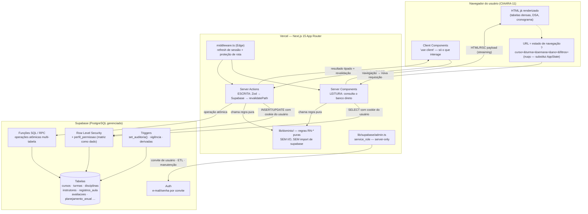

# Arquitetura Alvo — Next.js + Supabase

> **Documento de referência.** Toda decisão estrutural da v2.1 nasce aqui. Os documentos 24
> (estrutura do repositório) e 25 (camada de dados e estado) detalham o que este documento decide;
> nenhum dos dois pode contradizê-lo, e nenhum dos três pode contradizer o `BRIEF-v2.1.md`.

## 0. O que esta arquitetura substitui — e o que ela não toca

A v2.0 é um sistema **em produção**: Google Apps Script (V8) + Google Sheets + Vanilla JS/Bootstrap 5,
15 arquivos `.gs`, 12 arquivos `.html`, 39 specs Spec Kit executadas, base migrada e saneada
(23 abas). A v2.1 **não é um sistema novo** — é o mesmo domínio reimplantado noutra plataforma.

| Camada | v2.0 | v2.1 | Marcação |
|---|---|---|---|
| Runtime de execução | Apps Script V8, servidor Google | Node.js na Vercel (Edge para o middleware) | **[MIGRAÇÃO v2.1]** |
| Persistência | Google Sheets (23 abas) | Supabase PostgreSQL (23 tabelas + `perfil_permissao`) | **[MIGRAÇÃO v2.1]** |
| Transporte cliente↔servidor | `google.script.run` (RPC implícito) | Server Components (leitura) + Server Actions (escrita) | **[MIGRAÇÃO v2.1]** |
| Modularização | `include()` + escopo global compartilhado dos `.gs` | Módulos ES + fronteira servidor/cliente do App Router | **[MIGRAÇÃO v2.1]** |
| Estado de navegação | objeto `AppState` em `_Comum.html` | URL (`searchParams`) via `nuqs` | **[MIGRAÇÃO v2.1]** |
| Contrato de colunas | aba `_Meta_Colunas` | `information_schema` + tipos gerados pelo Supabase CLI | **[ABSORVIDO PELA PLATAFORMA]** |
| Verificação de permissão no servidor (`RNF-SEG-02`) | disciplina de código (`exigirFuncao`) | Row Level Security no PostgreSQL | **[ABSORVIDO PELA PLATAFORMA]** |
| `BUILD_ID` / detecção de deploy parcial (`RF-MOD-04`) | constante duplicada em `Core.gs` e `Index.html` | deploy atômico da Vercel — não existe mais "publicar `.gs` sem `.html`" | **[ABSORVIDO PELA PLATAFORMA]** |
| Regras de negócio `RN-*` | `RegrasNormativas.gs`, `Cronograma.gs`, `MotorPreditivo.gs`, `Instrutores.gs` | `lib/dominio/` — funções puras TypeScript | **[PRESERVADO]** (nova implementação, mesma lógica) |
| Corpo normativo, vocabulário, tetos, faixas de CH | — | — | **[PRESERVADO]** — não se toca (BRIEF §9) |

**[REVOGADO — v2.1] `RNF-PLAT-01..04`.** A v2.0 proibia framework, banco externo, bundler e CI/CD —
restrições legítimas enquanto a plataforma era o Apps Script, porque cada uma delas, ali, era um
gerador de risco sem contrapartida. Na v2.1 as quatro proibições são revogadas e substituídas por
decisões explícitas (BRIEF §1). O Princípio III da constitution é **reescrito, não deletado**:
onde ele dizia "não introduza plataforma", passa a dizer "a plataforma é Next.js + Supabase, e nada
além do que o BRIEF §1 lista entra sem decisão registrada". As proibições permanentes que sobram
(ORM que esconda SQL, banco fora do Supabase, biblioteca de componentes além de shadcn/Radix,
regra de negócio só na UI) são o que restou do espírito original do princípio.

---

## 1. Visão geral em camadas



### 1.1 Onde cada responsabilidade mora — e por quê

| Responsabilidade | Mora em | Justificativa |
|---|---|---|
| Autenticação (quem é) | Supabase Auth | Não se escreve autenticação à mão; `RF-AUTH-01..03` passam a ser configuração |
| Autorização (o que pode) | RLS + `perfil_permissao` no banco | `RNF-SEG-02` deixa de ser disciplina de código e vira garantia do motor |
| Integridade referencial | FKs, `CHECK`, `UNIQUE`, `EXCLUDE` no PostgreSQL | `RN-MAT-01/02`, `RF-DADOS-06/07` param de depender de validação em código |
| Atomicidade multi-tabela | funções SQL (RPC) | Transações ACID — a v2.0 não tinha; ver §5 |
| Regras de negócio `RN-*` | `lib/dominio/` (TypeScript puro) | Testável sem banco; é o coração portado — ver §6 |
| Validação de entrada | Zod em `lib/validacao/`, compartilhada cliente+servidor | Mata a duplicação que `RNF-MAN-02` descrevia |
| Composição de tela e leitura | Server Components | Uma ida ao banco, HTML pronto, sem JSON intermediário |
| Escrita | Server Actions | Um único ponto de entrada tipado por mutação |
| Estado de navegação | URL (`nuqs`) | `RF-NAV-01..03` com deep-link de graça — ver documento 25 |
| Interação local (abrir/fechar, arrastar, editar inline) | Client Components | Só onde o usuário realmente interage |
| Impressão (`RNF-COMP-01`) | rotas `/print/*` + `@media print` | Sem shell, quebra de página controlada, paridade com a v2.0 |

**Princípio de fronteira:** *o dado nunca atravessa a rede duas vezes para chegar à tela*. Na v2.0,
uma tela de DSA fazia `google.script.run.getDsaSemanal()` → JSON → montagem no navegador. Na v2.1,
o Server Component consulta o PostgreSQL e devolve a grade já renderizada. Isso apaga uma categoria
inteira de defeito da v2.0 — a montagem de HTML por concatenação de string no cliente, com escape
manual (`escapar()`), que já causou pelo menos dois bugs documentados nas specs 022/023.

---

## 2. A fronteira servidor/cliente

### 2.1 Server Components por padrão — a regra, não a preferência

No App Router, **todo componente é Server Component até que alguém escreva `"use client"`**. Essa é
a decisão do BRIEF §1 e ela não é estilística: um Server Component

1. **executa no servidor, perto do banco** — a consulta ao Supabase acontece dentro da região da
   Vercel, não no navegador do usuário na rede da OM;
2. **não vai para o bundle** — o código do componente, suas dependências de formatação, o SDK do
   Supabase server-side: nada disso é baixado pelo navegador;
3. **pode ser `async`** — `await supabase.from(...)` direto no corpo do componente, sem `useEffect`,
   sem estado de carregamento manual, sem a cascata `carregando → erro → dados` que a v2.0 escrevia
   à mão em cada view (`carregarInstrutores().catch(mostrarAvisoNivel2)` e as suas 15 irmãs do
   Hotfix 012);
4. **não tem segredo vazado** — a `service_role`, a chave do banco e qualquer variável sem prefixo
   `NEXT_PUBLIC_` só existem ali.

### 2.2 Quando `"use client"` se justifica

`"use client"` é uma **declaração de que aquele componente precisa do navegador**. Justificam-se
exatamente estes casos:

| Situação | Exemplo no CIAARA-11 | Alternativa se não fosse cliente |
|---|---|---|
| Estado local que muda sem ir ao servidor | abrir/fechar o painel de qualificação do instrutor | — não há |
| Manipulador de evento do DOM | arrastar um bloco de TA na grade do DSA (`moverLancamentoDsa`) | — não há |
| Hook do React (`useState`, `useReducer`, `useEffect`) | máscara de CPF/CEP/RETELMA no formulário do instrutor | validação só no submit |
| API só do navegador | `window.print()` na rota `/print/dsa` | — não há |
| Biblioteca que toca o DOM | Recharts (gráficos), Radix (menus, diálogos) | — não há |
| Formulário controlado com feedback imediato | React Hook Form + Zod no cadastro de instrutor | `<form action={acao}>` puro, sem feedback por campo |

**Não justificam:** formatar uma data, somar uma coluna, decidir se um badge é verde ou vermelho,
ordenar uma lista por antiguidade (`RN-ANT-02`), calcular um teto normativo. Tudo isso é cálculo —
e cálculo acontece no servidor, onde o dado já está.

### 2.3 O custo de errar essa fronteira num sistema de tabelas densas

Este ponto é específico do CIAARA-11 e precisa ser dito com números. O sistema tem
**798 vínculos instrutor↔disciplina**, **~1.753 registros de aula** e telas que mostram
**177 instrutores com 6 colunas e 8 filtros combinados** (a `ViewInstrutores.html` da v2.0).

Se o `"use client"` for posto no topo da página em vez de na folha:

- **Cascata de cliente.** `"use client"` é contagioso *para baixo*: todo componente importado por um
  Client Component também vira cliente. Marcar a página inteira transforma a tabela de 177 linhas,
  o formatador de nome militar, o catálogo de 57 siglas de `Esp_Hab_Obs` e a escala de antiguidade
  em código baixado pelo navegador. O bundle cresce, o *time to interactive* piora, e a rede da OM
  paga por isso a cada acesso.
- **Volta do JSON intermediário.** Um Client Component não faz `await supabase` do servidor: ele
  precisa buscar via rota/`fetch`. Os 798 vínculos viram um payload JSON serializado, transferido e
  re-parseado — exatamente o que a v2.0 fazia por falta de alternativa, e exatamente o que causou o
  achado da spec 017 (~435 leituras completas redundantes por requisição no DSA).
- **Hidratação de tabela grande.** Uma `<table>` de 177×6 hidratada custa milissegundos de CPU no
  cliente por linha. Como Server Component, ela é HTML e ponto: zero JavaScript de hidratação.
- **Regra de negócio no cliente.** É a proibição permanente do BRIEF §1. Se o cálculo do teto AEC
  fosse feito num Client Component, ele estaria no bundle — legível, alterável no DevTools, e
  fora do alcance do teste de invariantes.

**Padrão obrigatório: "ilhas de interatividade".** A página é servidor; dentro dela, componentes
pequenos e nominais são cliente.

```tsx
// app/(app)/instrutores/page.tsx
// SEM "use client" no topo — este arquivo é Server Component, e é assim que tem de ser.

import { criarClienteServidor } from "@/lib/supabase/server";           // cliente Supabase que lê o cookie do usuário
import { ordenarPorAntiguidade } from "@/lib/dominio/instrutores/antiguidade"; // RN-ANT-01/02 — função pura, roda no servidor
import { TabelaInstrutores } from "@/components/ciaara/tabela-instrutores";    // servidor: só renderiza <tr>
import { BarraFiltrosInstrutores } from "@/components/ciaara/barra-filtros-instrutores"; // CLIENTE: é a ilha

// `searchParams` é a única fonte de verdade do filtro (documento 25). No Next.js 15 ele é uma Promise.
export default async function PaginaInstrutores(props: {
  searchParams: Promise<{ curso?: string; posto?: string; status?: string }>;
}) {
  const filtros = await props.searchParams;      // desembrulha os parâmetros da URL (?curso=CUR-000004&posto=CT)
  const supabase = await criarClienteServidor(); // cliente autenticado como o usuário logado — a RLS já vale aqui

  // Uma única consulta, no servidor, com os filtros já aplicados no SQL — não no navegador.
  const { data: instrutores, error } = await supabase
    .from("instrutores")                                   // tabela v2.1 (era a aba `Cad_Instrutor`)
    .select("id, codigo, nome_completo, nome_guerra, posto_graduacao, esp_hab_obs, status")
    .eq("status", "ativo")                                 // exclusão lógica universal (BRIEF §2) — nunca DELETE
    .order("nome_completo");                               // ordenação estável de base; a de negócio vem abaixo

  if (error) throw error;                                  // sobe para o error.tsx do segmento (§7)

  // Regra de negócio pura, no servidor: nunca alfabético, sempre antiguidade real (RN-ANT-02).
  const ordenados = ordenarPorAntiguidade(instrutores ?? []);

  return (
    <section>
      {/* Ilha de interatividade: só a barra de filtros é cliente, porque ela escreve na URL. */}
      <BarraFiltrosInstrutores valoresIniciais={filtros} />

      {/* A tabela de 177 linhas permanece Server Component: HTML puro, zero hidratação. */}
      <TabelaInstrutores instrutores={ordenados} />
    </section>
  );
}
```

---

## 3. Fluxo de leitura — RSC lê o banco direto, a RLS aplica sozinha

A leitura na v2.1 tem **um** caminho: o Server Component monta o cliente de servidor, o cliente
carrega o cookie de sessão do usuário, o PostgREST do Supabase abre a conexão com o `role`
`authenticated` e o `auth.uid()` daquele usuário, e **as policies de RLS filtram a linha antes de
ela sair do banco**. Não existe `if (perfil !== 'Admin')` no meio do caminho.

### 3.1 O cliente de servidor

```ts
// lib/supabase/server.ts
import { createServerClient } from "@supabase/ssr";  // fábrica do cliente que sabe ler/escrever cookies
import { cookies } from "next/headers";              // acesso ao cookie store da requisição corrente (Next.js)
import type { Database } from "@/lib/tipos/database"; // tipos gerados por `supabase gen types typescript`

/**
 * Cria um cliente Supabase autenticado como o USUÁRIO da requisição corrente.
 *
 * O quê: devolve um `SupabaseClient<Database>` tipado.
 * Para quê: toda leitura de Server Component e toda escrita de Server Action passam por aqui —
 *           é o único caminho em que a RLS enxerga `auth.uid()` preenchido.
 * Como: lê o cookie `sb-<projeto>-auth-token` da requisição e o injeta no header Authorization.
 *
 * ATENÇÃO: não é cacheável entre requisições. Chame a função dentro de cada componente/ação;
 * não guarde o retorno num módulo (isso vazaria a sessão de um usuário para outro).
 */
export async function criarClienteServidor() {
  const cookieStore = await cookies();               // no Next.js 15 `cookies()` é assíncrono

  return createServerClient<Database>(
    process.env.NEXT_PUBLIC_SUPABASE_URL!,           // URL pública do projeto — pode ir ao cliente
    process.env.NEXT_PUBLIC_SUPABASE_ANON_KEY!,      // chave anônima — segura por si só PORQUE existe RLS
    {
      cookies: {
        // getAll: entrega ao SDK todos os cookies da requisição para ele localizar o token de sessão.
        getAll() {
          return cookieStore.getAll();
        },
        // setAll: chamado quando o SDK renova o token. Em Server Component a escrita de cookie é
        // proibida pelo Next.js — por isso o try/catch: o refresh de verdade acontece no middleware (§8).
        setAll(cookiesParaGravar) {
          try {
            cookiesParaGravar.forEach(({ name, value, options }) =>
              cookieStore.set(name, value, options)
            );
          } catch {
            // Silêncio deliberado: estamos num Server Component de leitura. O middleware já renovou.
            // Engolir aqui é correto; engolir no middleware seria bug.
          }
        },
      },
    }
  );
}
```

### 3.2 O padrão de leitura, comentado

```tsx
// app/(app)/turmas/[turma]/dsa/page.tsx
// Detalhe Semanal de Aula — a tela mais densa do sistema (RF-DSA-01..08).

import { Suspense } from "react";
import { criarClienteServidor } from "@/lib/supabase/server";
import { montarGradeSemanal } from "@/lib/dominio/dsa/grade";        // RN puro: organiza blocos em TA × dia
import { detectarConflitos } from "@/lib/dominio/dsa/conflitos";     // RN-CONF-01, puro (ver §6.3)
import { semanaIsoParaIntervalo } from "@/lib/dominio/calendario/semana-iso";
import { GradeDsa } from "@/components/ciaara/grade-dsa";            // ilha cliente: arrastar/soltar bloco
import { EsqueletoGrade } from "@/components/ciaara/esqueleto-grade";

export default async function PaginaDsa(props: {
  params: Promise<{ turma: string }>;                 // segmento dinâmico: /turmas/TUR-000012/dsa
  searchParams: Promise<{ semana?: string; ano?: string }>; // estado na URL (documento 25)
}) {
  const { turma: codigoTurma } = await props.params;
  const { semana, ano } = await props.searchParams;

  // Degradação segura (RN-DEG-01): parâmetro ausente ou inválido cai em valor neutro,
  // NUNCA em exceção. A tela abre na semana corrente em vez de estourar um 500.
  const anoLetivo = Number(ano) || new Date().getFullYear();
  const semanaIso = Number(semana) || semanaIsoDeHoje();
  const { inicio, fim } = semanaIsoParaIntervalo(anoLetivo, semanaIso); // função pura de calendário

  const supabase = await criarClienteServidor();

  // ---------------------------------------------------------------------------------------------
  // CONSULTA 1 — os lançamentos da turma na semana.
  // O join é feito pelo PostgREST (`disciplinas(...)`, `instrutores(...)`), numa única viagem:
  // é assim que se evita o N+1 descrito no §11. NUNCA faça um `select` por linha dentro de um map.
  // ---------------------------------------------------------------------------------------------
  const { data: lancamentos, error: erroLancamentos } = await supabase
    .from("registros_aula")
    .select(`
      id, codigo, data, ta_inicial, tempos_consumidos, conteudo_resumo, local, status,
      disciplinas ( id, codigo, nome_disciplina, carga_horaria_tempos ),
      instrutores ( id, codigo, nome_completo, nome_guerra, posto_graduacao, esp_hab_obs )
    `)
    .eq("turma_codigo", codigoTurma)   // filtro de negócio
    .gte("data", inicio)               // limites da semana ISO
    .lte("data", fim)
    .eq("status", "ativo");            // exclusão lógica (BRIEF §2)

  if (erroLancamentos) throw erroLancamentos; // vai para o error.tsx do segmento (§7)

  // ---------------------------------------------------------------------------------------------
  // CONSULTA 2 — os blocos das DEMAIS turmas na mesma semana, para RN-CONF-01.
  // A RLS já limita o usuário aos cursos que ele pode ver; o que ele não pode ver simplesmente
  // não vem — e, por decisão de domínio, um conflito com turma invisível é reportado como
  // "conflito com turma fora do seu escopo", nunca omitido (ver §11, risco R-03).
  // ---------------------------------------------------------------------------------------------
  const { data: blocosGlobais } = await supabase
    .from("vw_blocos_ocupacao")        // VIEW: unifica registros_aula + avaliacoes + atividades_nao_letivas
    .select("id, turma_codigo, data, ta_inicial, tempos_consumidos, instrutor_id, local")
    .gte("data", inicio)
    .lte("data", fim);

  // ---------------------------------------------------------------------------------------------
  // DOMÍNIO — aqui o dado vira informação. Nenhuma destas duas funções conhece o Supabase.
  // ---------------------------------------------------------------------------------------------
  const grade = montarGradeSemanal(lancamentos ?? [], { anoLetivo, semanaIso });
  const conflitos = detectarConflitos(blocosGlobais ?? []);

  return (
    <Suspense fallback={<EsqueletoGrade />}>
      {/* A grade é a ilha cliente (arrastar bloco); os dados chegam prontos do servidor. */}
      <GradeDsa grade={grade} conflitos={conflitos} turma={codigoTurma} semana={semanaIso} ano={anoLetivo} />
    </Suspense>
  );
}
```

### 3.3 Por que isso é mais seguro que a v2.0

Na v2.0, `getDsaSemanal` era uma função `.gs` exposta por `google.script.run`. Qualquer usuário
autenticado podia chamá-la com qualquer `ID_Turma`; a proteção era `exigirEscopoTurma_()` — uma
linha de código que alguém precisava lembrar de escrever. Na v2.1, se a policy de `registros_aula`
diz que o Operador só lê as turmas dos cursos de `app.cursos_do_usuario()`, **não há chamada que
burle isso**: o banco devolve zero linhas. O esquecimento deixa de ser possível porque a checagem
não está mais no caminho do código — está no caminho do dado.

---

## 4. Fluxo de escrita — Server Action → Zod → Supabase → `revalidatePath`

### 4.1 O contrato de retorno

Toda Server Action da v2.1 devolve o mesmo tipo. Isso é convenção dura: o componente de formulário
não precisa saber qual ação chamou para saber como tratar o retorno.

```ts
// lib/acoes/tipos.ts

/**
 * Falha de uma Server Action, discriminada por `tipo`.
 *
 * O quê: a única forma de erro que atravessa a fronteira servidor→cliente.
 * Para quê: a UI precisa distinguir "você digitou errado" de "o banco recusou" — são mensagens,
 *           tratamentos e até tons de alerta diferentes (ver §4.4).
 * Como: união discriminada; o `switch (erro.tipo)` no cliente é exaustivo por construção.
 */
export type FalhaAcao =
  /** O dado enviado é inválido. Culpa do formulário. Erro por campo, corrigível pelo usuário. */
  | { tipo: "validacao"; mensagem: string; campos: Record<string, string[]> }
  /** O banco recusou por RLS/permissão. O dado pode até estar certo; o usuário é que não pode. */
  | { tipo: "autorizacao"; mensagem: string }
  /** Violação de invariante do banco: unicidade, FK, CHECK. O dado conflita com o que já existe. */
  | { tipo: "conflito"; mensagem: string; restricao?: string }
  /** Qualquer outra coisa: rede, timeout, bug. Não se mostra detalhe técnico ao usuário. */
  | { tipo: "infraestrutura"; mensagem: string; correlacao: string };

/** Resultado de uma Server Action: sucesso com dados, ou falha discriminada. `avisos` carrega RN-DEG-02. */
export type ResultadoAcao<T> =
  | { ok: true; dados: T; avisos: string[] }
  | { ok: false; erro: FalhaAcao };
```

### 4.2 O tradutor de erro do PostgreSQL

```ts
// lib/acoes/erros.ts
import { randomUUID } from "node:crypto";
import type { PostgrestError } from "@supabase/supabase-js";
import type { FalhaAcao } from "./tipos";

/**
 * Traduz um erro do PostgREST/PostgreSQL para a `FalhaAcao` correspondente.
 *
 * O quê: mapeia SQLSTATE → categoria de falha da aplicação.
 * Para quê: garantir que a distinção "RLS recusou" × "dado inválido" × "colide com dado existente"
 *           seja feita UMA vez, num lugar só, e não reinventada em cada ação.
 * Como: `switch` sobre `error.code`. Códigos vêm do catálogo do PostgreSQL, não são invenção nossa.
 */
export function traduzirErroSupabase(error: PostgrestError): FalhaAcao {
  switch (error.code) {
    // 42501 = insufficient_privilege. É o código que o PostgreSQL devolve quando um INSERT/UPDATE
    // é barrado por policy de RLS ("new row violates row-level security policy").
    // Semântica de negócio: o dado pode estar perfeito — o USUÁRIO é que não tem alçada.
    case "42501":
      return {
        tipo: "autorizacao",
        mensagem:
          "Você não tem permissão para gravar este registro. " +
          "Se acredita que deveria ter, procure o Encarregado do Curso ou o Administrador do sistema.",
      };

    // 23505 = unique_violation. Ex.: RF-DADOS-06 (ID_Curso + Cod_Disciplina único).
    case "23505":
      return {
        tipo: "conflito",
        mensagem: "Já existe um registro com esta chave. Verifique se o lançamento não foi feito duas vezes.",
        restricao: error.details ?? undefined,
      };

    // 23503 = foreign_key_violation. Ex.: turma que aponta para curso inexistente (RN-MAT-01).
    case "23503":
      return {
        tipo: "conflito",
        mensagem: "O registro referencia um item que não existe ou foi desativado. Recarregue a tela e tente de novo.",
        restricao: error.details ?? undefined,
      };

    // 23514 = check_violation. Ex.: `tempos_consumidos > 0`, `semana_ano between 1 and 53`.
    case "23514":
      return {
        tipo: "conflito",
        mensagem: "O valor informado está fora do intervalo permitido pelas regras do sistema.",
        restricao: error.constraint ?? undefined,
      };

    // P0001 = raise_exception: erro levantado de propósito por uma função nossa (RPC), com
    // mensagem já escrita em português para o usuário. Repassar o texto é intencional aqui.
    case "P0001":
      return { tipo: "conflito", mensagem: error.message };

    // Qualquer outra coisa: não expor detalhe técnico. Registrar com correlação para achar no log.
    default: {
      const correlacao = randomUUID();
      console.error(`[${correlacao}] Erro Supabase não mapeado`, {
        code: error.code, message: error.message, details: error.details,
      });
      return {
        tipo: "infraestrutura",
        mensagem: "Não foi possível concluir a operação. Tente novamente; se persistir, informe o código abaixo.",
        correlacao,
      };
    }
  }
}
```

### 4.3 Uma Server Action completa, comentada linha a linha

```ts
// lib/acoes/dsa.ts
"use server"; // marca TODO export deste arquivo como Server Action — nada aqui vai para o bundle do cliente.

import { revalidatePath } from "next/cache";
import { criarClienteServidor } from "@/lib/supabase/server";
import { esquemaLancarAula } from "@/lib/validacao/dsa";      // MESMO schema Zod usado no formulário (RNF-MAN-02)
import { validarTetoSemanalTfm } from "@/lib/dominio/dsa/tetos";       // RN puro
import { avaliarNonoTempo } from "@/lib/dominio/horarios/nono-tempo";  // RN-DEG-02 puro
import { traduzirErroSupabase } from "./erros";
import type { ResultadoAcao } from "./tipos";

/**
 * Lança uma aula no Detalhe Semanal de Aula (RF-DSA-04).
 *
 * O quê: grava uma linha em `registros_aula` para uma turma, num dia, a partir de um TA inicial.
 * Para quê: é a operação mais frequente do sistema — o lançamento diário do DSA pelo Operador.
 * Como: valida com Zod → aplica regras puras → grava via cliente do usuário (RLS decide) →
 *       revalida os caminhos que mostram este dado → devolve `ResultadoAcao` tipado.
 *
 * @param _estadoAnterior estado devolvido pela chamada anterior (assinatura exigida por `useActionState`)
 * @param formData        payload do formulário (funciona com JS desligado, via `<form action={...}>`)
 */
export async function lancarAula(
  _estadoAnterior: ResultadoAcao<{ id: string }> | null,
  formData: FormData
): Promise<ResultadoAcao<{ id: string }>> {
  // -----------------------------------------------------------------------------------------
  // 1. VALIDAÇÃO — o dado é sequer plausível?
  //    `safeParse` nunca lança: devolve `{ success, data | error }`. Isso mantém a ação sem
  //    try/catch em volta da validação e deixa o caminho de erro explícito.
  // -----------------------------------------------------------------------------------------
  const analise = esquemaLancarAula.safeParse({
    turmaId: formData.get("turmaId"),
    disciplinaId: formData.get("disciplinaId"),
    instrutorId: formData.get("instrutorId"),
    data: formData.get("data"),
    taInicial: Number(formData.get("taInicial")),
    temposConsumidos: Number(formData.get("temposConsumidos")),
    conteudoResumo: formData.get("conteudoResumo"),
    local: formData.get("local"),
  });

  if (!analise.success) {
    // `flatten().fieldErrors` devolve { campo: ["mensagem"] } — exatamente o formato que o
    // React Hook Form consome para pintar o erro embaixo do input certo.
    return {
      ok: false,
      erro: {
        tipo: "validacao",
        mensagem: "Confira os campos destacados antes de lançar.",
        campos: analise.error.flatten().fieldErrors as Record<string, string[]>,
      },
    };
  }

  const entrada = analise.data; // a partir daqui o dado é tipado e confiável em FORMA (não em ALÇADA)

  // -----------------------------------------------------------------------------------------
  // 2. REGRAS DE DOMÍNIO — puras, sem I/O. Duas naturezas diferentes, tratadas diferente:
  //    (a) `validarTetoSemanalTfm` pode BLOQUEAR (é regra normativa dura);
  //    (b) `avaliarNonoTempo` só AVISA (RN-DEG-02: 9º TA é alerta informativo, nunca bloqueio).
  // -----------------------------------------------------------------------------------------
  const avisos: string[] = [];

  const teto = validarTetoSemanalTfm(entrada); // devolve { permitido, motivo? }
  if (!teto.permitido) {
    return {
      ok: false,
      erro: {
        tipo: "validacao",
        mensagem: teto.motivo!,
        campos: { temposConsumidos: [teto.motivo!] },
      },
    };
  }

  const nonoTempo = avaliarNonoTempo(entrada.taInicial, entrada.temposConsumidos);
  if (nonoTempo.excede) {
    // NÃO retorna erro. Empilha aviso e segue — RN-DEG-02, BRIEF §9
    // ("9º TA é alerta informativo, nunca bloqueio").
    avisos.push(nonoTempo.mensagem);
  }

  // -----------------------------------------------------------------------------------------
  // 3. ESCRITA — o cliente carrega o cookie do usuário; a RLS decide se a linha pode nascer.
  //    Não há `if (perfil === ...)` aqui. A alçada é do banco (RNF-SEG-02 absorvido).
  // -----------------------------------------------------------------------------------------
  const supabase = await criarClienteServidor();

  const { data: criado, error } = await supabase
    .from("registros_aula")
    .insert({
      turma_id: entrada.turmaId,
      disciplina_id: entrada.disciplinaId,
      instrutor_id: entrada.instrutorId,
      data: entrada.data,                       // `date` no banco; o fuso é irrelevante para dia letivo
      ta_inicial: entrada.taInicial,
      tempos_consumidos: entrada.temposConsumidos,
      conteudo_resumo: entrada.conteudoResumo,
      local: entrada.local,
      status: "ativo",                          // exclusão lógica universal (BRIEF §2)
      // `criado_por` e `criado_em` NÃO vão aqui: são preenchidos pela trigger `set_auditoria()`
      // a partir de `auth.uid()`. Enviar do cliente permitiria forjar autoria.
    })
    .select("id")                               // devolve só o que precisamos
    .single();                                  // exige exatamente uma linha; erro se vier 0 ou 2

  if (error) {
    // Aqui mora a distinção que o §4.4 explica: RLS (42501) ≠ validação ≠ colisão de chave.
    return { ok: false, erro: traduzirErroSupabase(error) };
  }

  // -----------------------------------------------------------------------------------------
  // 4. REVALIDAÇÃO — invalidar o cache do Next.js nos caminhos afetados por esta escrita.
  //    É o sucessor direto do `AppState.invalidar([...])` da v2.0 (04-appstate.md), com uma
  //    diferença decisiva: lá a invalidação era manual e podia ser esquecida por outra view;
  //    aqui ela é declarada ao lado da própria mutação, no servidor, uma vez só.
  //    A matriz completa "mutação × caminho" está no documento 25 §5.
  // -----------------------------------------------------------------------------------------
  revalidatePath(`/turmas/${entrada.turmaId}/dsa`);   // a grade que acabou de mudar
  revalidatePath(`/cronograma`);                       // previsto × executado muda com o lançamento
  revalidatePath(`/disciplinas`);                      // CH executada da disciplina muda (achado Épico D)

  return { ok: true, dados: { id: criado.id }, avisos };
}
```

### 4.4 RLS recusou × dado inválido — por que a mensagem é diferente

Esta distinção é **requisito de usabilidade**, não capricho. Os dois casos parecem iguais para o
código (uma escrita que não aconteceu) e são opostos para o usuário:

| | Erro de validação | Erro de RLS |
|---|---|---|
| O que aconteceu | O dado enviado está errado | O dado está certo; o usuário não tem alçada |
| Quem pode resolver | O próprio usuário, agora | Encarregado de Curso / Administrador |
| Onde a mensagem aparece | embaixo do campo, em vermelho | no topo do formulário, como aviso de permissão |
| O que **não** dizer | — | "Erro ao salvar", "Tente novamente" (mente: tentar de novo não resolve) |
| Ação sugerida | "Corrija o campo destacado" | "Solicite acesso ao curso X ao Administrador" |
| Deve reabrir o formulário? | Sim, com os dados preenchidos | Sim, mas com o botão de gravar desabilitado |

**Armadilha específica da RLS que precisa estar documentada:** para `INSERT`/`UPDATE`/`DELETE`, a
policy negada **levanta erro** (`42501`) — é visível. Para `SELECT`, a policy negada **não levanta
erro**: simplesmente não devolve a linha. O resultado é uma tela vazia, sem nenhuma indicação de que
existe dado que o usuário não pode ver. Por isso, toda tela de listagem que possa vir vazia por
restrição de escopo **deve dizer isso explicitamente**:

```tsx
// components/ciaara/estado-vazio.tsx  (Server Component)
export function EstadoVazio({ escopoRestrito }: { escopoRestrito: boolean }) {
  return escopoRestrito ? (
    // Diferencia "não há dado" de "há dado que você não pode ver" — mitigação do risco R-03 (§11).
    <p>Nenhum registro no seu escopo de acesso. Podem existir registros de outros cursos que você não visualiza.</p>
  ) : (
    <p>Nenhum registro cadastrado ainda.</p>
  );
}
```

---

## 5. Quando usar RPC (função no banco) em vez de Server Action

**Regra de decisão:**

> Use Server Action quando a operação for **uma escrita**, ou várias escritas que podem ficar pela
> metade sem corromper o significado do dado.
> Use RPC (`create function ... language plpgsql`) quando a operação for **atômica por natureza** —
> se metade dela acontecer, o banco fica com um estado que a norma não admite — **ou** quando o
> cálculo depender de tanto dado que trazê-lo para o Node seria absurdo.

Uma Server Action que faz três `INSERT` seguidos **não é uma transação**: cada chamada ao PostgREST
é a sua própria transação. Se a segunda falhar, a primeira já está gravada. A v2.0 convivia com isso
porque o Sheets não oferecia alternativa; a v2.1 não tem essa desculpa.

### 5.1 Os dois casos canônicos do domínio

#### (a) Fechamento de semana do DSA — atomicidade

Fechar uma semana envolve: marcar os `registros_aula` da semana como consolidados, recalcular a CHD
executada por disciplina, atualizar o `status` das `avaliacoes` cuja data já passou (`Pendente` →
`Atrasada`, `RN-AVAL-01` revisada) e gravar o evento de auditoria. Se o passo 3 falhar depois do
passo 1, a semana fica "fechada com avaliação em aberto" — um estado que nenhum relatório sabe ler.

```sql
-- supabase/migrations/20260825120000_fn_fechar_semana_dsa.sql

-- O quê: consolida uma semana ISO do DSA de uma turma, em UMA transação.
-- Para quê: garantir que nunca exista turma com semana meio-fechada (RF-DSA-09, RN-AVAL-01).
-- Como: função plpgsql; tudo dentro do corpo roda numa transação implícita — erro = ROLLBACK total.
-- SECURITY INVOKER (padrão): a função roda com o papel do CHAMADOR, então a RLS de cada tabela
-- continua valendo. Isso é deliberado: uma RPC não é um atalho para furar permissão.
create or replace function app.fechar_semana_dsa(
  p_turma_id  uuid,      -- turma cuja semana será fechada
  p_ano       integer,   -- ano letivo (1º parâmetro da semana ISO)
  p_semana    integer    -- número da semana ISO (1..53)
)
returns table (registros_consolidados integer, avaliacoes_atrasadas integer)
language plpgsql
security invoker
set search_path = app, public   -- search_path fixo: impede sequestro de função por schema temporário
as $$
declare
  v_inicio date;         -- segunda-feira da semana
  v_fim    date;         -- domingo da semana
  v_regs   integer := 0; -- contador de registros consolidados
  v_avals  integer := 0; -- contador de avaliações remarcadas como atrasadas
begin
  -- Validação de faixa: barreira redundante à do Zod, de propósito (defesa em profundidade).
  if p_semana < 1 or p_semana > 53 then
    raise exception 'Semana ISO inválida: %', p_semana using errcode = 'P0001';
  end if;

  -- Resolve o intervalo da semana ISO no próprio banco — mesma aritmética usada pelo domínio TS.
  v_inicio := to_date(p_ano::text || to_char(p_semana, 'FM00') || '1', 'IYYYIWID');
  v_fim    := v_inicio + 6;

  -- PASSO 1 — consolida os lançamentos da semana.
  update registros_aula
     set situacao_consolidacao = 'consolidado',
         editado_em            = now()          -- `editado_por` vem da trigger set_auditoria()
   where turma_id = p_turma_id
     and data between v_inicio and v_fim
     and status = 'ativo'
     and situacao_consolidacao is distinct from 'consolidado';
  get diagnostics v_regs = row_count;

  -- PASSO 2 — avaliações agendadas para a semana que não foram registradas viram 'atrasada'.
  update avaliacoes
     set status     = 'atrasada',
         editado_em = now()
   where turma_id = p_turma_id
     and data_prevista between v_inicio and v_fim
     and status = 'pendente'
     and tempos_consumidos is null;             -- nunca registrada no DSA (RN-AVAL-02 revisada)
  get diagnostics v_avals = row_count;

  -- PASSO 3 — rastro de auditoria. Nunca reescreve linha anterior; sempre acrescenta evento.
  insert into migracao_log (evento, entidade, chave, detalhe, criado_por)
  values ('fechamento_semana', 'registros_aula',
          p_turma_id::text || ':' || p_ano || 'W' || p_semana,
          jsonb_build_object('registros', v_regs, 'avaliacoes', v_avals),
          auth.uid());

  -- Se qualquer passo acima falhar, NADA acima é gravado. É exatamente isso que a v2.0 não tinha.
  return query select v_regs, v_avals;
end;
$$;
```

Chamada a partir da Server Action:

```ts
// lib/acoes/dsa.ts (continuação)
const { data, error } = await supabase.rpc("fechar_semana_dsa", {
  p_turma_id: turmaId,   // os nomes dos parâmetros são os da assinatura SQL — o CLI os tipa
  p_ano: ano,
  p_semana: semana,
});
// `error.code === 'P0001'` chega traduzido pelo `traduzirErroSupabase` como conflito, com a
// mensagem em português já escrita dentro do `raise exception`.
```

#### (b) Geração do planejamento anual — atomicidade + volume

O motor preditivo (`MotorPreditivo.gs` da v2.0, `RN-2027-*`) gera centenas de linhas de
`planejamento_anual` para um ano inteiro. A mecânica de não-regressão exige que salvar a versão
`N+1` promova-a a `Salvo` e rebaixe a versão anterior a `Arquivado` **na mesma transação** —
o invariante é "no máximo 1 versão `Salvo` por `ano_letivo`". Duas Server Actions em sequência
podem deixar o ano com duas versões salvas ou nenhuma.

| Aspecto | Server Action | RPC |
|---|---|---|
| Gerar a prévia (cálculo puro sobre disciplinas, feriados, reservas) | **sim** — o cálculo é `lib/dominio/planejamento/`, testável em Vitest | não |
| Persistir as N linhas da prévia | pode (um `insert` em lote é uma transação) | tanto faz |
| Promover `Rascunho` → `Salvo` e arquivar a anterior | **não** | **sim** — `app.salvar_planejamento(ano, versao)` |
| Recalcular ocupação de todas as turmas do ano | não (traria ~1.753 registros ao Node) | **sim** — agrega no SQL |

**Onde o motor preditivo mora, afinal:** o **cálculo** fica em `lib/dominio/planejamento/` (puro,
testável, portado da v2.0 quase 1:1); a **persistência atômica do resultado** fica numa RPC. Não se
reescreve o motor em PL/pgSQL — isso jogaria fora a portabilidade dos testes de invariante e
contrariaria o §6.

### 5.2 Quando **não** usar RPC

- Para uma escrita simples. `insert` numa tabela não precisa de função.
- Para esconder regra de negócio do TypeScript. Se a regra é `RN-*`, ela pertence a `lib/dominio/`,
  onde o Vitest a alcança. Regra em PL/pgSQL só se testa com pgTAP — mais caro e menos legível.
- Como atalho para furar RLS. Uma função `SECURITY DEFINER` que grava sem checar alçada é um
  buraco na fronteira de segurança. As únicas `SECURITY DEFINER` autorizadas são as auxiliares de
  autorização do BRIEF §3 (`app.pode`, `app.perfil_atual`, `app.cursos_do_usuario`,
  `app.usuario_atual`), todas `STABLE`, todas somente leitura, todas com `search_path` fixo.

---

## 6. `lib/dominio/` — o coração portado

### 6.1 O que é e o que não é

`lib/dominio/` contém as **~40 regras `RN-`** da v2.0 como funções TypeScript **puras**:

- **entra:** cálculo de tetos normativos (AEC 10% / TAD 5% / TR 10%), distribuição semanal de carga
  horária, detecção de conflito de instrutor e sala (`RN-CONF-01`), ordenação por antiguidade
  (`RN-ANT-01/02`), resolução de regime vigente por data (`RN-2027-09`), motor preditivo,
  sugestão do DSA (`RF-DSA-08`), aritmética de semana ISO, formatação de nome militar
  (`RF-INSTR-15`), faixas de CH docente;
- **não entra:** nada que faça I/O. **Regra dura: nenhum arquivo em `lib/dominio/` importa
  `supabase`, `next/*`, `react` ou `node:fs`.** Se precisa de dado, recebe por parâmetro.

### 6.2 Por que essa separação é o que garante a migração

Este é o ponto mais importante do documento, e merece ser dito sem rodeio.

A lógica consolidada da v2.0 não está em risco por causa do PostgreSQL nem do React — está em risco
porque, na v2.0, **regra e I/O estão no mesmo corpo de função**. `calcularTetosDoCurso` lê a
planilha e calcula; `distribuicaoSemanalMateria_` lê a aba e distribui. Portar essas funções
diretamente significaria reescrevê-las junto com o acesso a dados, e é aí que a lógica se perde:
numa reescrita simultânea de duas coisas, ninguém consegue provar que só uma mudou.

A separação inverte isso:

1. **A regra é extraída primeiro, sem tocar em persistência.** Copia-se o corpo do cálculo,
   trocando "ler a aba" por "receber o array". A transformação é mecânica e revisável.
2. **O teste vem junto, quase 1:1.** A suíte de invariantes da v2.0 (`tests/*.test.js`) já testava
   essas funções com dados sintéticos — porque a parte pura já era testável. Esses testes viram
   Vitest com mudança de `require` para `import` e pouco mais (BRIEF §7, item 2).
3. **Se o teste passa, a regra sobreviveu.** É essa a prova de não regressão que o BRIEF §7 exige —
   invariantes estruturais e matemáticos, nunca diff contra a saída histórica de um curso
   específico (a CAHO 2026 foi rejeitada como padrão-ouro em 2026-08-10).
4. **A troca de plataforma fica confinada.** Supabase, Next.js e Vercel só aparecem em `lib/acoes/`,
   `lib/supabase/` e `app/`. Se a v3.0 trocar de banco outra vez, `lib/dominio/` não muda.

Uma consequência prática que vale registrar: **é possível rodar a suíte de domínio inteira sem
banco nenhum, em menos de um segundo, no CI**. Isso muda o custo de mexer nas regras — e regra
barata de testar é regra que se conserta em vez de contornar.

### 6.3 Exemplo real 1 — distribuição semanal de carga horária

Porte de `distribuicaoSemanalMateria_` (`Cronograma.gs`, Épico G), consumida também pelo motor de
sugestão do DSA (`SugestaoDsa.gs`, `RF-DSA-08`).

```ts
// lib/dominio/cronograma/distribuicao-semanal.ts
//
// REGRA DE OURO DESTE ARQUIVO: nenhum import de supabase, next, react ou fs.
// Só tipos e funções puras. Se você sentiu vontade de buscar um dado aqui, o parâmetro está faltando.

import type { Aviso } from "@/lib/dominio/tipos";  // { codigo: string; mensagem: string }

/** Entrada da distribuição — tudo o que a regra precisa saber, sem saber de onde veio. */
export type EntradaDistribuicao = {
  /** Total de Tempos de Aula (TA) da disciplina. Origem: `disciplinas.carga_horaria_tempos`. */
  totalTempos: number;
  /** TA por dia letivo do regime vigente NA DATA (RN-2027-09). Origem: `curso_regime_historico`. */
  temposPorDia: number;
  /** Dias letivos de cada semana da janela, em ordem. Feriados e reservas PROENS já descontados. */
  diasLetivosPorSemana: number[];
  /** Teto opcional de TA por semana para esta disciplina (ex.: TFM). `null` = sem teto. */
  tetoSemanal?: number | null;
};

/** Uma semana da distribuição. `semanaIndice` é 0-based dentro da janela recebida. */
export type SemanaDistribuida = {
  semanaIndice: number;
  diasLetivos: number;
  temposAlocados: number;
};

/** Saída neutra-com-aviso (RN-DEG-01): NUNCA lança; devolve o que conseguiu + o que não conseguiu. */
export type ResultadoDistribuicao = {
  semanas: SemanaDistribuida[];
  /** TA que não couberam na janela. > 0 significa "a disciplina não cabe no calendário". */
  temposNaoAlocados: number;
  avisos: Aviso[];
};

/**
 * Distribui a carga horária de uma disciplina pelas semanas da janela do curso.
 *
 * O quê: transforma "180 TA" em "semana 1: 20 TA, semana 2: 20 TA, …", respeitando os dias
 *        letivos reais de cada semana e o regime de TA/dia vigente.
 * Para quê: alimenta o cronograma previsto (RF-CRONOS-01..08), o motor preditivo (RN-2027-*)
 *           e a sugestão semanal do DSA (RF-DSA-08). É a mesma aritmética nos três.
 * Como: enche semana a semana até o limite diário × dias letivos, aplicando teto semanal se houver;
 *       o que sobrar volta como `temposNaoAlocados` em vez de virar exceção (RN-DEG-01).
 *
 * Invariante testável (Vitest): `soma(semanas.temposAlocados) + temposNaoAlocados === totalTempos`.
 * Essa igualdade é a asserção que impede a classe inteira de bug "TA some no cronograma".
 */
export function distribuirCargaHorariaSemanal(entrada: EntradaDistribuicao): ResultadoDistribuicao {
  const avisos: Aviso[] = [];

  // --- Degradação segura na ENTRADA (RN-DEG-01) -------------------------------------------------
  // Dado ausente/absurdo não derruba a tela: vira neutro + aviso. Isso é o contrato do sistema
  // desde a v2.0 (C-10 em 01-schema.md) e continua valendo aqui, na mesma forma.
  if (!Number.isFinite(entrada.totalTempos) || entrada.totalTempos <= 0) {
    avisos.push({
      codigo: "RN-DEG-01",
      mensagem: "Disciplina sem carga horária definida — distribuição exibida como vazia.",
    });
    return { semanas: [], temposNaoAlocados: 0, avisos };
  }

  if (!Number.isFinite(entrada.temposPorDia) || entrada.temposPorDia <= 0) {
    avisos.push({
      codigo: "RN-DEG-01",
      mensagem: "Regime de tempos não resolvido para a data — usando 8 TA/dia como referência.",
    });
  }
  // `??` não serve aqui: 0 é finito e precisa cair no padrão. Por isso o teste explícito acima.
  const temposPorDia =
    Number.isFinite(entrada.temposPorDia) && entrada.temposPorDia > 0 ? entrada.temposPorDia : 8;

  // --- Distribuição ------------------------------------------------------------------------------
  let restante = Math.trunc(entrada.totalTempos); // TA é sempre inteiro — trunca defensivamente
  const semanas: SemanaDistribuida[] = [];

  for (const [semanaIndice, diasLetivos] of entrada.diasLetivosPorSemana.entries()) {
    if (restante <= 0) {
      // A disciplina já terminou antes do fim da janela: as semanas restantes ficam zeradas,
      // mas AINDA APARECEM. Semana omitida quebraria o alinhamento visual da grade do cronograma.
      semanas.push({ semanaIndice, diasLetivos, temposAlocados: 0 });
      continue;
    }

    // Capacidade bruta: quantos TA cabem nesta semana pelo regime.
    const capacidadeBruta = Math.max(0, Math.trunc(diasLetivos)) * temposPorDia;

    // Teto semanal específico da disciplina (ex.: TFM), quando houver. `Infinity` = sem teto,
    // e `Math.min` com Infinity devolve o outro operando — por isso não há `if` aqui.
    const teto = entrada.tetoSemanal && entrada.tetoSemanal > 0 ? entrada.tetoSemanal : Infinity;

    // Aloca o menor entre: o que cabe, o que a regra permite, e o que ainda falta.
    const temposAlocados = Math.min(capacidadeBruta, teto, restante);

    semanas.push({ semanaIndice, diasLetivos, temposAlocados });
    restante -= temposAlocados;
  }

  // --- Sobra: a disciplina não coube na janela ---------------------------------------------------
  if (restante > 0) {
    // Nota deliberada: isto é AVISO, não erro. A tela mostra a disciplina estourando a janela,
    // com o marcador visual de excesso — que é o que o Encarregado precisa VER para replanejar.
    // Lançar exceção aqui esconderia o problema em vez de mostrá-lo (RN-DEG-01 + RN-DEG-02).
    avisos.push({
      codigo: "RN-CRONOS-EXCESSO",
      mensagem: `${restante} TA não couberam na janela do curso. Reveja a janela ou a carga da disciplina.`,
    });
  }

  return { semanas, temposNaoAlocados: restante, avisos };
}
```

Teste correspondente (BRIEF §7, item 2 — "toda função de `lib/dominio/` tocada"):

```ts
// tests/unidade/cronograma/distribuicao-semanal.test.ts
import { describe, it, expect } from "vitest";
import { distribuirCargaHorariaSemanal } from "@/lib/dominio/cronograma/distribuicao-semanal";

describe("distribuirCargaHorariaSemanal — RF-CRONOS-01, RN-DEG-01", () => {
  it("conserva a carga horária total: alocado + não alocado === total", () => {
    // Invariante matemático — o tipo de asserção que o BRIEF §7 exige em vez de diff histórico.
    const r = distribuirCargaHorariaSemanal({
      totalTempos: 180, temposPorDia: 8, diasLetivosPorSemana: [5, 5, 4, 5, 5],
    });
    const alocado = r.semanas.reduce((s, x) => s + x.temposAlocados, 0);
    expect(alocado + r.temposNaoAlocados).toBe(180);
  });

  it("desconta feriado: semana com 4 dias letivos recebe menos TA que a de 5", () => {
    const r = distribuirCargaHorariaSemanal({
      totalTempos: 500, temposPorDia: 8, diasLetivosPorSemana: [5, 4],
    });
    expect(r.semanas[0].temposAlocados).toBe(40); // 5 × 8
    expect(r.semanas[1].temposAlocados).toBe(32); // 4 × 8 — feriado respeitado
  });

  it("degrada com aviso, nunca lança, quando a carga horária é indefinida (RN-DEG-01)", () => {
    const r = distribuirCargaHorariaSemanal({
      totalTempos: 0, temposPorDia: 8, diasLetivosPorSemana: [5],
    });
    expect(r.semanas).toEqual([]);
    expect(r.avisos.map((a) => a.codigo)).toContain("RN-DEG-01");
  });
});
```

### 6.4 Exemplo real 2 — detecção de conflito de horário (`RN-CONF-01`)

Porte de `detectarConflitosDsa_` (`Dsa.gs`, Épico H). A v2.0 chegou a fazer até ~435 leituras
redundantes da planilha por requisição aqui (achado da spec 017). Como função pura que recebe os
blocos já carregados, o problema simplesmente não existe.

```ts
// lib/dominio/dsa/conflitos.ts

/** Um bloco ocupando TA na grade. Origem: VIEW `vw_blocos_ocupacao` (aula + avaliação + atividade). */
export type BlocoOcupacao = {
  id: string;
  turmaCodigo: string;
  /** Data do dia letivo, em ISO `YYYY-MM-DD`. Dia letivo é data civil — não tem hora, não tem fuso. */
  data: string;
  /** Primeiro TA ocupado (1..N). `null` = bloco histórico migrado sem posição (RN-DEG-01). */
  taInicial: number | null;
  temposConsumidos: number;
  instrutorId: string | null;
  local: string | null;
};

export type Conflito = {
  /** `instrutor`: a mesma pessoa em duas turmas no mesmo TA. `local`: a mesma sala. */
  tipo: "instrutor" | "local";
  data: string;
  ta: number;
  /** Chave do recurso disputado (id do instrutor ou nome do local). */
  recurso: string;
  /** Os dois (ou mais) blocos que disputam o recurso. */
  blocos: BlocoOcupacao[];
};

/**
 * Detecta conflito de instrutor e de sala em uma janela de blocos já carregada.
 *
 * O quê: encontra pares de blocos que ocupam o MESMO recurso, no MESMO dia, no MESMO TA.
 * Para quê: RN-CONF-01 — um instrutor não pode estar em duas turmas ao mesmo tempo, e uma sala
 *           não pode receber duas turmas ao mesmo tempo. É o que a grade do DSA sinaliza em vermelho.
 * Como: expande cada bloco nos TA que ele ocupa, indexa por (recurso, data, TA) e reporta os
 *       índices com 2+ ocupantes. Custo O(n × tempos) — com ~1.753 registros/ano, irrelevante.
 *
 * Puro por construção: recebe os blocos, devolve os conflitos. Não sabe o que é Supabase.
 */
export function detectarConflitos(blocos: BlocoOcupacao[]): Conflito[] {
  // Índice: chave "tipo|recurso|data|ta" → lista de blocos que ocupam aquela célula.
  // Map em vez de objeto literal: chaves arbitrárias (nome de sala com acento, uuid) sem
  // risco de colisão com propriedades herdadas de Object.prototype.
  const ocupacao = new Map<string, BlocoOcupacao[]>();

  for (const bloco of blocos) {
    // Degradação segura (RN-DEG-01): bloco migrado da v1.0 sem `ta_inicial` não posiciona na grade.
    // Ele é exibido em faixa de rodapé do dia (01-schema.md §5) e NÃO participa da detecção —
    // acusar conflito de um bloco cuja posição não se conhece seria inventar informação.
    if (bloco.taInicial === null || bloco.temposConsumidos <= 0) continue;

    // Expande o bloco nos TA que ele efetivamente ocupa: um bloco de 3 TA a partir do 2º
    // ocupa os TA 2, 3 e 4.
    for (let deslocamento = 0; deslocamento < bloco.temposConsumidos; deslocamento++) {
      const ta = bloco.taInicial + deslocamento;

      // Conflito de instrutor: só faz sentido quando há instrutor atribuído.
      if (bloco.instrutorId) {
        empilhar(ocupacao, `instrutor|${bloco.instrutorId}|${bloco.data}|${ta}`, bloco);
      }
      // Conflito de local: só quando há local informado. `local` é coluna nova e opcional
      // (RNF-CONF-02) — ausência é normal em registro histórico, não é erro.
      if (bloco.local && bloco.local.trim() !== "") {
        empilhar(ocupacao, `local|${bloco.local.trim()}|${bloco.data}|${ta}`, bloco);
      }
    }
  }

  const conflitos: Conflito[] = [];

  for (const [chave, ocupantes] of ocupacao) {
    // Um ocupante = uso normal. Dois ou mais = disputa.
    if (ocupantes.length < 2) continue;

    // Dois blocos DA MESMA TURMA no mesmo TA não são conflito de recurso: são um erro de
    // lançamento duplicado, tratado por outra regra (e por UNIQUE no banco). Aqui só interessa
    // disputa ENTRE turmas — que é o que RN-CONF-01 define.
    const turmasDistintas = new Set(ocupantes.map((b) => b.turmaCodigo));
    if (turmasDistintas.size < 2) continue;

    const [tipo, recurso, data, ta] = chave.split("|");
    conflitos.push({
      tipo: tipo as "instrutor" | "local",
      data,
      ta: Number(ta),
      recurso,
      blocos: ocupantes,
    });
  }

  // Ordem estável: por data, depois por TA. Saída determinística é pré-requisito para testar.
  return conflitos.sort((a, b) => a.data.localeCompare(b.data) || a.ta - b.ta);
}

/** Acrescenta `valor` à lista da `chave`, criando a lista se ainda não existir. */
function empilhar<T>(mapa: Map<string, T[]>, chave: string, valor: T): void {
  const atual = mapa.get(chave);
  if (atual) atual.push(valor);
  else mapa.set(chave, [valor]);
}
```

> **Nota de arquitetura.** `RN-CONF-01` poderia, em tese, virar uma constraint `EXCLUDE USING gist`
> no PostgreSQL. **Decisão: não.** Conflito de horário no CIAARA-11 é **alerta**, não bloqueio — o
> Encarregado precisa poder lançar e ver o vermelho para negociar a troca. Uma constraint impediria
> o lançamento, o que mudaria comportamento validado da v2.0 e feriria `RN-DEG-02`.
> **Ponto que precisa de confirmação do Bernardo** (ver resumo final).

---

## 7. Tratamento de erro e degradação segura (`RN-DEG-01` / `RN-DEG-02`)

### 7.1 Três níveis, três mecanismos

| Nível | Natureza | Mecanismo v2.1 | Origem v2.0 |
|---|---|---|---|
| 1 | Dado ausente ou fora do previsto | **resultado neutro + aviso** na função de domínio | `RN-DEG-01`, C-10 |
| 2 | Regra normativa informativa violada | **aviso não bloqueante** no `ResultadoAcao.avisos` | `RN-DEG-02` (9º TA) |
| 3 | Falha real (banco fora, bug, permissão) | **`error.tsx` do segmento** — o resto do app continua de pé | `.catch(mostrarAvisoNivel2)` do Hotfix 012 |

### 7.2 `error.tsx` por segmento — degradação com fronteira

A v2.0 tinha um problema estrutural: um erro numa view derrubava a experiência inteira, porque tudo
vivia no mesmo `index.html`. As specs 012/013 gastaram esforço acrescentando `.catch(alert)` a 15
pontos de chamada, um a um, e ainda assim o achado do 15º ponto só apareceu durante a implementação.

No App Router, a fronteira é **estrutural**: cada segmento pode ter o seu `error.tsx`, e um erro
lançado dentro dele é contido ali. O `layout.tsx` acima permanece renderizado — o menu não some,
a navegação continua, o usuário troca de tela sem recarregar.

```tsx
// app/(app)/turmas/[turma]/dsa/error.tsx
"use client"; // OBRIGATÓRIO: error.tsx é sempre Client Component (precisa do boundary do React)

import { useEffect } from "react";
import { AlertaConformidade } from "@/components/ciaara/alerta-conformidade";

/**
 * Fronteira de erro do segmento do DSA.
 *
 * O quê: substitui APENAS a grade do DSA quando algo abaixo dela lança.
 * Para quê: cumprir RN-DEG-01 na camada de UI — a falha de uma tela não derruba o sistema.
 * Como: o Next.js injeta `error` (já sanitizado em produção) e `reset` (re-renderiza o segmento).
 */
export default function ErroDsa({
  error,
  reset,
}: {
  error: Error & { digest?: string }; // `digest` é o identificador do log no servidor
  reset: () => void;                  // tenta renderizar o segmento de novo, sem recarregar a página
}) {
  useEffect(() => {
    // Registro no console do navegador para diagnóstico. Em produção o Next.js já reportou
    // o stack completo no servidor; aqui só correlacionamos pelo digest.
    console.error("Falha no segmento DSA", { digest: error.digest });
  }, [error]);

  return (
    <AlertaConformidade nivel="erro" titulo="Não foi possível carregar o Detalhe Semanal de Aula">
      <p>
        O restante do sistema continua disponível — use o menu para ir a outra tela.
        Se o problema persistir, informe o código <code>{error.digest ?? "sem código"}</code>.
      </p>
      <button type="button" onClick={reset}>Tentar carregar de novo</button>
    </AlertaConformidade>
  );
}
```

**Onde colocar `error.tsx`, obrigatoriamente:** `app/(app)/turmas/[turma]/dsa/`,
`app/(app)/cronograma/`, `app/(app)/relatorio/`, `app/(app)/instrutores/`, `app/(app)/admin/`, e um
`app/error.tsx` de último recurso. Cada um desses segmentos tem consulta pesada e/ou dependência de
dado migrado — são os candidatos naturais a falhar.

**`app/global-error.tsx`** cobre falha no próprio `layout.tsx` raiz. Ele substitui `<html>` inteiro;
mantenha-o minimalista e sem dependência de token de tema (se o tema quebrou, ele precisa funcionar
mesmo assim).

### 7.3 O padrão alerta-não-bloqueio (`RN-DEG-02`)

```ts
// lib/dominio/horarios/nono-tempo.ts

/**
 * Avalia o uso do 9º Tempo de Aula.
 *
 * O quê: informa se o lançamento invade o TA marcado como `excepcional` no catálogo de horários.
 * Para quê: RN-DEG-02 / RF-HOR-03.1 — o 9º TA é autorizado por currículo (CAHO, C-Ap-HN, C-Ap-FR)
 *           e portanto NUNCA pode bloquear o lançamento. É informação, não barreira.
 * Como: função pura que devolve `{ excede, mensagem }`. Quem chama decide o que fazer — e a
 *       decisão, no CIAARA-11, é sempre "empilhar em `avisos` e gravar assim mesmo".
 *
 * ATENÇÃO AO REVISOR: se algum dia esta função aparecer dentro de um `if (...) return erro`,
 * é regressão de RN-DEG-02. O teste `tests/unidade/horarios/nono-tempo.test.ts` cobre isso.
 */
export function avaliarNonoTempo(
  taInicial: number,
  temposConsumidos: number,
  ultimoTaNormal = 8 // padrão do regime mais comum; o chamador passa o real do regime vigente
): { excede: boolean; mensagem: string } {
  const ultimoTaOcupado = taInicial + temposConsumidos - 1;

  if (ultimoTaOcupado <= ultimoTaNormal) {
    return { excede: false, mensagem: "" };
  }

  return {
    excede: true,
    mensagem:
      `Este lançamento ocupa até o ${ultimoTaOcupado}º TA, além do ${ultimoTaNormal}º tempo normal. ` +
      `Uso autorizado por currículo — lançamento registrado normalmente.`,
  };
}
```

Na UI, o aviso aparece como faixa âmbar **acima da confirmação de sucesso**, nunca como diálogo
modal que exija decisão. O usuário lançou, o lançamento está gravado, e ele foi informado.

---

## 8. Autenticação e sessão

### 8.1 O middleware é o único lugar que renova o token

```ts
// middleware.ts (raiz do repositório)
import { type NextRequest, NextResponse } from "next/server";
import { createServerClient } from "@supabase/ssr";

/**
 * Middleware de sessão e proteção de rota.
 *
 * O quê: roda ANTES de qualquer rota; renova o token de acesso do Supabase e barra anônimo.
 * Para quê: (a) sem o refresh aqui, a sessão expira e o usuário é deslogado no meio do trabalho —
 *           Server Components não podem gravar cookie, então este é o único ponto onde o token
 *           renovado consegue voltar ao navegador; (b) proteção de rota em um lugar só.
 * Como: reconstrói a resposta a cada `setAll` para que os cookies novos saiam no header.
 */
export async function middleware(request: NextRequest) {
  // Resposta base: repassa os headers da requisição para os handlers seguintes.
  let response = NextResponse.next({ request: { headers: request.headers } });

  const supabase = createServerClient(
    process.env.NEXT_PUBLIC_SUPABASE_URL!,
    process.env.NEXT_PUBLIC_SUPABASE_ANON_KEY!,
    {
      cookies: {
        getAll: () => request.cookies.getAll(),
        setAll(cookiesParaGravar) {
          // Grava na REQUISIÇÃO (para os Server Components desta mesma passada verem o token novo)…
          cookiesParaGravar.forEach(({ name, value }) => request.cookies.set(name, value));
          // …e reconstrói a RESPOSTA, para que o Set-Cookie chegue ao navegador.
          response = NextResponse.next({ request: { headers: request.headers } });
          cookiesParaGravar.forEach(({ name, value, options }) =>
            response.cookies.set(name, value, options)
          );
        },
      },
    }
  );

  // `getUser()` (e NÃO `getSession()`): `getUser` valida o JWT contra o servidor do Supabase.
  // `getSession` só lê o cookie e confia nele — inaceitável como base de decisão de acesso.
  // Este é também o gatilho do refresh automático do token.
  const { data: { user } } = await supabase.auth.getUser();

  const caminho = request.nextUrl.pathname;
  const rotaPublica =
    caminho.startsWith("/login") ||
    caminho.startsWith("/convite") ||
    caminho.startsWith("/recuperar-senha") ||
    caminho.startsWith("/auth");

  // Anônimo tentando rota protegida → login, guardando o destino para voltar depois de autenticar.
  if (!user && !rotaPublica) {
    const url = request.nextUrl.clone();
    url.pathname = "/login";
    url.searchParams.set("proximo", caminho); // deep-link preservado (RF-NAV — ver documento 25)
    return NextResponse.redirect(url);
  }

  // Autenticado voltando ao login → manda para o Início. Evita "tela de login logado".
  if (user && caminho.startsWith("/login")) {
    const url = request.nextUrl.clone();
    url.pathname = "/inicio";
    return NextResponse.redirect(url);
  }

  return response;
}

export const config = {
  // Não roda em asset estático nem em imagem otimizada — economiza invocação sem perder cobertura.
  matcher: ["/((?!_next/static|_next/image|favicon.ico|.*\\.(?:svg|png|jpg|jpeg|gif|webp)$).*)"],
};
```

### 8.2 O middleware protege a rota, não o dado

Ponto que precisa ficar explícito para não gerar falsa segurança: **o middleware só decide se a
página abre**. Ele não sabe se o usuário pode ver aquele curso, aquela turma, aquele instrutor.
Quem sabe é a RLS. Portanto:

- **nunca** confie no middleware para autorização de dado;
- **nunca** implemente `if (perfil === "Operador")` como única barreira — a UI oculta por
  conveniência; o banco é a fronteira real (BRIEF §1);
- **sempre** escreva o teste negativo de RLS (BRIEF §7, item 4): para cada perfil, o que ele **não**
  pode ler/escrever é negado pelo banco. Testar só o caminho feliz de RLS não prova nada.

### 8.3 `service_role` — isolamento absoluto

```ts
// lib/supabase/admin.ts
import "server-only"; // ← A LINHA MAIS IMPORTANTE DO ARQUIVO.
                      // O pacote `server-only` faz o BUILD FALHAR se um Client Component importar
                      // este módulo, direta ou transitivamente. É garantia de compilação, não
                      // disciplina de revisão de código.

import { createClient } from "@supabase/supabase-js";
import type { Database } from "@/lib/tipos/database";

/**
 * Cliente administrativo — IGNORA TODA A RLS.
 *
 * O quê: cliente Supabase com a chave `service_role`.
 * Para quê: exatamente três usos autorizados, e nenhum outro:
 *           (1) convite de usuário pelo Admin — `auth.admin.inviteUserByEmail()` (BRIEF §3);
 *           (2) carga do ETL Sheets → PostgreSQL (Épico 2);
 *           (3) rotina de manutenção executada por script versionado, nunca por requisição de tela.
 * Como: chave lida de `SUPABASE_SERVICE_ROLE_KEY` — variável SEM prefixo `NEXT_PUBLIC_`,
 *       portanto inexistente no bundle do cliente.
 *
 * PROIBIDO: usar este cliente para "resolver" uma RLS que está barrando indevidamente.
 * Se a policy está errada, conserta-se a policy. Contornar a RLS aqui apaga a fronteira de
 * segurança inteira do sistema, silenciosamente e sem deixar rastro.
 */
export function criarClienteAdmin() {
  return createClient<Database>(
    process.env.NEXT_PUBLIC_SUPABASE_URL!,
    process.env.SUPABASE_SERVICE_ROLE_KEY!,
    {
      auth: {
        autoRefreshToken: false, // não há usuário para manter logado
        persistSession: false,   // nada é gravado em cookie/localStorage
      },
    }
  );
}
```

Barreiras redundantes, todas ativas ao mesmo tempo (defesa em profundidade):

1. `import "server-only"` — quebra o build se vazar para o cliente;
2. variável de ambiente sem `NEXT_PUBLIC_` — o Next.js não a inclui no bundle;
3. regra de ESLint `no-restricted-imports` proibindo `lib/supabase/admin` fora de
   `lib/acoes/**` e `scripts/**` (documento 24);
4. revisão de PR: qualquer diff que toque `admin.ts` exige justificativa no corpo do PR.

### 8.4 Fluxo de convite (BRIEF §3)

```
Admin preenche o cadastro em /admin/usuarios
   → Server Action (única no sistema que usa criarClienteAdmin())
   → auth.admin.inviteUserByEmail(email, { redirectTo: "/convite/[token]" })
   → insert em `usuarios` com auth_user_id, perfil, escopo_curso
   → usuário recebe e-mail, define senha (mín. 12 caracteres, verificada contra vazamentos)
   → primeiro acesso; `usuarios.ultimo_acesso` atualizado por trigger
```

Signup público **desabilitado no painel do Supabase** — não é código, é configuração, e precisa
constar da lista de verificação de implantação do documento de migração.

---

## 9. Desempenho — e por que ele quase não é assunto aqui

### 9.1 O tamanho real do problema

24 cursos · 29 turmas · 175 disciplinas · 177 instrutores · 798 vínculos · ~1.753 registros de aula ·
663 atividades não letivas · 111 avaliações · dezenas de usuários simultâneos no máximo.

Isto é uma base **pequena**. O PostgreSQL responde a qualquer consulta desse porte em unidades de
milissegundo com os índices certos. **A instrução do BRIEF §10 é para dimensionar, não para
otimizar** — e vale repetir aqui porque o instinto de otimizar prematuramente é o que produz
código ilegível sem nenhum ganho mensurável.

**Não faça na v2.1:** cache manual em memória, desnormalização "por performance", tabela de
agregados mantida por trigger, paginação onde cabem 30 linhas, `useMemo` em cálculo trivial.

### 9.2 O que vale a pena, e só isso

| Técnica | Onde | Por quê |
|---|---|---|
| **Streaming + `<Suspense>`** | DSA, cronograma, relatório | A parte rápida da tela (cabeçalho, seletor de turma) pinta imediatamente; a grade chega em seguida. Melhora percepção, não throughput. |
| **`loading.tsx` por segmento** | todos os segmentos de `(app)` | Esqueleto instantâneo na navegação. Substitui o "spinner manual" da v2.0. |
| **`revalidateTag`** | mutações que afetam várias telas | Mais preciso que `revalidatePath` quando o mesmo dado aparece em 3 rotas. Matriz no documento 25 §5. |
| **Paginação/virtualização** | apenas listagens > 200 linhas | Hoje só `instrutor_disciplina` (798) chega perto. Paginar antes disso é custo sem retorno. |
| **Índice no banco** | FKs + colunas de filtro (`turma_id`, `data`, `status`, `ano_letivo`) | Barato, invisível, e é o único "otimizar" que se faz de antemão. |
| **Join no PostgREST** (`select("a, b(...)")`) | toda leitura com relação | Evita N+1 (risco R-02 do §11). Não é otimização — é correção. |

```tsx
// app/(app)/relatorio/page.tsx — streaming aplicado com critério
import { Suspense } from "react";

export default async function PaginaRelatorio(props: {
  searchParams: Promise<{ curso?: string }>;
}) {
  const { curso } = await props.searchParams;

  return (
    <>
      {/* Cabeçalho e seletor não dependem de consulta pesada: renderizam de imediato. */}
      <CabecalhoRelatorio cursoSelecionado={curso} />

      {/* Cada seção do relatório (RF-REL, 7 seções) faz o próprio await e chega quando ficar pronta.
          O usuário vê a tela se montando por partes em vez de encarar tela branca até a última query. */}
      <Suspense fallback={<EsqueletoSecao titulo="Totalizadores" />}>
        <SecaoTotalizadores curso={curso} />
      </Suspense>
      <Suspense fallback={<EsqueletoSecao titulo="Carga horária docente" />}>
        <SecaoCargaDocente curso={curso} />
      </Suspense>
    </>
  );
}
```

### 9.3 O caso que realmente dói: impressão

`RNF-COMP-01` exige paridade de impressão com a v2.0 (DSA, Relatório do Curso, Cronograma, Ficha do
Instrutor, LIQ, OS de Instrutoria). As rotas `/print/*` renderizam **sem shell** e devem ser
**totalmente servidor** — se houver hidratação pendente quando `window.print()` disparar, a página
sai incompleta. Este é o único ponto do sistema em que "menos JavaScript" é requisito funcional, e
não preferência.

---

## 10. Ambientes

| Ambiente | Onde roda | Banco | Quem usa |
|---|---|---|---|
| **Local** | `next dev` na máquina do desenvolvedor | Supabase CLI (Docker), banco descartável | desenvolvimento |
| **Preview** | Vercel Preview, uma URL por branch | branch do Supabase (ou projeto de homologação) com dado sintético/anonimizado | revisão de PR, validação com o Bernardo |
| **Produção** | Vercel Production, domínio institucional | projeto Supabase de produção | CIAARA-11 |

### 10.1 Como as migrations fluem

```bash
# ── LOCAL ──────────────────────────────────────────────────────────────────────
supabase start                                   # sobe PostgreSQL + Auth + Studio em Docker
supabase migration new criar_registros_aula      # cria supabase/migrations/<timestamp>_criar_registros_aula.sql
#   → escreve-se o SQL À MÃO. O arquivo de migration é a fonte de verdade do schema,
#     nunca um diff gerado que ninguém leu.
supabase db reset                                # derruba, reaplica TODAS as migrations e roda seed.sql
#   → `db reset` é o teste de que a sequência inteira de migrations aplica do zero. Rode sempre.
supabase gen types typescript --local > lib/tipos/database.ts   # regenera os tipos
#   → ESTE COMANDO É OBRIGATÓRIO APÓS TODA MIGRATION. Ver risco R-04 (§11).

# ── PREVIEW ────────────────────────────────────────────────────────────────────
git push origin feat/RF-DSA-08-sugestao-semanal  # a Vercel cria a URL de preview
#   → o CI aplica as migrations no banco de preview e roda pgTAP contra ele.

# ── PRODUÇÃO ───────────────────────────────────────────────────────────────────
supabase db push --linked                        # aplica as migrations pendentes em produção
#   → executado pelo CI no merge para `main`, nunca da máquina de ninguém.
```

**Regras não negociáveis:**

1. **Nunca** alterar schema pelo Studio em preview ou produção. Toda mudança é migration versionada.
2. Toda migration tem **caminho de reversão** — script `down` ou plano escrito no PR (BRIEF §7,
   item 6: "migration aplicada em ambiente de preview e revertível").
3. `lib/tipos/database.ts` é **gerado**, entra no commit e **nunca** é editado à mão.
4. Migration que altera dado (não só estrutura) roda em preview com cópia representativa antes de
   ir a produção, e registra evento em `migracao_log` — nunca reescreve linha já gravada.

---

## 11. Riscos arquiteturais e mitigação

| # | Risco | Como se manifesta no CIAARA-11 | Mitigação | Como se detecta |
|---|---|---|---|---|
| **R-01** | **Cascata de Client Components** | Alguém põe `"use client"` no `page.tsx` de instrutores; a tabela de 177 linhas, o catálogo de 57 siglas e a escala de antiguidade vão para o bundle | `"use client"` só em folha; revisão de PR olha o diff de `"use client"`; orçamento de bundle no CI | `next build` imprime o tamanho por rota; regressão > 20 KB numa rota abre discussão no PR |
| **R-02** | **N+1 em RSC** | `for (const turma of turmas) { await supabase.from("registros_aula")... }` — o `await` dentro do laço é invisível e devastador; é a mesma classe do achado da spec 017 (~435 leituras redundantes) | Um `select` com join do PostgREST por tela; ESLint proíbe `await` dentro de laço em `app/**`; `Promise.all` quando forem consultas independentes | Log de contagem de queries em desenvolvimento; teste e2e mede tempo da rota do DSA |
| **R-03** | **RLS mal escrita bloqueando silenciosamente** | Policy de `SELECT` restritiva demais → a tela abre **vazia**, sem erro. O usuário conclui "não tem dado cadastrado" e o suporte persegue um fantasma | Teste negativo **e positivo** por perfil (BRIEF §7, item 4); componente `EstadoVazio` distingue "não há" de "você não vê" (§4.4); toda policy nova entra com um caso pgTAP nomeado | Suíte de RLS no CI; alerta se uma consulta de tela crítica retorna 0 linhas para um perfil que deveria ver dado |
| **R-04** | **Divergência tipos gerados × schema** | Migration aplicada sem rodar `gen types`; `tsc` passa (o tipo antigo ainda existe) e o erro só aparece em runtime, em produção | `gen types` no fluxo obrigatório (§10.1); **passo de CI que regenera os tipos e falha se o `git diff` não estiver limpo** | Job `verificar-tipos-gerados` no CI — é a única defesa que não depende de alguém lembrar |
| **R-05** | **Cold start** | Primeira requisição após ociosidade tem latência visível. Com dezenas de usuários e picos concentrados (início do expediente), é percebido como "sistema lento de manhã" | Middleware no Edge (cold start desprezível); rotas de leitura com `revalidate` moderado onde o dado é estável (catálogos); manter dependências enxutas | Métrica de TTFB da Vercel por rota; comparação p95 primeira × subsequente |
| **R-06** | **Regra de negócio migrando para SQL sem querer** | Uma RPC "resolve mais rápido" e a regra `RN-` acaba em PL/pgSQL, fora do alcance do Vitest | Critério do §5 escrito e citado no template de PR; toda RPC nova declara no PR por que não é Server Action | Revisão; contagem de linhas de PL/pgSQL por migration como sinal de alerta |
| **R-07** | **Server Action tratada como API pública** | Server Action é um endpoint HTTP de fato. Sem validação Zod, aceita qualquer payload que alguém forje | Zod **obrigatório** na primeira linha de toda Server Action, sem exceção; RLS como segunda barreira | Regra de lint/revisão: Server Action sem `safeParse` não passa |
| **R-08** | **Perda de paridade de impressão** (`RNF-COMP-01`) | O `@media print` da v2.0 levou 4 hotfixes (specs 023–026) para funcionar. Reescrever do zero convida os mesmos bugs de volta | Rotas `/print/*` sem shell, servidor puro; teste e2e Playwright compara contra o layout aprovado da v2.0 | Teste e2e de impressão por documento, obrigatório na DoD da fatia |
| **R-09** | **`service_role` vazando** | Um `import` inocente em componente compartilhado leva a chave ao bundle | `import "server-only"`; variável sem `NEXT_PUBLIC_`; ESLint `no-restricted-imports`; revisão obrigatória | Build quebra na hora; varredura de string da chave no output do build no CI |
| **R-10** | **Acoplamento de `lib/dominio/` à plataforma** | Alguém importa `next/headers` ou `supabase` numa função de domínio "só desta vez", e a testabilidade some | Regra ESLint `no-restricted-imports` com escopo em `lib/dominio/**`; documentada no topo de cada arquivo | Lint no CI — falha o build, não gera aviso |

### 11.1 Riscos que a migração **elimina**

Justo registrar também o outro lado — o BRIEF §0 pede que se cite onde a v2.1 destrava o que a v2.0
não podia:

| Risco da v2.0 | Estado na v2.1 |
|---|---|
| Deploy parcial (`.gs` novo sem `.html`) — o `BUILD_ID` existia só para detectar isso | **Eliminado.** Deploy da Vercel é atômico; `RF-MOD-04` **[ABSORVIDO PELA PLATAFORMA]** |
| Integridade referencial por convenção (vínculo órfão em `Instrutor_Disciplina`, achado real) | **Eliminado.** FK declarativa no banco |
| Escrita parcial em operação multi-aba | **Eliminado.** Transações ACID (§5) |
| Contrato de coluna mantido à mão (`_Meta_Colunas`) | **Eliminado.** `information_schema` + tipos gerados |
| Verificação de permissão esquecida numa função exposta | **Eliminado.** RLS aplica antes do dado sair do banco |
| Timeout de execução do Apps Script em curso com múltiplas turmas | **Eliminado.** O agregado é feito no SQL |
| Ausência de ambiente de homologação | **Eliminado.** Preview por branch |

---

## 12. Rastreabilidade — destino de cada item citado

| Origem v2.0 | Destino v2.1 | Onde neste documento |
|---|---|---|
| `RNF-PLAT-01..04` | **[REVOGADO — v2.1]** — substituídos pela stack do BRIEF §1 | §0 |
| `RNF-SEG-02` | **[ABSORVIDO PELA PLATAFORMA]** — vira RLS | §1.1, §3.3, §8.2 |
| `RF-MOD-01..03` | **[PRESERVADO]** — modularização por módulos ES + fronteira RSC/cliente | §2 |
| `RF-MOD-04` (`BUILD_ID`) | **[ABSORVIDO PELA PLATAFORMA]** — deploy atômico | §0, §11.1 |
| `RN-DEG-01` | **[PRESERVADO]** — resultado neutro + aviso, `error.tsx` por segmento | §6.3, §7 |
| `RN-DEG-02` | **[PRESERVADO]** — `ResultadoAcao.avisos`, nunca bloqueio | §4.3, §7.3 |
| `RN-CONF-01` | **[PRESERVADO]** — função pura em `lib/dominio/dsa/conflitos.ts` | §6.4 |
| `RN-ANT-01/02` | **[PRESERVADO]** — `lib/dominio/instrutores/antiguidade.ts` | §2.3 |
| `RN-2027-09` (regime vigente por data) | **[PRESERVADO]** — resolução por vigência, no domínio | §6.3 |
| `RN-AVAL-01/02` | **[PRESERVADO]** — status de execução consolidado por RPC | §5.1(a) |
| `RN-EVT-01/03` | **[PRESERVADO]** — `atividades_nao_letivas` + colunas derivadas | §1.1 |
| `RNF-MAN-02` (config duplicada) | **[PRESERVADO — resolvido]** — schema Zod único (documento 25 §6) | §4.3 |
| `RNF-CONF-02` (coluna aditiva/opcional) | **[PRESERVADO]** — coluna nullable + degradação na leitura | §6.4 |
| `RNF-COMP-01` (impressão) | **[PRESERVADO]** — rotas `/print/*` | §9.3, R-08 |
| `RF-NAV-01..03` | **[PRESERVADO — destravado]** — URL como estado (documento 25 §1) | §1.1 |
| `RNF-NORM-04` | **rejeitado — permanece rejeitado.** Não gera requisito | BRIEF §9 |
| `RNF-NORM-06` | **[PRESERVADO]** — o sistema não calcula nota/média/aprovação | BRIEF §9 |
| `_Meta_Colunas` | **aposentada** — **[ABSORVIDO PELA PLATAFORMA]** | §0 |

---

## 13. Pontos que dependem de confirmação

1. **`RN-CONF-01` como alerta, não bloqueio** (§6.4). A leitura adotada é que conflito de
   instrutor/sala continua sendo sinalização visual, jamais impedimento de lançamento — coerente com
   `RN-DEG-02`. Se a intenção for bloquear, muda a arquitetura (vira constraint no banco).
2. **Conflito com turma fora do escopo de visão do usuário** (§3.2). A proposta é reportar
   "conflito com turma fora do seu escopo", sem revelar qual — omitir esconderia informação
   operacional relevante; revelar fura a RLS.
3. **`situacao_consolidacao` em `registros_aula`** (§5.1a). O fechamento de semana pressupõe essa
   coluna, que não existe no mapa do BRIEF §2.1. É coluna nova da v2.1 ou o fechamento é derivado?

---

*Fim do documento 20. Continua em `24-Estrutura-do-Repositorio-e-Convencoes.md` e
`25-Camada-de-Dados-e-Estado.md`.*
