# Esquema Físico — CIAARA-11 v2.1

## 1. Propósito e método

Este documento é o **schema físico alvo** da v2.1 em PostgreSQL/Supabase. Ele não redesenha o
domínio: reimplanta, noutra plataforma, exatamente o mesmo modelo que a v2.0 já executou e
populou em Google Sheets (23 abas, base migrada e saneada). Toda entidade, coluna, regra e achado
da v2.0 tem aqui destino explícito — **preservado**, **absorvido pela plataforma** ou
**revogado com substituto nomeado**.

**Método.** Leitura integral do `docs/arquitetura/01-schema.md` da v2.0 (dicionário §4, abas
complementares §5, roteiro de migração §6, achados §7 e §8) e do documento 05 da Fase 1, cruzada
com o `BRIEF-v2.1.md`. Cada tabela deste documento cita a aba de origem; cada coluna cita a coluna
de origem; cada decisão cita seu identificador (`RN-`, `RF-`, `RNF-`, achado `(a)`–`(o)`, missão,
achado `LIQ-`/`UE-`/`TURMA-`/`DISC-`).

### 1.1 O que muda do Sheets para o PostgreSQL — e por quê

| Na v2.0 (Sheets) | Na v2.1 (PostgreSQL) | Por que muda |
|---|---|---|
| Contrato de coluna numa aba `_Meta_Colunas` lida pelo código | Catálogo do banco + tipos TypeScript gerados | O motor garante o contrato; o Supabase CLI o entrega tipado ao frontend |
| Integridade referencial por convenção e teste | `FOREIGN KEY` declarativa com `ON DELETE` explícito | FK quebrada deixa de ser achado de auditoria e passa a ser `INSERT` recusado |
| Dado derivado como `FORMULA` na célula | `GENERATED ALWAYS AS … STORED` ou `VIEW` | Fórmula era a única saída do Sheets; aqui derivado nunca é segunda fonte de verdade |
| Domínio por validação de dados da célula | `ENUM` (normativo) ou FK/gatilho para `config_listas` (operacional) | Validação de célula é contornável abrindo a planilha; tipo não é |
| Proteção de aba + conta de serviço | `ENABLE ROW LEVEL SECURITY` + `GRANT` | Segurança no dado, não na função que o lê |
| Escrita em lote que podia falhar pela metade | Transação ACID | "Arquivar a versão anterior na mesma transação" passa a ser verdade literal |
| Auditoria carimbada pelo Apps Script | Gatilho `app.set_auditoria()` | Esquecer de carimbar deixa de ser possível |
| Histórico protegido por regra escrita | Gatilho `app.bloquear_reescrita()` | `migracao_log` recusa `UPDATE`/`DELETE` no motor |
| Unicidade contornada por função específica de curso | Índice único parcial genérico | Aposenta o contorno do C-Ap-FR (RF-DADOS-06) |

### 1.2 O que **não** muda

Todo o corpo normativo (DGPM-101/103, DEnsM, PCP-FCT-2, PROENS, Regimento Interno); os termos
intraduzíveis (**CHD, AEC, TAD, TR, TA, DSA, CHR, PROENS, CAHO, LIQ, OS de Instrutoria, ROTA,
LHFC, PM, OD, TFM**); a nomenclatura **"Disciplina"** (P-14); os tetos (AEC ≤ 10%, TAD ≤ 5%,
TR ≤ 10%); as faixas de CH docente; o 9º TA como **alerta, nunca bloqueio**; `RNF-NORM-04`
**rejeitado**; `RNF-NORM-06` (o sistema não calcula nota, média ou aprovação); degradação segura
(`RN-DEG-01`) e alerta-não-bloqueio (`RN-DEG-02`).

### 1.3 Fronteira deliberada: o que o SQL **não** faz

As regras de **planejamento** — distribuição semanal de carga (`RN-DIST-01/02/03`), motor
preditivo (`RN-2027-*`), sugestão do DSA, detecção de conflito de horário — **não** são
implementadas em SQL. A `RN-DIST-01` é explícita: existe uma função compartilhada de distribuição
e *"não pode existir uma segunda implementação em paralelo"*. Essa função vive em `lib/dominio/`
(BRIEF §4), pura e testável sem banco. O SQL **agrega fatos já registrados**; ele não planeja.

A única exceção deliberada é `app.fn_peso_posto()` (RN-ANT-02), que precisa existir em SQL para
ordenar consultas no servidor — e por isso lê a escala de `config_listas`, **a mesma fonte que o
TypeScript consome**. Duas escalas de antiguidade divergentes seriam o defeito mais provável de
uma reescrita; ler o dado em vez de codificar a constante é o antídoto estrutural.

---

## 2. Convenções físicas C-01 a C-10, reescritas para PostgreSQL

| # | Convenção v2.0 | Destino v2.1 | Como fica |
|---|---|---|---|
| **C-01** | Nomenclatura ASCII `Snake_Case` sem acento | **[PRESERVADO]** | `snake_case` **minúsculo**, tabelas no plural, sem aspas. Um nome errado passa a ser erro de compilação, não campo em branco na tela |
| **C-02** | `_Meta_Colunas` como ponto único de definição | **[ABSORVIDO PELA PLATAFORMA]** | Ver §2.1 |
| **C-03** | Tipagem por vocabulário controlado + validação de célula | **[ABSORVIDO PELA PLATAFORMA]** | Tipos nativos (`date`, `time`, `timestamptz`, `numeric`, `smallint`, `boolean`, `uuid`, `ENUM`). A corrupção `1900-03-15` numa coluna de minutos é impossível: `smallint` recusa data |
| **C-04** | PK estática `PREFIXO-NNNNNN`, nunca fórmula | **[PRESERVADO E REFORÇADO]** | Ver §2.2 |
| **C-05** | Exclusão lógica universal, nunca inferida de vazio | **[PRESERVADO]** | `status` `NOT NULL` com `DEFAULT`, ENUM `status_registro`/`status_turma`/`status_vigencia`. Nenhuma tabela tem `DELETE` no fluxo normal; toda FK é `ON DELETE RESTRICT` |
| **C-06** | Quarteto de auditoria em toda aba | **[ABSORVIDO PELA PLATAFORMA]** | `criado_por`/`criado_em`/`editado_por`/`editado_em` em **todas** as 22 tabelas (superset das duas regras da v2.0), preenchido pelo gatilho `app.set_auditoria()`. O carimbo de criação é **imutável em UPDATE** |
| **C-07** | Preservação de origem (`Origem_Migracao_v1`, `*_Legado_v1`) | **[PRESERVADO]** | `origem_migracao_v1 text` em toda tabela migrada; colunas `*_legado_v1` mantidas (`tipo_legado_v1`, `instrutores_atribuidos_legado_v1`, `disciplinas_ministradas_legado_v1`); tabela `migracao_log` |
| **C-08** | Vigência temporal `Vigente_A_Partir_De` + `Vigente_Ate` | **[PRESERVADO E REFORÇADO]** | Par `vigente_de date NOT NULL` + `vigente_ate date NULL`. **Novo:** constraint `EXCLUDE USING gist` impede vigências ativas sobrepostas em `curso_regime_historico` — a resolução por data passa a ser matematicamente não ambígua |
| **C-09** | Proteção física de aba + conta de serviço | **[ABSORVIDO PELA PLATAFORMA]** | Ver §2.3 |
| **C-10** | Degradação segura: coluna nova é aditiva e opcional | **[PRESERVADO]** | Coluna nova entra `NULL`-able com `DEFAULT`; gatilhos de domínio aceitam `NULL` sempre; `app.fn_parametro_numerico()` devolve neutro em vez de estourar (`RN-DEG-01`) |

### 2.1 C-02 — o exemplo canônico de requisito absorvido

`_Meta_Colunas` existia **porque o Google Sheets não tem contrato de coluna nativo**. Backend e
frontend precisavam ler os nomes de coluna de uma tabela para não duplicar literais divergentes —
foi essa duplicação que produziu o achado (g), com o campo `Dep. / Divisão` aparecendo bloqueado
por divergência de acentuação e três cabeçalhos fisicamente truncados no arquivo.

No PostgreSQL o `information_schema` **é** o contrato, garantido pelo motor, e o
`supabase gen types typescript` o entrega ao frontend como `lib/tipos/database.ts`. Referenciar
uma coluna inexistente deixa de ser um campo em branco em produção e passa a ser erro de
compilação do `tsc`. A aba é **aposentada**, o requisito é **cumprido com mais garantia do que
antes**, e nenhum código precisa manter uma tabela de metadados sincronizada com a realidade.

**Este é o exemplo canônico de "requisito absorvido pela plataforma" desta migração.**

### 2.2 C-04 — preservado e reforçado

A v2.0 congelou `Turmas_Ativas.ID_Turma` e `Cad_Disciplinas.ID_Grade` como valores literais porque
*"uma PK que se recalcula é uma PK que pode mudar sozinha e orfanar todo o histórico que a
referencia"*. A v2.1 preserva esse raciocínio e o reforça com **duas chaves em vez de uma**:

| Chave | Papel | Regra |
|---|---|---|
| `id uuid PRIMARY KEY DEFAULT gen_random_uuid()` | Identidade técnica | **Toda FK aponta para cá.** Gerada pelo banco, jamais reutilizada, opaca a qualquer regra de negócio |
| `codigo text UNIQUE NOT NULL` | Chave de negócio legada | Guarda o `ID_*` da v2.0 (`C-Ap-FR`, `VIN-000123`, `LOG-000508`). É o que garante rastreabilidade 1:1 com o histórico |

Separar as duas resolve um conflito real: a rastreabilidade exige um identificador **estável e
legível**; a integridade referencial exige um identificador **imune a renomeação de negócio**. Com
uma coluna só, corrigir um código de curso significaria propagar a mudança por 1.753 registros de
aula. Com duas, é um `UPDATE` numa linha.

**Exceção documentada preservada (`RN-CRUD-03(b)`):** o `codigo` de `instrutores` é um **inteiro
simples sem prefixo**, não `INS-000001`, porque todo o restante do sistema já o interpreta como
número. Unificar os padrões quebraria referências existentes.

### 2.3 C-09 — absorvido por RLS + GRANT

A v2.0 protegia a base congelando a linha 1, protegendo abas de fato contra edição manual e
liberando escrita apenas para a conta de serviço do Apps Script. Era proteção **na função**: quem
alcançasse a planilha por fora contornava tudo.

Na v2.1 a fronteira é o dado. Toda tabela recebe `ENABLE ROW LEVEL SECURITY`, e uma tabela sem
policy é **inacessível por padrão** — isso é intencional (BRIEF §2). O `RNF-SEG-02` (verificação
no servidor) deixa de ser disciplina de código e passa a ser garantia do motor: **é RLS**.

As policies e os `GRANT` **não estão neste schema**: pertencem integralmente a `05_rls.sql`, para
que a superfície de segurança tenha um único dono. Os arquivos 00–04 apenas **habilitam** a RLS e
entregam as quatro funções auxiliares que as policies consomem (§7.1).

---

## 3. Mapa completo de tabelas

| # | Aba v2.0 | Tabela v2.1 | Arquivo | Linhas migradas | Situação |
|---|---|---|---|---|---|
| 1 | `Cad_Cursos` | `cursos` | 01 | 24 | Alterada — perde as 7 colunas-fórmula de regime |
| 2 | — | `configuracoes_horario` | 01 | 5 configs | **[NOVO — v2.1]** cabeçalho, ver §3.2 |
| 3 | `Horarios_Tempos_Aula` | `horarios_tempos_aula` | 01 | ~40 | Reconstruída/despivotada |
| 4 | `Cad_Cursos_Regime_Historico` | `curso_regime_historico` | 01 | 29 | Preservada + `EXCLUDE` de sobreposição |
| 5 | `Turmas_Ativas` | `turmas` | 01 | 29 | Alterada |
| 6 | `Cad_Disciplinas` | `disciplinas` | 01 | 175 | Alterada — unicidade genérica |
| 7 | `Turma_Disciplina` | `turma_disciplina` | 01 | **210** | ⚠️ **ausente do BRIEF §2.1**, ver §3.1 |
| 8 | `Cad_Instrutor` | `instrutores` | 01 | 177 | Alterada — cabeçalhos canônicos |
| 9 | `Instrutor_Disciplina` | `instrutor_disciplina` | 01 | 798 | Alterada — fórmulas viram view |
| 10 | `Responsaveis_Curso` | `responsaveis_curso` | 01 | 2 (semente) | Alterada + populada |
| 11 | `Avaliacoes_Planejadas` | `avaliacoes_planejadas` | 02 | 118 | Estrutura mantida |
| 12 | `Registro_Aulas_E_Atividades` | `registros_aula` | 02 | 1.566 | Alterada — perde as 186 de avaliação |
| 13 | `Avaliacoes` | `avaliacoes` | 02 | 111 (+ órfãs) | **Fusão** (Missão 3) |
| 14 | `Eventos_Extracurriculares` | `atividades_nao_letivas` | 02 | 664 | Alterada + renomeada |
| 15 | `Planejamento_Anual` | `planejamento_anual` | 02 | 0 (nasce vazia) | Nova (Missão 1) |
| 16 | `Config_Listas` | `config_listas` | 03 | 13 → longo | Reconstruída |
| 17 | `Config_Parametros` | `config_parametros` | 03 | seed normativo | Nova |
| 18 | — | `perfil_permissao` | 03 | — | **[NOVO — v2.1]** BRIEF §3 |
| 19 | `Eventos_Globais` + `Calendario_Feriados` | `feriados` | 03 | 26 | Fusão |
| 20 | `Calendario_Janelas_Curso` | `janelas_curso` | 03 | — | Nova |
| 21 | `Calendario_Reservas` | `reservas_proens` | 03 | — | Nova |
| 22 | `_Migracao_Log` | `migracao_log` | 03 | ≥717 | Nova — **append-only** |
| 23 | `_Arquivo_Avaliacoes_v1` | `arquivo_avaliacoes_v1` | 03 | 186 | Nova — **append-only** |
| 24 | `Usuarios` | `usuarios` | *auth* | 3 | Fora deste schema, ver §3.3 |
| 25 | `Usuario_Curso` | `usuario_curso` | *auth* | — | Fora deste schema, ver §3.3 |
| — | `_Meta_Colunas` | **aposentada** | — | — | Absorvida (C-02, §2.1) |

### 3.1 ⚠️ `turma_disciplina` — lacuna identificada no mapa do BRIEF §2.1

O mapa do BRIEF foi escrito a partir das 23 abas da planilha e **não inclui `Turma_Disciplina`**.
Essa entidade, porém, existe e está populada: o achado **LIQ-1** foi aprovado por Bernardo em
2026-08-20 e **aplicado à planilha ao vivo no mesmo dia** (spec 027-liq-automacao, T001;
`_Migracao_Log` `LOG-000508` a `LOG-000717`), com **210 linhas confirmadas** — 89 herdadas da
grade e 121 em branco.

**Por que ela é necessária.** `disciplinas.previsao_inicio/termino` é a janela da *grade do curso*,
não da turma. Quatro cursos rodam **duas turmas no mesmo ano letivo** com janelas distintas
(`C-ApA-AuxNav-PR-SP`, `C-ApA-PCN-PR-EAD`, `C-ApA-PrevMe-PR-EAD`, `C-ApA-OcOp-PR-SP`), e a LIQ
real é organizada **por turma**, com o sufixo `T2`. Sem esta tabela, a LIQ de qualquer trimestre
com segunda turma sai com o período errado ou duplica a linha.

**Decisão tomada:** a tabela foi criada em `01_tabelas_cadastro.sql`, marcada `[NOVO — v2.1 ·
LACUNA DO BRIEF §2.1, AGUARDA CONFIRMAÇÃO]`. Omiti-la significaria perder 210 linhas de dado em
produção e quebrar o Épico 11 (LIQ). **Requer confirmação do Bernardo** quanto ao nome e à
inclusão no mapa canônico.

### 3.2 `configuracoes_horario` — consequência estrutural, não escopo novo

A v2.0 guardava `ID_Config` + `Tempo_Numero` numa aba só, com `Nome_Config` repetido em cada
linha. Isso é, em modelo relacional, **um cabeçalho e suas linhas**. Sem o cabeçalho não existe
alvo possível para a FK de `curso_regime_historico.ID_Config` — não se referencia uma coluna não
única. Separar não inventa domínio: torna *declarável* a integridade que a v2.0 só podia esperar
que existisse, e é justamente esse item ("integridade referencial declarativa no banco") que o
BRIEF §0 aponta como o que a v2.1 destrava.

É também o que resolve, de forma definitiva, o pior achado da auditoria da v2.0: as chaves órfãs
`D` e `E`, referenciadas por 5 cursos e inexistentes como linha. Uma FK torna esse estado
impossível.

### 3.3 `usuarios` e `usuario_curso` — fora deste schema, por composição

Estas duas tabelas pertencem à migration de **autenticação**, junto de `auth.users` e das policies
(`05_rls.sql`). Os arquivos 00–04 dependem delas apenas em quatro funções auxiliares, escritas em
**PL/pgSQL** justamente para resolver referências em tempo de execução — assim `CREATE FUNCTION`
funciona mesmo antes de as tabelas existirem, e cada função degrada para `NULL`/conjunto vazio se
a migration de autenticação ainda não foi aplicada. Negar por omissão é o padrão correto.

Consequência registrada: as colunas `criado_por` e `editado_por` são `uuid` **sem FK física**.
Elas guardam `auth.uid()`. Uma FK para `usuarios(id)` acoplaria estes arquivos à ordem de criação
do schema de autenticação, e uma FK para `auth.users(id)` impediria rodar a suíte pgTAP em
PostgreSQL puro. A referência é lógica e está documentada em `COMMENT`. Mesmo tratamento para
`responsaveis_curso.usuario_id`.

---

## 4. Dicionário de dados

Convenções da leitura: **N?** = admite nulo · **PK/FK/UQ/CK** = chave primária/estrangeira/única/
verificação · **GEN** = coluna gerada. Todas as tabelas migradas têm, além do listado,
`origem_migracao_v1 text` (C-07) e o quarteto `criado_por uuid` / `criado_em timestamptz NOT NULL
DEFAULT now()` / `editado_por uuid` / `editado_em timestamptz` (C-06) — omitidos das tabelas
abaixo para não repetir 22 vezes.

### 4.1 `cursos` ← `Cad_Cursos`

| Coluna | Tipo | N? | Default | Constraint | Origem v2.0 |
|---|---|---|---|---|---|
| `id` | `uuid` | não | `gen_random_uuid()` | PK | — |
| `codigo` | `text` | não | — | UQ | `ID_Curso` |
| `nome_curso` | `text` | não | — | — | `Nome_Curso` |
| `nome_normalizado` | `text` | sim | GEN | — | **[NOVO]** busca |
| `classificacao` | `escopo_curso` | não | — | CK ≠ `geral` | `Classificacao` |
| `modalidade` | `modalidade_ensino` | não | `presencial` | — | `Modalidade` |
| `proposito` | `text` | sim | — | — | `Proposito` |
| `limite_turmas_ano` | `smallint` | não | `1` | CK ≥ 1 | `Limite_Turmas_Ano` |
| `duracao_semanas` | `numeric(6,2)` | sim | — | CK > 0 | `Duracao_Semanas` |
| `duracao_dias` | `integer` | sim | — | CK > 0 | `Duracao_Dias` |
| `prioridade_alocacao` | `criterio_prioridade_alocacao` | não | `carga_restante_por_dia_util` | — | `Prioridade_Alocacao` (RF-CRONOS-08) |
| `status` | `status_registro` | não | `ativo` | — | `Status` |

**[REVOGADO — v2.1]** As sete colunas de regime que a v2.0 manteve como `FORMULA` de exibição
(`Regime_Padrao_Tempos`, `TA_Padrao`, `Intervalo_Padrao`, `Config_Horario_Padrao`,
`Regime_Excecao`, `Config_Horario_Excecao`, `Limite_Diario_EAD`) **não existem como colunas**.
Substituto nomeado: a view `vw_cursos_regime_vigente` (§7.3), que as resolve a partir de
`curso_regime_historico`. Uma fórmula de exibição em PostgreSQL é uma view — e uma view não pode
divergir da fonte nem por acidente.

### 4.2 `configuracoes_horario` ← `Horarios_Tempos_Aula` (cabeçalho)

| Coluna | Tipo | N? | Constraint | Origem v2.0 |
|---|---|---|---|---|
| `id` / `codigo` | `uuid` / `text` | não | PK / UQ | `ID_Config` (`CFG-A1`, `CFG-A1-v2`) |
| `nome_config` | `text` | não | — | `Nome_Config` — descritivo, **nunca chave** |
| `status` | `status_config_horario` | não | CK coerência com sucessora | `Status` (`Ativo`/`Substituido`) |
| `substituida_por_id` | `uuid` | sim | FK self, CK ≠ próprio id | **[NOVO]** materializa a sucessão versionada |

### 4.3 `horarios_tempos_aula` ← `Horarios_Tempos_Aula` (linhas)

| Coluna | Tipo | N? | Constraint | Origem v2.0 |
|---|---|---|---|---|
| `id` | `uuid` | não | PK | — |
| `configuracao_id` | `uuid` | não | FK → `configuracoes_horario` **ON DELETE CASCADE** | `ID_Config` |
| `tempo_numero` | `smallint` | não | UQ(`configuracao_id`,`tempo_numero`); CK 1–12 | `Tempo_Numero` |
| `periodo` | `periodo_dia` | não | — | `Periodo` (RF-HOR-04) |
| `tipo_tempo` | `tipo_tempo` | não | — | `Tipo_Tempo` — `excepcional` = 9º TA |
| `hora_inicio` / `hora_fim` | `time` | não | CK fim > início | `Hora_Inicio` / `Hora_Fim` |
| `intervalo_apos_min` | `smallint` | sim | CK 0–120 | `Intervalo_Apos_Min` — **CK impede a recorrência de `1900-03-15`** |

*Único `ON DELETE CASCADE` do schema: um TA órfão de configuração é lixo, não histórico.*

### 4.4 `curso_regime_historico` ← `Cad_Cursos_Regime_Historico`

| Coluna | Tipo | N? | Constraint | Origem v2.0 |
|---|---|---|---|---|
| `id` / `codigo` | `uuid` / `text` | não | PK / UQ | `ID_Regime` (`REG-NNNNNN`) |
| `curso_id` | `uuid` | não | FK → `cursos` RESTRICT | `ID_Curso` |
| `tipo_regime` | `tipo_regime` | não | — | `Tipo_Regime` |
| `configuracao_horario_id` | `uuid` | sim | FK RESTRICT | `ID_Config_Horario` — nulo nos 4 EAD puros |
| `regime_tempos` | `smallint` | não | CK 1–12 | `Regime_Tempos` — **imutável por norma** (RF-HOR-02) |
| `ta_duracao_min` | `smallint` | não | CK ∈ (45, 50) | `TA_Duracao_Min` — **imutável por norma** |
| `intervalo_manha_min` / `intervalo_tarde_min` | `smallint` | não | CK 0–120 | idem — editáveis (RF-HOR-01) |
| `hora_inicio_manha` / `hora_inicio_tarde` | `time` | não | CK tarde > manhã | idem (RF-HOR-04) |
| `limite_diario_ead_horas` | `numeric(4,2)` | sim | CK > 0 | `Limite_Diario_EAD_Horas` |
| `vigente_de` | `date` | não | UQ(`curso_id`,`tipo_regime`,`vigente_de`) | `Vigente_A_Partir_De` — **coluna central da RN-2027-09** |
| `vigente_ate` | `date` | sim | CK ≥ `vigente_de` | `Vigente_Ate` — nulo = vigente |
| `fundamento_curricular` / `motivo` | `text` | sim | — | idem (RF-HOR-03 / RF-HOR-09) |
| `status` | `status_vigencia` | não | — | `Status` (`Ativo`/`Cancelado`) |

**[NOVO — v2.1]** `EXCLUDE USING gist (curso_id WITH =, tipo_regime WITH =,
daterange(vigente_de, vigente_ate + 1) WITH &&) WHERE (status = 'ativo')`. Duas vigências ativas
sobrepostas passam a ser `INSERT` recusado. É o que torna `app.fn_regime_vigente()` **não ambígua
por construção**.

*Detalhe de implementação verificado em cluster:* o construtor de **dois** argumentos
(`daterange(a, b)`, limite superior exclusivo) é usado com `vigente_ate + 1` para reproduzir a
semântica inclusiva da v2.0; `vigente_ate` nulo propaga nulo, que em `range` significa limite
aberto — exatamente "ainda vigente". Nem o construtor de três argumentos com `'[]'` nem
`tipo_regime::text` podem ser usados: o cast enum→text passa pela função de I/O do tipo e é
`STABLE`, e o PostgreSQL recusa expressão não `IMMUTABLE` em índice/`EXCLUDE`. O `btree_gist`
suporta `ENUM` diretamente, tornando o cast desnecessário.

### 4.5 `turmas` ← `Turmas_Ativas`

| Coluna | Tipo | N? | Constraint | Origem v2.0 |
|---|---|---|---|---|
| `id` / `codigo` | `uuid` / `text` | não | PK / UQ | `ID_Turma` — era **fórmula** na v1.0, literal na v2.0 (C-04) |
| `curso_id` | `uuid` | não | FK RESTRICT | `ID_Curso` |
| `turma` | `text` | não | UQ(`curso_id`,`ano_letivo`,`turma`) | `Turma` (`T1`, `T2`) |
| `ano_letivo` | `smallint` | não | CK 2020–2099 | `Ano_Letivo` |
| `alunos` | `smallint` | sim | CK ≥ 0 | `Alunos` |
| `modalidade` | `modalidade_ensino` | sim | — | `Modalidade` |
| `data_inicio` / `data_termino` | `date` | sim | CK término ≥ início | idem |
| `sala_alocada` | `text` | sim | — | `Sala_Alocada` |
| `status` | `status_turma` | **não** | — | `Status` — a única turma vazia foi classificada na migração |

**[REVOGADO — v2.1]** `Nome_Completo_Curso` (`FORMULA`) → view `vw_turmas_rotulo`.
**[ABERTO]** achado `TURMA-1`: o valor `arquivada` **não** foi acrescentado ao ENUM; acrescentá-lo
depois é `ALTER TYPE … ADD VALUE`, aditivo e sem risco.

### 4.6 `disciplinas` ← `Cad_Disciplinas`

| Coluna | Tipo | N? | Constraint | Origem v2.0 |
|---|---|---|---|---|
| `id` / `codigo` | `uuid` / `text` | não | PK / UQ | `ID_Grade` (PK estática, C-04) |
| `curso_id` | `uuid` | não | FK RESTRICT | `ID_Curso` |
| `id_disciplina_legado` | `text` | sim | — | `ID_Disciplina` |
| `cod_disciplina` | `text` | não | **UQ parcial (`curso_id`,`cod_disciplina`) WHERE ativo** | `Cod_Disciplina` |
| `nome_disciplina` | `text` | não | — | `Nome_Disciplina` |
| `nome_normalizado` | `text` | sim | GEN | **[NOVO]** chave de casamento RN-AVAL-01 |
| `instrutores_atribuidos` | `uuid[]` | não | `{}`; gatilho de FK | `ID_Instrutor` (CSV) — achado (i) |
| `instrutores_atribuidos_legado_v1` | `text` | sim | — | ⚠️ **legado** — CSV bruto (C-07) |
| `carga_horaria_tempos` | `integer` | não | CK > 0 | `Carga_Horaria_Tempos` — nome único canônico, achado (f) |
| `ordem_sugerida` | `smallint` | sim | — | `Ordem_Sugerida` |
| `previsao_inicio` / `previsao_termino` | `date` | sim | CK término ≥ início | idem — **padrão da grade**, ver LIQ-1 |
| `semanas` | `integer` | sim | GEN | `Semanas` (`FORMULA`) |
| `ch_semanal` | `numeric(8,2)` | sim | GEN | `CH_Semanal` (`FORMULA`) |
| `modo_atribuicao_padrao` | `modo_atribuicao` | não | `dividido`; CK ≠ `herdar` | `Modo_Atribuicao_Padrao` (RN-MAT-05) |
| `tecnica_ensino_sugerida` / `local_padrao` | `text` | sim | — | DISC-1, **aprovado 2026-08-15** |
| `status` | `status_registro` | não | `ativo` | `Status` |

**[REVOGADO — v2.1]** `Instrutores_Selecionados` (`FORMULA`) — o comportamento do achado (i) é
preservado (`instrutores_atribuidos` continua a única fonte bruta); a exibição vira JOIN.

**Unicidade genérica:** o índice `uq_disciplinas_curso_cod_ativo` é **parcial** por
`status = 'ativo'`. A parcialidade é essencial: a migração resolveu a duplicata `C-Esp-ALH`/`ALH-II`
mantendo 1 linha ativa + 1 inativa, e um `UNIQUE` total rejeitaria justamente o dado já saneado.
Preservar histórico e garantir unicidade só coexistem com índice parcial.

**[ATENÇÃO — `ch_semanal` não é a distribuição.]** É a média informativa herdada da fórmula da
v1.0. A distribuição semanal é `RN-DIST-01/02` (última semana recebe o resto) e tem implementação
única em `lib/dominio/`.

### 4.7 `turma_disciplina` ← `Turma_Disciplina` (LIQ-1) ⚠️

| Coluna | Tipo | N? | Constraint | Origem v2.0 |
|---|---|---|---|---|
| `id` / `codigo` | `uuid` / `text` | não | PK / UQ | `ID_Turma_Disciplina` (`TDI-NNNNNN`) |
| `turma_id` / `disciplina_id` | `uuid` | não | FK RESTRICT; **UQ parcial** do par WHERE ativo | `ID_Turma` / `ID_Grade` |
| `previsao_inicio` / `previsao_termino` | `date` | sim | CK coerência + CK com `origem_periodo` | **fonte de verdade do período por turma** |
| `origem_periodo` | `origem_periodo` | não | `nao_informado` | `Origem_Periodo` |
| `status` | `status_registro` | não | `ativo` | `Status` |

**[REVOGADO — v2.1]** `ID_Curso`, `Cod_Disciplina` e `Nome_Disciplina` da v2.0: eram leitura
humana da planilha, redundantes com `disciplina_id`. Resolvidas por JOIN.

### 4.8 `instrutores` ← `Cad_Instrutor`

| Coluna | Tipo | N? | Constraint | Origem v2.0 |
|---|---|---|---|---|
| `id` / `codigo` | `uuid` / `text` | não | PK / UQ | `ID_Instrutor` — **inteiro sem prefixo** (RN-CRUD-03 b) |
| `posto_graduacao` | `text` | **não** | — | `Posto_Graduacao` (`P/G`) — fonte primária da RN-ANT-02 |
| `esp_hab_obs` | `text` | **não** | — | `Esp_Hab_Obs` |
| `nome_completo` | `text` | **não** | — | `Nome_Completo` |
| `categoria` | `text` | **não** | — | `Categoria` |
| `om` | `text` | **não** | — | `OM` |
| `nome_guerra` | `text` | sim | — | `Nome_Guerra` |
| `nome_normalizado` | `text` | sim | GEN | **[NOVO]** busca |
| `nip` / `data_nascimento` | `text` / `date` | sim | — | idem |
| `dep_divisao` | `text` | sim | — | `Dep_Divisao` — era `Dep. / Divisão`, achado (g) |
| `data_assuncao_setor` | `date` | sim | — | `Data_Assuncao_Setor` |
| `email` | `text` | sim | CK formato; UQ parcial `lower(email)` WHERE ativo | `E-mail` |
| `regime_trabalho` | `regime_trabalho_docente` | sim | — | `Regime de trabalho` (RNF-NORM-03) |
| `nivel_escolaridade` | `text` | sim | — | idem |
| `formacao_principal_secundaria` | `text` | sim | — | `Formacao_Principal_Secundaria` |
| `capacitacao_didatica` | `text` | sim | — | idem — vazio em 83,6%; **alerta**, nunca bloqueio (RNF-NORM-05) |
| `data_inicio_docencia_mb` | `date` | sim | CK CIAARA ≥ MB | `" da Docência na MB"` — **cabeçalho truncado**, achado (g) |
| `data_inicio_docencia_ciaara` | `date` | sim | — | `" da Docência no CIAARA"` — idem |
| `ultima_avaliacao_desempenho` / `data_avaliacao_desempenho` | `text` / `date` | sim | — | idem |
| `preferencia` | `text` | sim | — | `Preferencia` — preferência de horário semanal |
| `disciplinas_ministradas_legado_v1` | `text` | sim | — | ⚠️ **legado** — texto livre da v1.0 |
| `antiguidade_declarada` | `text` | sim | — | ⚠️ **legado reaproveitado** — `Antiguidade`, achado (d) |
| `antiguidade_declarada_num` | `integer` | sim | GEN | **[NOVO]** leitura numérica para desempate |
| `status` | `status_registro` | não | `ativo` | `Status` — vazio em 100% na base; migração atribuiu `Ativo` |

**[REVOGADO — v2.1]** as colunas-fórmula `Tempo no setor (Anos)`, `Docente ≤ 2 disciplinas?`,
`Carga horária ministrada no ano` e `Instrutor Completo`. As três primeiras viram
`vw_instrutor_carga_anual` (RN-INST-04: carga é **sempre calculada, nunca digitada**); a quarta já
havia sido removida pela spec 025 e **não é recriada** — a `RN-INST-03` passa a ser garantida
pelos cinco `NOT NULL` acima.

**⚠️ Pendência para o Bernardo:** a spec 025 (`remover_instrutor_completo_adicionar_estado.py`)
adicionou uma coluna `Estado` que a documentação da v2.0 apenas nomeia. Não foi modelada aqui por
falta de definição semântica. Ver §9.

### 4.9 `instrutor_disciplina` ← `Instrutor_Disciplina`

| Coluna | Tipo | N? | Constraint | Origem v2.0 |
|---|---|---|---|---|
| `id` / `codigo` | `uuid` / `text` | não | PK / UQ | `ID_Vinculo` (`VIN-NNNNNN`) |
| `instrutor_id` / `disciplina_id` | `uuid` | não | FK RESTRICT; **UQ parcial** do par WHERE ativo | `ID_Instrutor` / `ID_Grade` |
| `modo_atribuicao` | `modo_atribuicao` | não | `herdar` | `Modo_Atribuicao` (RN-MAT-05) |
| `status` | `status_registro` | não | `ativo` | `Status` |

**[REVOGADO — v2.1]** as três colunas-`FORMULA` (`Instrutor (Posto/Grad. e Nome)`, `Matéria`,
`Curso`) → view `vw_instrutor_disciplina_rotulada`. Eram desnormalização de exibição exigida pela
falta de JOIN no Sheets.
**[DEFERIDO]** achado `LIQ-3` (`papel_liq`: Titular/Reserva_1/Reserva_2, exigido pelo Anexo C da
NORMHIDRO 30-23) — **não implementado**, conforme decisão de 2026-08-20.

### 4.10 `responsaveis_curso` ← `Responsaveis_Curso`

| Coluna | Tipo | N? | Constraint | Origem v2.0 |
|---|---|---|---|---|
| `id` / `codigo` | `uuid` / `text` | não | PK / UQ | `ID_Responsavel` (`RSP-NNNNNN`) |
| `curso_id` | `uuid` | **sim** | FK RESTRICT | `ID_Curso` — **NULL substitui o literal `GERAL`** |
| `ordem` | `smallint` | não | CK ≥ 1 | `Ordem` |
| `papel_assinatura` | `papel_assinatura` | não | — | `Papel_Assinatura` |
| `preenchimento` | `modo_preenchimento_assinatura` | não | CK nominal (`fixo`) / chave (`dinamico`) | `Preenchimento` |
| `posto_graduacao` / `especialidade` / `nome_guerra` / `nome_completo` / `nip` | `text` | sim | — | idem |
| `funcao_descricao` | `text` | não | — | `Funcao_Descricao` |
| `instrutor_id` | `uuid` | sim | FK RESTRICT | `ID_Instrutor_Link` |
| `email_usuario` / `usuario_id` | `text` / `uuid` | sim | FK **lógica** → `usuarios` | `Email_Usuario` |
| `vigente_de` / `vigente_ate` | `date` | não / sim | CK coerência | idem (C-08) |
| `exibir_no_dsa` | `boolean` | não | `true` | `Exibir_No_DSA` |
| `status` | `status_registro` | não | `ativo` | `Status` |

### 4.11 `avaliacoes_planejadas` ← `Avaliacoes_Planejadas`

| Coluna | Tipo | N? | Origem v2.0 |
|---|---|---|---|
| `id` / `codigo` | `uuid` / `text` | não | `ID_Item` |
| `curso_id` | `uuid` (FK RESTRICT) | não | `ID_Curso` |
| `nome_disciplina` | `text` | não | `Nome_Materia` → **"Disciplina"** (P-14) |
| `nome_normalizado` | `text` GEN | sim | **[NOVO]** chave de casamento da RN-AVAL-01 |
| `descricao_instrumentos` | `text` | sim | idem |
| `formula_mf` | `text` | sim | ⚠️ **legado** — achado (k) |
| `carater` | `text` | sim | ⚠️ **legado** — achado (k) |
| `observacoes` / `status` | `text` / `status_registro` | sim / não | idem |

**Sem FK para `disciplinas`, e isso é deliberado.** A `RN-AVAL-01` estabelece que o vínculo se dá
por **casamento de nome normalizado**, não por chave estrangeira formal. Criar a FK mudaria a
regra de negócio. O que a plataforma acrescenta é a coluna gerada `nome_normalizado`, que torna
esse casamento determinístico e indexável — antes ele dependia de a normalização do Apps Script
ser chamada igual nos dois lados.

**`formula_mf` e `carater` permanecem como informativos**, por decisão registrada no achado (k)
(v2.0 §6.8: *"Adiado com justificativa (mantidos como legado)"*), coerente com `RNF-NORM-06`: o
sistema não calcula nota, média final nem aprovação.

### 4.12 `registros_aula` ← `Registro_Aulas_E_Atividades`

> ⚠️ **[ALTERADO PELA DECISÃO UE-1 — 26/08/2026, rota (b)]** A tabela abaixo está no **grão de
> disciplina**, que era o grão vigente quando este documento foi escrito. **A decisão UE-1 moveu o
> fato de execução para o grão de Unidade de Ensino** (documento 05 §9.1). Portanto, na migration do
> Épico 1:
>
> - entra `unidades_ensino` (FK `disciplina_id`, `unique (disciplina_id, numero_ue)`);
> - `registros_aula` ganha `unidade_ensino_id` e passa a ter a **UE como grão**;
> - "CH executada da disciplina" é **derivada** — VIEW ou `GENERATED` —, nunca gravada em segunda
>   coluna (§7.6 do documento 05);
> - o ETL do Épico 2 precisa de uma regra de atribuição de UE para as ~1.753 linhas legadas, que não
>   têm essa informação. **Isso é trabalho novo, e não estava dimensionado neste documento.**
>
> O quadro de colunas a seguir **não foi reescrito**: ele permanece como o registro do desenho
> anterior à decisão. O desenho definitivo é produto do `/speckit-plan` do Épico 1.

| Coluna | Tipo | N? | Constraint | Origem v2.0 |
|---|---|---|---|---|
| `id` / `codigo` | `uuid` / `text` | não | PK / UQ | `ID_Registro` |
| `data` | `date` | não | — | `Data` |
| `turma_id` / `disciplina_id` | `uuid` | **não** | FK RESTRICT | `ID_Turma` / `ID_Grade` |
| `instrutor_id` | `uuid` | sim | FK RESTRICT; **CK obrigatório se `aula`** | `ID_Instrutor` (RN-INST-01) |
| `categoria_normativa` | `categoria_registro_aula` | não | `aula` | `Categoria_Normativa` |
| `tipo_atividade` | `text` | sim | gatilho → `config_listas` | `Tipo_Atividade` (subtipo operacional) |
| `metodologia` | `text` | sim | gatilho → `config_listas` | `Metodologia` |
| `tempos_consumidos` | `smallint` | não | CK 1–12 | `Tempos_Consumidos` |
| `ta_inicial` | `smallint` | sim | CK 1–12 | `TA_Inicial` |
| `ta_final` | `smallint` | sim | GEN | **[NOVO]** `ta_inicial + tempos − 1` |
| `conteudo_resumo` / `local` / `observacoes` | `text` | sim | — | idem |
| `status` | `status_registro` | não | `ativo` | `Status` |

**[REVOGADO — v2.1]** o valor `Avaliação` de `Tipo_Atividade`. As 186 execuções foram fundidas em
`avaliacoes` (RN-AVAL-02) e arquivadas em `arquivo_avaliacoes_v1`. O ENUM de dois valores é o que
impede a recorrência da contagem dupla de TA.

### 4.13 `avaliacoes` ← `Avaliacoes` (fusão, Missão 3)

| Coluna | Tipo | N? | Constraint | Origem v2.0 |
|---|---|---|---|---|
| `id` / `codigo` | `uuid` / `text` | não | PK / UQ | `ID_Avaliacao` (`AVL-NNNNNN`) |
| `turma_id` / `disciplina_id` | `uuid` | não | FK RESTRICT | `ID_Turma` / `ID_Grade` (RN-MAT-01) |
| `tipo_avaliacao` | `text` | sim | gatilho → `config_listas` | `Tipo_Avaliacao` |
| `data_avaliacao` | `date` | não | — | `Data_Avaliacao` — **agendar não consome TA** |
| `local` | `text` | sim | — | `Local` |
| `ta_inicial` / `tempos_consumidos` | `smallint` | sim | CK par coerente; CK 1–12 | idem — **compõem a CHD** (RN-EVT-03) |
| `ta_final` | `smallint` GEN | sim | — | **[NOVO]** |
| `data_vista_prova` | `date` | sim | CK ≥ `data_avaliacao` | `Data_Vista_Prova` |
| `ta_inicial_vista` / `tempos_consumidos_vista` | `smallint` | sim | CK par coerente | idem — **também compõem a CHD** |
| `ta_final_vista` | `smallint` GEN | sim | — | **[NOVO]** |
| `local_vista` | `text` | sim | — | `Local_Vista` |
| `instrutor_responsavel_id` | `uuid` | **não** | FK RESTRICT | `ID_Instrutor_Responsavel` — **exige habilitação** |
| `fiscal_id` | `uuid` | sim | FK RESTRICT; CK exclusivo com externo | `ID_Fiscal` — **não exige habilitação** (RF-AVAL-06) |
| `nome_fiscal_externo` | `text` | sim | CK exclusivo com `fiscal_id` | `Nome_Fiscal_Externo` |
| `status` | `status_avaliacao` | não | `pendente` | `Status` |
| `item_planejado_id` | `uuid` | sim | FK **ON DELETE SET NULL** | `ID_Item_Planejado` |
| `conteudo_resumo` / `metodologia` / `observacoes` | `text` | sim | — | idem |
| `origem_execucao_v1` | `text` | sim | — | `Origem_Execucao_v1` |
| `conciliacao_migracao` | `conciliacao_migracao` | sim | — | `Conciliacao_Migracao` |

**[REVOGADO — v2.1]** `Status_Vista` (`FORMULA`) → função `app.fn_status_vista()` + view
`vw_avaliacoes_situacao`. Não pode ser coluna gerada: depende de `CURRENT_DATE`, e gravar
"atrasada" em disco significaria que uma linha correta hoje estaria errada amanhã sem ninguém
tocá-la. É o exemplo canônico da distinção coluna gerada × view (§9.3).

`ON DELETE SET NULL` em `item_planejado_id` é o único do schema: perder o item planejado não pode
apagar a prova que foi realmente aplicada.

### 4.14 `atividades_nao_letivas` ← `Eventos_Extracurriculares`

| Coluna | Tipo | N? | Constraint | Origem v2.0 |
|---|---|---|---|---|
| `id` / `codigo` | `uuid` / `text` | não | PK / UQ | `ID_Evento` (`EVT-NNNNNN`) |
| `categoria_normativa` | `categoria_normativa` | **não** | sem default | `Categoria_Normativa` — domínio estritamente fechado (RN-EVT-01) |
| `subtipo` | `text` | sim | sem FK (lista **sugerida**) | `Subtipo` |
| `tipo_legado_v1` | `text` | sim | — | ⚠️ **legado** — `Tipo` bruto da v1.0 (C-07) |
| `escopo` | `escopo_atividade` | não | **CK correlato a `turma_id`** | `Escopo` |
| `turma_id` | `uuid` | sim | FK RESTRICT | `ID_Turma` — obrigatório se `turma`, nulo se `global` |
| `data` / `descricao` | `date` / `text` | não | — | idem |
| `tempos_consumidos` | `smallint` | não | CK 1–12 | idem |
| `ta_inicial` | `smallint` | sim | CK 1–12 | `TA_Inicial` — coluna nova, achado (c) |
| `ta_final` | `smallint` GEN | sim | — | **[NOVO]** |
| `local` | `text` | sim | — | `Local` — coluna nova, achado (c) |
| `compoe_cht` | `boolean` GEN | não | — | `Compoe_CHT` (`FORMULA` → coluna gerada) |
| `observacoes` / `status` | `text` / `status_registro` | sim / não | — | idem |

**[MIGRAÇÃO v2.1] Renomeada.** `Eventos_Extracurriculares` descrevia **uma** das quatro categorias
e batizava as quatro. `atividades_nao_letivas` é o nome do conteúdo real. Distribuição migrada:
Estudo Individual 531 · AEC 62 · TAD 59 (60 com a cerimônia transferida) · TR 11.

### 4.15 `planejamento_anual` ← `Planejamento_Anual` (Missão 1)

| Coluna | Tipo | N? | Constraint | Origem v2.0 |
|---|---|---|---|---|
| `id` / `codigo` | `uuid` / `text` | não | PK / UQ | `ID_Planejamento` (`PLAN-{Ano}-{NNNNNN}`) |
| `ano_letivo` | `smallint` | não | CK 2020–2099 | `Ano_Letivo` |
| `versao` | `smallint` | não | CK ≥ 1 | `Versao` |
| `status_previa` | `status_planejamento` | não | gatilho: 1 `salvo`/ano | `Status_Previa` |
| `curso_id` | `uuid` | não | FK RESTRICT | `ID_Curso` |
| `turma_prevista_id` | `uuid` | sim | FK RESTRICT | `ID_Turma_Prevista` |
| `rotulo_turma_prevista` | `text` | sim | — | `Rotulo_Turma_Prevista` |
| `tipo_linha` | `tipo_linha_planejamento` | não | **CK correlato a `disciplina_id`** | `Tipo_Linha` |
| `disciplina_id` | `uuid` | sim | FK RESTRICT; **UQ parcial** WHERE `disciplina` | `ID_Grade` |
| `semana_ano` | `smallint` | não | CK 1–53; **CK bate com a data** | `Semana_Ano` |
| `data_inicio_semana` | `date` | não | **CK isodow = 1** | `Data_Inicio_Semana` |
| `tempos_alocados` | `smallint` | não | CK ≥ 0 | `Tempos_Alocados` — valor **corrente** |
| `tempos_alocados_motor` | `smallint` | sim | CK ≥ 0 | `Tempos_Alocados_Motor` — valor **original** |
| `origem_linha` | `origem_linha_planejamento` | não | **gatilho automático** | `Origem_Linha` |
| `descricao` / `observacoes` | `text` | sim | — | idem |
| `gerado_por` / `gerado_em` | `uuid` / `timestamptz` | sim / não | — | `Gerado_Por` / `Timestamp_Geracao` |
| `salvo_por` / `salvo_em` | `uuid` / `timestamptz` | sim | — | `Salvo_Por` / `Timestamp_Salvamento` |

A **unicidade lógica** da v2.0 (`Ano_Letivo` + `Versao` + `ID_Curso` + `ID_Grade` + `Semana_Ano`)
é aplicada como índice único **parcial**, só `WHERE tipo_linha = 'disciplina'`: nas demais
naturezas `disciplina_id` é nulo e várias linhas na mesma semana são legítimas — um índice total
colapsaria todos os eventos manuais de uma semana em um só.

A redundância `semana_ano` × `data_inicio_semana` é deliberada (torna a linha legível sem
recalcular ISO) e os dois `CHECK` garantem que ela seja sempre verdadeira. Redundância sem
verificação é a origem de toda segunda fonte de verdade.

### 4.16 `config_listas` ← `Config_Listas`

| Coluna | Tipo | N? | Constraint | Origem v2.0 |
|---|---|---|---|---|
| `id` | `uuid` | não | PK | — |
| `lista` | `text` | não | UQ(`lista`,`valor`); CK snake_case | `Lista` |
| `valor` | `text` | não | CK não vazio | `Valor` |
| `rotulo_exibicao` | `text` | não | — | `Rotulo_Exibicao` |
| `ordem` | `smallint` | não | `0` | `Ordem` — em `escala_antiguidade` **é o peso da RN-ANT-02** |
| `ativo` | `boolean` | não | `true` | `Ativo` |
| `observacao` | `text` | sim | — | `Observacao` |

Listas semeadas: `metodologias`, `tipos_atividade`, `tipos_avaliacao`, `escala_antiguidade`.

### 4.17 `config_parametros` ← `Config_Parametros`

| Coluna | Tipo | N? | Constraint | Origem v2.0 |
|---|---|---|---|---|
| `id` | `uuid` | não | PK | — |
| `chave` | `text` | não | UQ(`chave`, `coalesce(ano_vigencia,0)`) WHERE ativo | `Chave` |
| `valor` | `text` | não | — | `Valor` |
| `tipo` | `text` | não | CK ∈ (numero, percentual, inteiro, texto, booleano) | `Tipo` |
| `unidade` | `text` | sim | — | `Unidade` |
| `ano_vigencia` | `smallint` | sim | CK 2020–2099 | `Ano_Vigencia` — nulo = perene |
| `descricao` / `fundamento_normativo` | `text` | sim | — | idem (RNF-NORM-07) |
| `editavel_por` | `perfil_usuario` | sim | — | `Editavel_Por` |
| `status` | `status_registro` | não | `ativo` | — |

Seed normativo aplicado em `03`: `teto.aec_percentual_chr` (10), `teto.tad_percentual_chr` (5),
`teto.tr_percentual_chr` (10), as seis chaves `ch_docente.*.min/max`,
`alocacao.teto_tfm_rigido` (6), `alocacao.teto_geral_recomendado` (25),
`alocacao.limite_ta_dia_padrao` (8), `avaliacao.ta_padrao_bloco_prova` (3),
`avaliacao.prazo_vista_dias` (7).

### 4.18 `perfil_permissao` — **[NOVO — v2.1]**

| Coluna | Tipo | N? | Constraint | Origem |
|---|---|---|---|---|
| `id` | `uuid` | não | PK | — |
| `perfil` | `perfil_usuario` | não | UQ(`perfil`,`recurso`,`acao`) | BRIEF §3 |
| `recurso` | `text` | não | CK snake_case | nome da tabela/área de dados |
| `acao` | `text` | não | CK ∈ (ler, criar, editar, **desativar**) | RN-RBAC-02 |
| `permitido` | `boolean` | não | `false` | — |
| `observacao` | `text` | sim | — | — |

`desativar` no lugar de `excluir`: nada é apagado neste sistema (C-05), e o vocabulário da matriz
precisa refletir o que o sistema realmente faz. **Esta tabela é a fronteira de segurança**: quem
escreve nela pode se autoconceder qualquer permissão; a policy do arquivo 05 deve restringi-la ao
perfil `admin`, com teste negativo obrigatório (BRIEF §7.4).

### 4.19 `feriados` ← `Calendario_Feriados` + `Eventos_Globais`

| Coluna | Tipo | N? | Constraint | Origem v2.0 |
|---|---|---|---|---|
| `id` / `codigo` | `uuid` / `text` | não | PK / UQ | `ID_Feriado` |
| `ano` | `smallint` | não | CK 2020–2099; **CK bate com `data`** | `Ano` |
| `data` / `descricao` | `date` / `text` | não | — | idem |
| `impacto` | `impacto_feriado` | não | `dia_inteiro` | `Impacto` |
| `abrangencia` / `origem_proens` | `text` | sim | — | idem |
| `status` | `status_registro` | não | `ativo` | `Status` |

Aposenta a constante `FERIADOS_2027` do `Código.gs` (achado (e), RF-DADOS-04, RNF-MAN-04).

### 4.20 `janelas_curso` ← `Calendario_Janelas_Curso`

| Coluna | Tipo | N? | Constraint | Origem v2.0 |
|---|---|---|---|---|
| `id` / `codigo` | `uuid` / `text` | não | PK / UQ | `ID_Janela` |
| `ano` | `smallint` | não | CK 2020–2099 | `Ano` |
| `curso_id` | `uuid` | não | FK RESTRICT; UQ(`ano`,`curso_id`,`turma_prevista`) WHERE ativo | `ID_Curso` |
| `turma_prevista` | `text` | sim | **sem FK** | `Turma_Prevista` |
| `data_inicio_prevista` / `data_termino_prevista` | `date` | sim | CK coerência | idem |
| `origem_proens` / `status` | `text` / `status_registro` | sim / não | — | idem |

`turma_prevista` é texto e **não** FK: a janela é publicada pelo PROENS **antes** de a turma
existir. Amarrá-la a `turmas` inverteria a ordem real dos fatos. Aposenta `SEMENTES_2027`.

### 4.21 `reservas_proens` ← `Calendario_Reservas`

| Coluna | Tipo | N? | Constraint | Origem v2.0 |
|---|---|---|---|---|
| `id` / `codigo` | `uuid` / `text` | não | PK / UQ | `ID_Reserva` |
| `ano` | `smallint` | não | CK 2020–2099 | `Ano` |
| `curso_id` | `uuid` | não | FK RESTRICT; UQ(`ano`,`curso_id`,`tipo_reserva`) WHERE ativo | `ID_Curso` |
| `tipo_reserva` | `tipo_reserva` | não | — | `Tipo_Reserva` (só TAD e TR) |
| `tempos_reservados` | `integer` | não | CK ≥ 0 | `Tempos_Reservados` |
| `criterio` / `origem_proens` / `status` | `text` / `text` / `status_registro` | sim / sim / não | — | idem |

Aposenta `RESERVAS_PROENS`. É o "previsto" contra o qual `vw_conformidade_tetos` compara o
executado.

### 4.22 `migracao_log` ← `_Migracao_Log` · **append-only**

| Coluna | Tipo | N? | Origem v2.0 |
|---|---|---|---|
| `id` / `codigo` | `uuid` / `text` | não | `ID_Log` (`LOG-NNNNNN`) |
| `executado_em` / `executado_por` | `timestamptz` / `uuid` | não / sim | `Timestamp` / `Executado_Por` |
| `origem_tabela` / `origem_chave` | `text` | não / sim | `Aba_Origem` / `Chave_Origem` |
| `destino_tabela` / `destino_chave` | `text` | sim | `Aba_Destino` / `Chave_Destino` |
| `acao` | `acao_migracao` | não | `Acao` |
| `regra_aplicada` / `valor_antes` / `valor_depois` / `observacao` | `text` | sim | idem |

`UPDATE` e `DELETE` são recusados pelo gatilho `trg_migracao_log_imutavel`. A numeração da v2.0 é
continuada pelo ETL: o log da v2.1 é continuação, não recomeço.

### 4.23 `arquivo_avaliacoes_v1` ← `_Arquivo_Avaliacoes_v1` · **append-only**

| Coluna | Tipo | N? | Origem v2.0 |
|---|---|---|---|
| `id` / `codigo` | `uuid` / `text` | não | `ID_Registro` legado |
| `data`, `turma_codigo_v1`, `disciplina_codigo_v1`, `instrutor_codigo_v1`, `tipo_atividade_v1`, `metodologia_v1`, `tempos_consumidos_v1`, `ta_inicial_v1`, `conteudo_resumo_v1`, `local_v1`, `observacoes_v1`, `registrado_por_v1`, `registrado_em_v1` | cópia da linha legada | sim | `Registro_Aulas_E_Atividades` |
| `avaliacao_destino_id` / `avaliacao_destino_codigo_v1` | `uuid` (FK RESTRICT) / `text` | sim | `ID_Avaliacao_Destino` |
| `arquivado_em` / `arquivado_por` / `observacao_migracao` | `timestamptz` / `uuid` / `text` | não / sim / sim | — |

`registrado_em_v1` é **texto**, deliberadamente: guarda o carimbo bruto da v1.0 inclusive quando
malformado. Converter aqui destruiria a evidência que a quarentena existe para guardar.

### 4.24 `usuarios` e `usuario_curso` — contrato para a migration de autenticação

Colunas exigidas pelos arquivos 00–04 (ver §3.3):

| `usuarios` | Tipo | Observação |
|---|---|---|
| `id` | `uuid` PK | alvo de `usuario_curso.usuario_id` |
| `auth_user_id` | `uuid` UQ → `auth.users(id)` ON DELETE RESTRICT | BRIEF §3 |
| `email` / `nome` | `text` | `Email` / `Nome` |
| `perfil` | `perfil_usuario` | ENUM já criado em `00` |
| `escopo_curso` | `escopo_curso` | ENUM já criado em `00` |
| `instrutor_id` | `uuid` FK | `ID_Instrutor_Link` |
| `status` | `status_registro` | consultado por `app.usuario_atual()` |
| `ultimo_acesso` | `timestamptz` | auditoria de acesso |

| `usuario_curso` | Tipo | Observação |
|---|---|---|
| `id` / `codigo` | `uuid` / `text` | `ID_Vinculo` |
| `usuario_id` / `curso_id` | `uuid` FK | N:N do Encarregado de Curso |
| `status` | `status_registro` | consultado por `app.cursos_do_usuario()` |

---

## 5. Diagrama de relacionamentos

Simplificado às entidades centrais para preservar a legibilidade. `usuarios`/`usuario_curso`
aparecem tracejados por pertencerem à migration de autenticação; `turma_disciplina` aparece
marcado por ser a lacuna do BRIEF §2.1 (§3.1).

```mermaid
erDiagram
    CURSOS ||--o{ TURMAS : "oferta em ano letivo"
    CURSOS ||--o{ DISCIPLINAS : "grade curricular"
    CURSOS ||--o{ CURSO_REGIME_HISTORICO : "regime vigente por data"
    CURSOS ||--o{ RESPONSAVEIS_CURSO : "assina DSA"
    CURSOS ||--o{ JANELAS_CURSO : "janela PROENS"
    CURSOS ||--o{ RESERVAS_PROENS : "reserva TAD/TR"
    CURSOS ||--o{ AVALIACOES_PLANEJADAS : "dever-ser"
    CURSOS ||--o{ PLANEJAMENTO_ANUAL : "motor preditivo"

    CONFIGURACOES_HORARIO ||--o{ HORARIOS_TEMPOS_AULA : "N tempos de aula"
    CONFIGURACOES_HORARIO ||--o{ CURSO_REGIME_HISTORICO : "configura"

    TURMAS ||--o{ REGISTROS_AULA : "execucao letiva"
    TURMAS ||--o{ AVALIACOES : "aplicacao e vista"
    TURMAS ||--o{ ATIVIDADES_NAO_LETIVAS : "AEC TAD TR EI"
    TURMAS ||--o{ TURMA_DISCIPLINA : "periodo por turma"

    DISCIPLINAS ||--o{ REGISTROS_AULA : "compoe CHD"
    DISCIPLINAS ||--o{ AVALIACOES : "compoe CHD"
    DISCIPLINAS ||--o{ INSTRUTOR_DISCIPLINA : "habilitacao"
    DISCIPLINAS ||--o{ TURMA_DISCIPLINA : "periodo por turma"
    DISCIPLINAS ||--o{ PLANEJAMENTO_ANUAL : "linha de disciplina"

    INSTRUTORES ||--o{ INSTRUTOR_DISCIPLINA : "habilitado em"
    INSTRUTORES ||--o{ REGISTROS_AULA : "ministra"
    INSTRUTORES ||--o{ AVALIACOES : "aplica ou fiscaliza"
    INSTRUTORES ||--o{ RESPONSAVEIS_CURSO : "vinculo nominal"

    AVALIACOES_PLANEJADAS ||--o{ AVALIACOES : "vinculo confirmado"
    AVALIACOES ||--o{ ARQUIVO_AVALIACOES_V1 : "quarentena da fusao"

    USUARIOS ||--o{ USUARIO_CURSO : "encarregado de curso"
    CURSOS ||--o{ USUARIO_CURSO : "sob coordenacao"
    USUARIOS }o--|| PERFIL_PERMISSAO : "matriz por perfil"

    CONFIG_LISTAS ||--o{ REGISTROS_AULA : "dominio operacional"
    CONFIG_LISTAS ||--o{ AVALIACOES : "dominio operacional"
```

**Relações que o diagrama não desenha, por serem deliberadamente não declarativas:**

| Relação | Por quê |
|---|---|
| `avaliacoes_planejadas` ↔ `disciplinas` | Casamento por **nome normalizado**, não FK (RN-AVAL-01) |
| `disciplinas.instrutores_atribuidos` → `instrutores` | Array `uuid[]`; integridade por gatilho (achado (i)) |
| `janelas_curso.turma_prevista` → `turmas` | Janela existe **antes** da turma |
| `feriados` → turmas | Feriado é global por data, não por vínculo |

---

## 6. Índices e sua justificativa

Os índices seguem os **quatro padrões de consulta reais** do sistema. Com 24 cursos, 29 turmas e
1.753 registros de aula, desempenho não é problema (BRIEF §10) — cada índice abaixo existe por
**correção** (unicidade, resolução por vigência) ou por ser o caminho literal de uma tela.

| Padrão de consulta | Tela / regra | Índices |
|---|---|---|
| **Por turma** (semana do DSA, relatório) | RF-DSA-*, RF-REL | `idx_reg_aula_turma_data`, `idx_avaliacoes_turma_data`, `idx_ativ_turma_data`, `idx_turma_disciplina_turma` |
| **Por curso + ano** (cronograma, LIQ, calendário) | Épico 7, 11 | `idx_turmas_curso_ano`, `idx_plan_curso_ano`, `idx_janelas_ano_curso`, `idx_reservas_ano_curso`, `idx_feriados_ano` |
| **Por instrutor** (ficha, OS de instrutoria, carga anual) | RN-INST-04, RF-INSTR-13 | `idx_reg_aula_instrutor`, `idx_avaliacoes_instrutor`, `idx_avaliacoes_fiscal`, `idx_inst_disc_instrutor` |
| **Por intervalo de data** (motor preditivo, ano letivo) | Épico 7 | `idx_reg_aula_data`, `idx_avaliacoes_data`, `idx_ativ_data`, `idx_turmas_periodo`, `idx_feriados_data` |

### 6.1 Índices que existem por **correção**, não por desempenho

| Índice | O que garante | Origem |
|---|---|---|
| `uq_disciplinas_curso_cod_ativo` | Unicidade genérica `curso_id` + `cod_disciplina`, parcial por `ativo` | RF-DADOS-06, achado (a) |
| `uq_instrutor_disciplina_ativo` | Um instrutor não se habilita duas vezes na mesma disciplina | RN-MAT-02 |
| `uq_turma_disciplina_ativo` | Unicidade lógica `turma` + `disciplina` | LIQ-1 |
| `uq_planejamento_disciplina_semana` | Unicidade lógica, parcial por `tipo_linha = 'disciplina'` | v2.0 §4.1 |
| `uq_config_param_chave_ano` | Uma chave, um valor por ano de vigência | RNF-NORM-08 |
| `uq_janelas_curso_ano_turma`, `uq_reservas_ano_curso_tipo` | Uma janela/reserva por curso e ano | RF-DADOS-04 |
| `uq_instrutores_email_ativo` | Dois instrutores ativos não compartilham e-mail | — |
| `idx_regime_resolucao` (`curso_id`, `tipo_regime`, `vigente_de DESC`) WHERE ativo | É o caminho exato de `fn_regime_vigente()`, chamada uma vez por registro renderizado no DSA | RN-2027-09 |
| `idx_responsaveis_resolucao` | Caminho da resolução de assinatura na impressão | RF-DSA-06 |

### 6.2 Índices de apoio à experiência

`idx_cursos_nome_trgm`, `idx_disciplinas_nome_trgm` e `idx_instrutores_nome_trgm` são GIN sobre
`nome_normalizado` com `gin_trgm_ops` — busca por trecho de nome nas tabelas densas, tolerante a
acentuação (BRIEF §5: *"o sistema é de gestão, com tabelas grandes"*).
`idx_disciplinas_instrutores_atribuidos` é GIN sobre o array e responde *"a que disciplinas este
instrutor está atribuído?"* sem varredura.
`idx_instrutores_antiguidade` (`posto_graduacao`, `antiguidade_declarada_num`) cobre os dois níveis
da RN-ANT-02 — critério primário e desempate — porque **toda** lista de instrutores do sistema é
ordenada por antiguidade (RN-ANT-01, sem exceção).

---

## 7. Views e funções de domínio

### 7.1 Funções auxiliares de autorização (consumidas por `05_rls.sql`)

Todas `SECURITY DEFINER` + `STABLE` + `search_path` fixo (BRIEF §3), escritas em PL/pgSQL por
composição entre migrations (§3.3).

| Função | Retorno | O que faz | Por que existe |
|---|---|---|---|
| `app.uid_atual()` | `uuid` | Claim `sub` do JWT | Equivale a `auth.uid()` sem acoplar ao schema `auth` — permite rodar pgTAP em PostgreSQL puro |
| `app.usuario_atual()` | `uuid` | Linha de `usuarios` da sessão | Base das demais. `SECURITY DEFINER` porque, sem ele, a policy que pergunta "quem sou eu?" dependeria de já saber quem eu sou |
| `app.perfil_atual()` | `perfil_usuario` | Perfil RBAC da sessão | — |
| `app.pode(recurso, acao)` | `boolean` | Consulta `perfil_permissao` | Evita ~9 perfis × 22 tabelas × 4 ações de policies. Trocar permissão vira `UPDATE`. **Nega por omissão** |
| `app.cursos_do_usuario()` | `setof uuid` | Cursos alcançados | Resolve os três alcances: institucional total, N:N do Encarregado de Curso, escopo do Operador |

### 7.2 Funções de domínio

| Função | O que faz | Origem / por que |
|---|---|---|
| `app.set_auditoria()` | Preenche o quarteto de auditoria por inspeção `jsonb`; carimbo de criação **imutável em UPDATE** | C-06 absorvido. Genérico: uma função serve às 22 tabelas |
| `app.bloquear_reescrita()` | Recusa `UPDATE`/`DELETE` com mensagem em português | BRIEF §9 — integridade do histórico vira exceção do banco |
| `app.normalizar_texto(text)` | Minúsculo, sem acento, espaços colapsados, vazio → `NULL`. **IMMUTABLE** | RN-AVAL-01. `unaccent()` é `STABLE`; o invólucro fixa o dicionário para permitir uso em índice e coluna gerada |
| `app.fn_parametro_numerico(chave, ano)` | Lê limite normativo resolvido por vigência; degrada para `NULL` | RNF-NORM-08. Ponto **único** de entrada de teto/faixa em qualquer cálculo |
| `app.fn_regime_vigente(curso, data, tipo)` | Linha de regime vigente na data | **RN-2027-09.** Todo módulo que lia `Cad_Cursos.Regime_Padrao_Tempos` passa a chamá-la **com a data do próprio registro**. Resultado único por construção (o `EXCLUDE` impede ambiguidade) |
| `app.fn_peso_posto(posto)` | Peso da escala RN-ANT-02, lido de `config_listas` | Lê o **dado**, não uma constante, para que SQL e TypeScript consumam a mesma escala. Desconhecido = 999, nunca erro |
| `app.fn_antiguidade_ordem(instrutor)` | `peso_posto × 100000 + antiguidade_declarada` | RN-ANT-01/02. Um inteiro resolve os dois níveis: posto (primário) e antiguidade declarada (desempate, achado (d)) |
| `app.fn_status_vista(...)` | `realizada` / `atrasada` / `pendente` | RF-AVAL-03. **Função, não coluna gerada** — depende de `CURRENT_DATE` (§9.3) |
| `app.validar_instrutores_atribuidos()` | Integridade referencial do `uuid[]` | Achado (i). PostgreSQL não aceita FK sobre elemento de array |
| `app.validar_unicidade_disciplina()` | Alerta de domínio em português | RF-DADOS-06 pede *alerta*; erro cru de índice único não é alerta |
| `app.validar_dominio_config_lista()` | Valida valor contra `config_listas`, parametrizado por `TG_ARGV` | BRIEF §2. Substitui FK composta que exigiria colunas-fantasma |
| `app.validar_versao_salva_unica()` | No máximo 1 versão `salvo` por ano | v2.0 §4.1 |
| `app.marcar_origem_linha_planejamento()` | Grava `motor_editado` automaticamente | Preserva o diff motor × humano sem depender da aplicação |

### 7.3 Views

Todas declaradas `security_invoker = true` — sem isso, uma view criada pelo *owner* ignoraria a
RLS das tabelas que lê, um furo de segurança silencioso.

| View | O que entrega | Substitui / origem |
|---|---|---|
| `vw_cursos_regime_vigente` | Curso + regime padrão e de exceção vigentes hoje | **As 7 colunas-FÓRMULA de `Cad_Cursos`** (§4.1). Para fato passado, use `fn_regime_vigente(curso, data)` — esta view é para tela de cadastro, **nunca** para recalcular histórico |
| `vw_turmas_rotulo` | Rótulo institucional (`C-Ap-FR T2/2026`) | `Nome_Completo_Curso` (`FORMULA`). Mesmo sufixo de turma que a LIQ real usa |
| `vw_instrutor_disciplina_rotulada` | Vínculo com rótulos + `modo_atribuicao_efetivo` + ordem de antiguidade | As 3 colunas-`FORMULA` de `Instrutor_Disciplina`. Resolve `herdar` **uma vez** (RN-MAT-05) |
| `vw_ocupacao_ta` | Grade unificada de TA: aula, aplicação, vista, atividade não letiva | **[NOVO]** insumo do DSA e da detecção de conflito. **Não é constraint**: conflito de TA é alerta, nunca bloqueio (RN-DEG-02) |
| `vw_carga_horaria_turma` | CHD, CHT, CHR e composição por grandeza | Materializa CHD = aula + extraclasse + **avaliação + vista** (RN-EVT-03) e CHT = CHD + AEC + TAD + TR, com Estudo Individual **fora** (RN-EVT-01) |
| `vw_conformidade_tetos` | AEC/TAD/TR × tetos de 10%/5%/10% da CHR + reservas PROENS | **RNF-NORM-02.** Percentuais lidos de `config_parametros`, nunca literais |
| `vw_instrutor_carga_anual` | TA ministrados e fiscalizados por ano + faixa do regime + tempo no setor + habilitações | **RN-INST-04** (carga é sempre calculada, nunca digitada). Alimenta a coluna "Carga Horária" da LIQ (Anexo C da NORMHIDRO 30-23) e a Ficha de Docentes |
| `vw_avaliacoes_situacao` | Avaliações + `situacao_vista` calculada | `Status_Vista` (`FORMULA`), RF-AVAL-03 |
| `vw_disciplinas_execucao` | Previsto (turma tem precedência sobre grade) × executado × saldo de TA | Achado **DISC-2** — datas reais são leitura derivada, não coluna. Integra LIQ-1. `ta_executados` inclui **aula + avaliação + vista** (RN-EVT-03): contar só aulas inflaria o saldo exibido no DSA, que é o subdimensionamento do achado A-5 |

**Equivalência registrada sobre a base dos tetos.** O teto de AEC é enunciado ora como *"10% do
somatório das CHD"* (Glossário DEnsM §2), ora como *"10% do somatório das cargas horárias das
disciplinas"* (RNF-NORM-02, BRIEF §9). É a mesma grandeza: CHD é a carga horária **da** disciplina,
e seu somatório sobre o currículo **é** a CHR. As três bases são, portanto, a CHR curricular —
`vw_carga_horaria_turma.chr_curricular`.

---

## 8. Gatilhos

| Gatilho | Tabela | Momento | O que garante | Origem |
|---|---|---|---|---|
| `trg_*_auditoria` (21×) | todas as auditáveis | BEFORE INS/UPD, row | Quarteto de auditoria preenchido; criação imutável | C-06 |
| `trg_disciplinas_unicidade` | `disciplinas` | BEFORE INS/UPD de `curso_id`,`cod_disciplina`,`status` | Mensagem em português da unicidade genérica | RF-DADOS-06, achado (a) |
| `trg_disciplinas_instrutores_fk` | `disciplinas` | BEFORE INS/UPD de `instrutores_atribuidos` | Integridade referencial do `uuid[]` (`errcode 23503`) | Achado (i) |
| `trg_planejamento_versao_salva` | `planejamento_anual` | BEFORE INS/UPD de `status_previa` | No máximo 1 versão `salvo` por ano | v2.0 §4.1 |
| `trg_planejamento_origem_linha` | `planejamento_anual` | BEFORE INS/UPD de tempos | Marca `motor_editado` automaticamente | v2.0 §6.2 |
| `trg_reg_aula_tipo_atividade` | `registros_aula` | BEFORE INS/UPD | Valor ∈ `config_listas.tipos_atividade` | BRIEF §2 |
| `trg_reg_aula_metodologia` | `registros_aula` | BEFORE INS/UPD | Valor ∈ `config_listas.metodologias` | BRIEF §2 |
| `trg_avaliacoes_tipo` | `avaliacoes` | BEFORE INS/UPD | Valor ∈ `config_listas.tipos_avaliacao` | BRIEF §2 |
| `trg_avaliacoes_metodologia` | `avaliacoes` | BEFORE INS/UPD | Valor ∈ `config_listas.metodologias` | BRIEF §2 |
| `trg_migracao_log_imutavel` | `migracao_log` | BEFORE UPD/DEL, **statement** | Append-only | **BRIEF §9** |
| `trg_arquivo_avaliacoes_imutavel` | `arquivo_avaliacoes_v1` | BEFORE UPD/DEL, **statement** | Append-only | RF-DADOS-05 |

### 8.1 Auditoria — por que um gatilho genérico

`app.set_auditoria()` converte `NEW` em `jsonb`, altera **apenas as chaves que existirem naquela
tabela** e reconstrói o registro com `jsonb_populate_record`. Essa generalidade é o que permite
uma função servir às 22 tabelas sem uma versão por tabela. Duas decisões embutidas:

- **`criado_por` só é preenchido se veio `NULL`** — o ETL Python precisa poder informar
  explicitamente o autor histórico da linha.
- **No `UPDATE`, `criado_por`/`criado_em` são forçados de volta ao valor de `OLD`.** Quem criou a
  linha e quando não se reescreve — nem por engano, nem por má-fé.

### 8.2 Unicidade genérica — por que gatilho **e** índice

O índice `uq_disciplinas_curso_cod_ativo` já **garante** a unicidade; o gatilho não duplica a
garantia, ele qualifica a **mensagem**. A RF-DADOS-06 pede *"alertando o usuário em caso de
duplicidade"* — e `duplicate key value violates unique constraint` não é um alerta, é vazamento de
detalhe de implementação para a tela. O gatilho levanta `errcode 23505` com texto que a Server
Action exibe direto ao Encarregado.

### 8.3 Bloqueio de reescrita em `migracao_log`

`FOR EACH STATEMENT`, não `FOR EACH ROW`: o bloqueio não precisa inspecionar linha nenhuma, então
basta um disparo por comando — mais barato e igualmente intransponível. A mensagem instrui o que
fazer no lugar: *"Para corrigir um registro histórico, INSIRA um novo evento descrevendo a
correção"*.

---

## 9. Decisões registradas

### 9.1 Por que `uuid` + `codigo`, e não só o ID textual legado

| Alternativa | Problema |
|---|---|
| Só `ID_*` textual como PK | Corrigir um código de curso propagaria por 1.753 registros de aula. E o `ID_Instrutor` é inteiro sem prefixo (RN-CRUD-03 b) — um domínio de PK inconsistente entre tabelas |
| Só `uuid`, descartando o `ID_*` | Perde a rastreabilidade 1:1 com o histórico da v2.0, que é o alicerce da conferência pós-migração e do `migracao_log` |
| **`uuid` PK + `codigo` UNIQUE** ✅ | A identidade técnica é opaca e imune a renomeação; a chave de negócio permanece estável e legível. Renomear um código vira `UPDATE` numa linha |

Regra operacional: **FKs apontam para `id`, nunca para `codigo`** (BRIEF §2).

### 9.2 Por que ENUM para domínio normativo e tabela para domínio operacional

O critério é **quem administra**:

| Critério | Mecanismo | Exemplos |
|---|---|---|
| Fixado por norma ou pela estrutura do software; acrescentar valor exige mudar código que faz `switch` | `ENUM` (migration revisável) | `categoria_normativa`, `tipo_reserva`, `modo_atribuicao`, `perfil_usuario`, `escopo_curso`, `impacto_feriado`, `status_registro` + os estruturais (§9.2.1) |
| Administrável pelo Encarregado, muda sem norma nova | `config_listas` + gatilho de validação | metodologias, tipos de atividade, tipos de avaliação |
| Explicitamente **não restritivo** | texto livre | `atividades_nao_letivas.subtipo` (v2.0: *"lista sugerida, não restritiva"*) |

Dar ao usuário um botão que acrescenta um valor de `tipo_linha_planejamento` seria dar-lhe um
botão que quebra o motor preditivo. Inversamente, exigir migration para acrescentar uma
metodologia de ensino seria acoplamento sem propósito.

#### 9.2.1 ENUMs estruturais além dos sete nomeados no BRIEF

O BRIEF §2 nomeia sete ENUMs. Foram criados **19 adicionais** que satisfazem o mesmo critério
(fechados pela estrutura, não administráveis): `status_vigencia`, `tipo_regime`, `periodo_dia`,
`tipo_tempo`, `status_config_horario`, `status_turma`, `status_avaliacao`, `status_vista`,
`escopo_atividade`, `categoria_registro_aula`, `tipo_linha_planejamento`,
`origem_linha_planejamento`, `status_planejamento`, `papel_assinatura`,
`modo_preenchimento_assinatura`, `conciliacao_migracao`, `acao_migracao`, `origem_periodo`,
`modalidade_ensino`, `criterio_prioridade_alocacao`, `regime_trabalho_docente`. Os sete nomeados
permanecem exatamente com os nomes do BRIEF.

**Convenção de rótulo:** domínios que carregam sigla institucional preservam a grafia oficial em
maiúscula (`AEC`, `TAD`, `TR`) — o BRIEF §9 proíbe abreviar ou substituir esses termos, e a
grafia **é** o termo. Todos os demais rótulos usam `snake_case` minúsculo.

### 9.3 Por que colunas geradas em vez de fórmula — e onde a coluna gerada **não** serve

A `FORMULA` do Sheets era a única forma de exibir dado derivado. Em PostgreSQL há dois caminhos, e
a escolha entre eles é **determinística**:

| Se o derivado… | Mecanismo | Exemplos |
|---|---|---|
| depende **só da própria linha** e é `IMMUTABLE` | `GENERATED ALWAYS AS … STORED` | `compoe_cht`, `ta_final`, `semanas`, `ch_semanal`, `nome_normalizado`, `antiguidade_declarada_num` |
| depende de **outras linhas** (JOIN, agregação) | `VIEW` | `nome_completo_curso`, `instrutores_selecionados`, `carga_horaria_ministrada_ano`, datas reais (DISC-2) |
| depende de **`CURRENT_DATE`/`now()`** | **função + view, jamais coluna** | `status_vista`, `tempo_setor_anos`, regime vigente hoje |

O terceiro caso é o mais importante e o mais fácil de errar. Gravar `status_vista = 'atrasada'` em
disco significaria que uma linha **correta hoje estaria errada amanhã**, sem ninguém tocá-la —
exatamente a segunda fonte de verdade que o BRIEF §2 proíbe. Situação que depende de "hoje" é
sempre calculada na leitura. `GENERATED` recusaria a expressão de qualquer modo (exige
`IMMUTABLE`), e essa recusa do motor é o próprio argumento.

### 9.4 Demais decisões

| # | Decisão | Justificativa |
|---|---|---|
| D-01 | `configuracoes_horario` separada de `horarios_tempos_aula` | Sem cabeçalho não há alvo de FK para "a configuração" — e é essa FK que torna impossível o estado das chaves órfãs `D`/`E` (§3.2) |
| D-02 | `turma_disciplina` criada apesar de ausente do BRIEF §2.1 | 210 linhas em produção; omiti-la perderia dado migrado e quebraria o Épico 11. **Aguarda confirmação** (§3.1) |
| D-03 | `cursos.classificacao` reusa o ENUM `escopo_curso` (com `CHECK ≠ geral`) | Faz a policy do Operador ser uma comparação simples entre o escopo do usuário e a classificação do curso |
| D-04 | `responsaveis_curso.curso_id NULL` substitui o literal `GERAL` | No Sheets, valor mágico dentro de coluna de FK era a única saída; aqui `NULL` já significa "não se aplica a um curso" e a FK continua real |
| D-05 | `criado_por`/`editado_por` sem FK física | Evita acoplar estes arquivos à ordem da migration de autenticação e permite pgTAP em PostgreSQL puro (§3.3) |
| D-06 | `instrutores_atribuidos` como `uuid[]` + gatilho | Preserva o achado (i) (única fonte bruta da atribuição). **Alternativa recomendada para decisão futura:** normalizar em `disciplina_instrutor_atribuido`, ou usar `instrutor_disciplina.atribuido boolean` — ambas fora do mapa do BRIEF, por isso não aplicadas |
| D-07 | Nenhum `EXCLUDE` de sobreposição de TA | Conflito de horário é **alerta, nunca bloqueio** (RN-DEG-02; o 9º TA é o caso canônico). A `vw_ocupacao_ta` entrega o dado; a decisão é da aplicação |
| D-08 | `RN-INST-03` como cinco `NOT NULL` | A v2.0 validava no formulário, contornável editando a planilha. **Atenção ao ETL:** nulos legados farão a carga falhar — e devem, sendo saneados com decisão registrada no `migracao_log`, como se fez com o `Status` dos 177 instrutores |
| D-09 | Seed normativo dentro de `03` | Sem tetos e escala de antiguidade, as views e funções retornam neutro (correto por RN-DEG-01, mas inútil). São norma, não dado de teste. Podem migrar para `supabase/seed.sql` |
| D-10 | ENUMs em `public`, funções em `app` | O `supabase gen types typescript` expõe os ENUMs como `Database["public"]["Enums"]` sem configuração. Como o contrato de dados da v2.1 **é** o tipo gerado (é o que aposenta `_Meta_Colunas`), isso faz o contrato chegar ao TypeScript de graça |
| D-11 | Nenhum `GRANT` nos arquivos 00–04 | Privilégios e policies pertencem integralmente a `05_rls.sql`, para que a superfície de segurança tenha um único dono |

### 9.5 Achados da v2.0 — situação (UE-1 fechado em 26/08/2026; os demais como indicado)

| Achado | Situação | Efeito neste schema |
|---|---|---|
| **UE-1** — Unidade de Ensino não modelada | **FECHADO em 2026-08-26 — rota (b)** (impacto Alto) | `unidades_ensino` **é criada** no Épico 1 e **`registros_aula` passa ao grão de UE** — ver a nota em §4.12. A disciplina vira agregado derivado. CHD, DSA, Cronograma e motor preditivo entram no escopo do Épico 1 |
| **TURMA-1** — status `Arquivada` | **Aberto** (impacto Baixo) | Valor **não** acrescentado a `status_turma`; acrescentá-lo é `ALTER TYPE … ADD VALUE`, aditivo |
| **LIQ-3** — papel titular/reserva | **Deferido** por decisão de 2026-08-20 | Coluna `papel_liq` **não** criada |
| **LIQ-4** — persistência da LIQ emitida | **Deferido** | Tabela `LIQ_Emitida` **não** criada |
| **LIQ-2** — impedimentos do instrutor | **Descartado** por Bernardo em 2026-08-20 | Entidade `Instrutor_Impedimento` **não** criada. A coluna "Observação" da LIQ sai deliberadamente em branco: o sistema produz uma **minuta** |

### 9.6 Pontos que exigem confirmação do Bernardo

| # | Ponto | Impacto se não confirmado |
|---|---|---|
| P-1 | **`turma_disciplina` no mapa canônico** (§3.1) | ETL perde 210 linhas; Épico 11 (LIQ) sai com período errado |
| P-2 | **Valores de `criterio_prioridade_alocacao`** — a v2.0 declarou `Prioridade_Alocacao` como ENUM sem listar valores (RF-CRONOS-08) | O default reproduz o comportamento fixo da v1.0, então não há regressão; mas a configurabilidade prometida fica sem domínio |
| P-3 | **Coluna `Estado` de instrutor** (spec 025) — a documentação só nomeia o script de migração | Coluna não modelada; ETL pode encontrar dado sem destino |
| P-4 | **Valores de `modalidade_ensino`** — os três são os observados na base, não um domínio declarado | Uma modalidade fora do conjunto faria a carga falhar |
| P-5 | **Domínio de `cursos.classificacao` = `escopo_curso`** (D-03) | Se a classificação real não casar com o escopo do Operador, a policy de escopo do arquivo 05 precisa de outra chave |

---

*Este documento e os cinco arquivos SQL constituem o Épico 1 da v2.1 (Schema PostgreSQL). As
policies RLS e a matriz de permissões povoada pertencem a `05_rls.sql`; o ETL Sheets → PostgreSQL
pertence ao Épico 2 e deve rodar **antes** do Épico 3 — sem dado migrado não há o que proteger.*

---

## 10. Correções aplicadas em 26/08/2026 — achados da análise de ETL

A elaboração do documento 30 (Plano de Migração ETL) cruzou este schema, coluna a coluna, contra a
planilha viva da v2.0. O cruzamento encontrou **duas lacunas reais** — dado que existe na origem e
não tinha destino aqui. Ambas foram corrigidas em `docs/sql-referencia/01_tabelas_cadastro.sql` e revalidadas contra
um PostgreSQL 16: as seis migrations continuam aplicando limpo, em ordem, e os oito testes negativos
de RLS continuam passando.

O registro fica porque a lacuna é mais instrutiva que a correção: **as duas colunas vinham de specs
executadas depois do inventário de 02/08/2026 que serviu de base a este documento.** É a
demonstração prática de por que o mapa de-para é escrito contra a planilha ao vivo, e não contra a
documentação dela.

### 10.1 P-6 — `turma_disciplina` sem a atribuição de instrutor

**O que faltava.** `Turma_Disciplina.ID_Instrutor` (spec 029) e `CH_Prevista_Por_Instrutor`
(spec 032, coluna Q) não tinham coluna de destino.

**Por que era grave, e não cosmético.** Sem elas, o Épico 11 (LIQ e OS de Instrutoria) voltaria a
ler a atribuição de `instrutor_disciplina` — que é **habilitação**, não **atribuição**. Esse é
exatamente o defeito de produção que a **spec 034** corrigiu. Reintroduzi-lo pela migração seria uma
regressão silenciosa: o sistema funcionaria, a LIQ sairia, e sairia com os instrutores errados.

**Correção.** Duas colunas em `public.turma_disciplina`:

| Coluna | Tipo | Regra |
|---|---|---|
| `instrutor_id` | `uuid` → `instrutores(id)` `ON DELETE RESTRICT` | FK acrescentada por `ALTER` no fim do arquivo — `turma_disciplina` é criada **antes** de `instrutores` |
| `ch_prevista_por_instrutor` | `numeric(6,2)` | `CHECK`: só existe com `instrutor_id` preenchido, e nunca negativa |

Mais o índice parcial `idx_turma_disciplina_instrutor`, que serve à consulta mais quente da LIQ
("quais disciplinas este instrutor ministra nesta turma").

**As três atribuições do sistema, que agora ficam distintas no schema** — a confusão entre elas foi
a causa raiz do defeito da spec 034:

| Onde | O que significa |
|---|---|
| `instrutor_disciplina` | **Habilitação** — este instrutor *pode* ministrar esta disciplina |
| `disciplinas.instrutores_atribuidos` | **Atribuição de planejamento**, por grade de curso |
| `turma_disciplina.instrutor_id` | **Atribuição real**, por turma. *É daqui que a LIQ e a OS leem* |

### 10.2 P-7 — prioridade de disciplina promovida a coluna

**O que quebrava.** A prioridade por disciplina (spec 036) vivia em `Config_Parametros` sob a chave
`PRIORIDADE_DISCIPLINA_{ID_Grade}`, e `ID_Grade` é a string composta
`"{ID_Disciplina} - {ID_Curso} - {Cod_Disciplina}"`. Essa chave viola a constraint
`config_param_chave_snake` em quatro pontos — maiúsculas, espaços, hifens e o próprio formato
composto. **A carga do ETL falharia**, e a prioridade declarada de 175 disciplinas se perderia.

**Correção.** `disciplinas.prioridade_alocacao_peso smallint`, escala aberta (maior = mais
prioritário), `NULL` = sem prioridade declarada — e nesse caso o motor cai em `ordem_sugerida`
(degradação segura, `RN-DEG-01`).

**A decisão de fundo, que vale além deste caso.** `config_parametros` guarda **limite normativo com
fundamento em norma** — teto de AEC, faixa de CH docente, limite de TA por dia. Prioridade de
alocação é **atributo operacional de uma disciplina específica**, decidido pelo CIAARA e sem norma
por trás. Guardá-la lá era desvio de propósito da tabela, herdado de uma limitação do Sheets: não
havia onde mais pôr um par chave-valor por linha. O PostgreSQL não tem essa limitação, e o critério
do Princípio VII continua intacto — ele diz que **limite normativo** não é constante em código, não
que toda configuração vira linha em `config_parametros`.

### 10.3 Estado da validação após as correções

| Verificação | Resultado |
|---|---|
| Migrations `00`–`05` aplicam em ordem | ✅ limpo |
| Tabelas | **25** (23 + `usuarios` + `usuario_curso`) |
| Tabelas sem RLS habilitada | **0** |
| Policies | **71** |
| Policies de `DELETE` | **0** — deliberado (`RN-INST-05` generalizada) |
| Funções em `app` | 24 |
| Linhas semente de `perfil_permissao` | 152 |
| Testes negativos de RLS com sessão autenticada | 8 executados, **8 passam**, mais o controle positivo |
