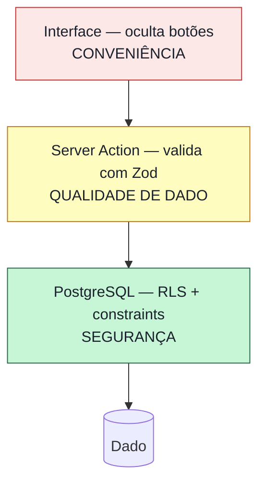
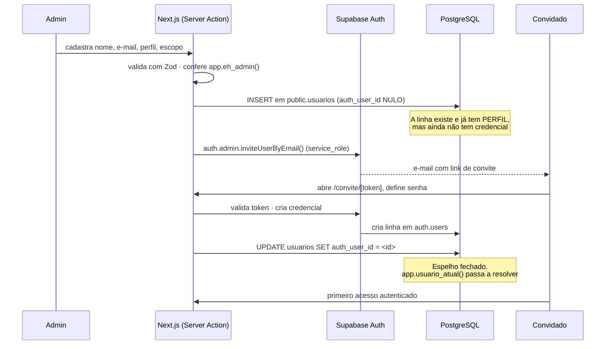

# Segurança, RLS e Autenticação — CIAARA-11 Versão 2.1

**Status:** Fase 2 — Arquitetura · **Precede:** Épico 1 (Schema + RLS) e Épico 3 (Auth + RBAC)
**Artefato executável correspondente:** `docs/sql-referencia/05_rls_policies.sql`

## Nota de migração (v2.1)

Este documento não existia na v2.0, e a ausência não era descuido: na plataforma anterior não havia
o que documentar aqui. O Apps Script autenticava pela conta Google (`Session.getActiveUser()`), a
autorização era um `if` no começo de cada função `.gs`, e o Google Sheets não tinha conceito algum de
permissão por linha. A segurança do CIAARA-11 v2.0 era, integralmente, **disciplina de código**.

A v2.1 muda a natureza da coisa. `RNF-SEG-02` — *"toda operação de escrita deve ser verificada no
servidor contra o perfil do usuário autenticado, independentemente do que a interface exibe ou
oculta"* — deixa de ser um compromisso que o desenvolvedor honra a cada função nova e passa a ser
uma **garantia do motor de banco de dados**. O PostgreSQL recusa a linha, não importa por qual
caminho a requisição chegou: Server Action, rota de API, console do Supabase ou `psql`. É a mudança
de segurança mais significativa desta versão, e é o assunto deste documento.

Uma decisão de produto muda junto: **a decisão D1 da v2.0 foi revertida em 25/08/2026**. A
autenticação deixa de ser pela conta Google e passa a ser **e-mail e senha, com conta criada
exclusivamente por convite do Administrador**. A seção 3 explica por quê, e o que se ganha e se
perde nessa troca.

---

## 1. Modelo de ameaças

Antes de escrever policy, é preciso saber contra o quê. Um modelo de ameaças honesto para este
sistema é modesto — e reconhecer isso evita gastar esforço em defesa de teatro.

### 1.1 O que o sistema é

Uma aplicação de gestão acadêmica de uma divisão (CIAARA-11) de um Centro de Instrução da Marinha.
Dezenas de usuários no máximo, todos militares ou servidores civis da própria organização, todos
identificados nominalmente. Sem cadastro público, sem página aberta, sem API para terceiros.

### 1.2 Ameaças reais, em ordem de probabilidade

| # | Ameaça | Probabilidade | Impacto | Defesa principal |
|---|---|---|---|---|
| A-1 | **Erro honesto com poder demais.** Um Operador de curso expedito edita, sem má intenção, um lançamento de curso regular que não deveria enxergar | Alta | Médio | RLS com recorte de escopo (§5) |
| A-2 | **Conta que sobrevive à pessoa.** Militar é transferido, conta continua ativa | Alta | Médio | Exclusão lógica + `ultimo_acesso` + revisão periódica (§4.4) |
| A-3 | **Vazamento de dado pessoal de militar** (nome, NIP, posto, e-mail) por hospedagem fora da infraestrutura da MB | Média | **Alto** | Pendência formal — §9 |
| A-4 | **Escalonamento de privilégio.** Usuário altera o próprio perfil para admin | Baixa | **Alto** | Gatilho `app.impedir_autoescalonamento` (§6.3) |
| A-5 | **Vazamento da chave `service_role`** para o navegador | Baixa | **Crítico** | Isolamento + regra de ESLint (§7) |
| A-6 | **Reescrita do histórico.** Alguém "corrige" `migracao_log` | Baixa | **Alto** | GRANT revogado + gatilho de bloqueio (§8.2) |
| A-7 | Senha fraca ou reutilizada | Média | Médio | Política de senha + verificação de vazamento (§4.5) |

### 1.3 O que está fora do modelo

Não são ameaças que este sistema pretenda enfrentar, e dizer isso é parte de um modelo honesto:
atacante com acesso físico ao datacenter do provedor; adversário com capacidade de Estado; negação
de serviço distribuída; e comprometimento da própria conta Supabase do Bernardo (que é a raiz de
confiança — se ela cai, tudo cai, e a defesa é MFA na conta do provedor, fora do escopo do código).

**A ameaça dominante deste sistema é a A-1: erro honesto com poder demais.** Não é sabotagem — é
um Operador com boa-fé mexendo onde não devia porque o sistema deixou. Toda a arquitetura desta
seção é desenhada primeiro contra ela, e só depois contra as outras.

---

## 2. As três camadas, e por que só uma delas é segurança



**Camada 1 — Interface.** Esconde o botão que o perfil não pode usar. É **conveniência de uso**,
não mecanismo de segurança — exatamente como `RNF-SEG-02` já dizia na v2.0. Qualquer pessoa com o
console do navegador aberto contorna esta camada em dez segundos, e isso é esperado.

**Camada 2 — Server Action.** Valida forma e coerência do dado com Zod antes de chamar o banco. É
**qualidade de dado e mensagem de erro decente**, não segurança: uma Server Action nova que esqueça
a validação produz erro feio, não brecha.

**Camada 3 — PostgreSQL.** RLS, constraints, gatilhos. **É aqui e só aqui que está a segurança.**
Se as camadas 1 e 2 desaparecessem inteiras, o sistema continuaria seguro — mais feio e menos
amigável, mas seguro.

> **A regra que resume o documento:** *nenhuma regra de autorização vive apenas na aplicação.*
> Se você consegue escrever uma condição de acesso em SQL, ela **tem** que estar em SQL. A versão
> em TypeScript é a cópia amigável; a versão em SQL é a verdadeira. É o Princípio XI da constitution
> (documento 40): **o banco é a fronteira**.

### 2.1 O bug que a v2.0 podia ter e a v2.1 não pode

Vale tornar isso concreto, porque a diferença é fácil de subestimar.

**Na v2.0.** Uma função nova em `Cronograma.gs` precisa listar os registros de aula de uma turma.
O desenvolvedor escreve a consulta, testa, funciona, faz o commit. Ele esqueceu a linha
`verificarPerfil_(e, 'registros_aula', 'ler')` no topo. Resultado: **qualquer usuário autenticado
lê o cronograma de qualquer turma, inclusive de cursos fora do escopo dele.** Nada avisa. Não há
erro, não há teste que quebre, não há revisão automática que pegue. O defeito vive até alguém
notar por acaso — e, pela natureza de um sistema de leitura, pode nunca ser notado.

**Na v2.1.** O mesmo desenvolvedor escreve a mesma consulta e esquece a mesma verificação. O
PostgreSQL aplica `registros_aula_ler` de qualquer forma, porque a policy está presa à tabela e não
ao caminho de código. O Operador de escopo expedito recebe as linhas dele — só as dele. **O
esquecimento não vira vulnerabilidade.** Na pior hipótese ele vira uma tela que mostra menos do que
deveria, e isso o usuário reporta no mesmo dia.

Essa é a diferença entre disciplina e garantia, e é o motivo de a RLS valer o custo de aprendê-la.

---

## 3. Autenticação por convite

### 3.1 Por que a decisão D1 foi revertida

A decisão D1 da v2.0 (documento 08) determinou manter a autenticação pela conta Google. **Ela
estava certa para aquela plataforma.** `Session.getActiveUser()` era nativo do Apps Script, custava
zero, não exigia gestão de senha e reaproveitava a conta institucional que todo mundo já tinha.

Fora do runtime Apps Script, cada um desses motivos desaparece:

| Motivo da D1 (2026) | Situação na v2.1 |
|---|---|
| Mecanismo nativo, custo zero de implementação | Fora do Apps Script, integrar Google OAuth é trabalho igual ou maior que e-mail/senha |
| Sem gestão de senha | O Supabase Auth gerencia hash, rotação e recuperação — não é mais código nosso |
| Reaproveita a conta institucional | Depende de o CIAARA operar Google Workspace institucional para **todos** os perfis. Instrutores da reserva e servidores civis podem não ter conta institucional |
| Sem senha na planilha | O conceito deixou de existir: não há mais planilha |

Some-se a isso o motivo positivo: **o CIAARA-11 passa a controlar o próprio ciclo de vida de
conta.** Convidar, desativar e reativar deixam de depender de um diretório externo que a divisão
não administra.

### 3.2 O que se ganha e o que se perde

**Ganha:** independência de provedor externo de identidade; conta para quem não tem e-mail
institucional; desativação imediata sob controle da própria divisão; e um fluxo de convite que
força o cadastro do perfil *antes* do primeiro acesso — o Admin decide o poder da conta antes de a
pessoa entrar, em vez de depois.

**Perde:** o login sem senha, que era mais cômodo; e ganha-se a responsabilidade de política de
senha e recuperação, que antes era do Google. A mitigação está em §4.5 e é modesta porque o
Supabase entrega quase tudo pronto.

**Registro para o futuro:** a reversão da D1 **não fecha a porta** para Google OAuth. O Supabase
Auth suporta os dois métodos na mesma base de usuários. Se um dia o CIAARA padronizar contas
institucionais para todos os perfis, acrescentar o provedor Google é configuração, não migração —
`public.usuarios` continua igual, porque ela guarda perfil, não credencial.

### 3.3 O fluxo de convite



**A janela entre o cadastro e o aceite é deliberada, não um efeito colateral.** Nela a linha existe
em `public.usuarios` com perfil e escopo definidos, mas sem `auth_user_id` — logo
`app.usuario_atual()` não resolve e a conta não alcança nada. É esse intervalo que permite ao Admin
revisar, corrigir ou cancelar o perfil **antes** de a pessoa conseguir entrar. Uma conta nunca
existe com poder indefinido.

### 3.4 Signup público desabilitado

No painel do Supabase, **`Enable Sign Ups` deve ficar desligado**. Não é detalhe de configuração: é
o que impede que qualquer pessoa com o endereço da aplicação crie uma credencial. Com ele ligado,
`auth.users` aceita cadastros — e embora a pessoa não alcançasse dado algum (sem linha em
`public.usuarios`, `app.usuario_atual()` devolve `NULL` e nenhuma policy concede acesso a `NULL`,
verificado pelo teste T-09), ela teria credencial válida no projeto, o que é lixo desnecessário e
superfície de ataque gratuita.

**Item de checklist do Épico 3, verificável no painel. Não há como garanti-lo por código.**

---

## 4. Ciclo de vida da conta

### 4.1 Criação
Somente por convite do Admin, conforme §3.3. Não há autocadastro, não há importação em massa fora
do ETL de migração.

### 4.2 Primeiro acesso
A pessoa define a senha em `/convite/[token]`. O token é o do Supabase Auth, com validade padrão de
24 horas — configurável, e recomenda-se manter curto. Convite expirado é reenviado pelo Admin, não
renovado pelo próprio convidado.

### 4.3 Recuperação de senha
Fluxo padrão do Supabase (`resetPasswordForEmail`), com uma restrição: **o e-mail só dispara se
existir linha ativa em `public.usuarios`**. Isso evita que uma credencial órfã (conta desativada no
domínio, mas ainda em `auth.users`) recupere acesso.

### 4.4 Desativação
`UPDATE public.usuarios SET status = 'inativo'` — **nunca DELETE**. Três motivos, nesta ordem:

1. `criado_por` e `editado_por` de milhares de lançamentos referenciam a linha. Apagá-la orfanaria
   o histórico de autoria, violando `RNF-CONF-01` e `RNF-AUD-01`.
2. A FK `auth_user_id → auth.users(id)` é `ON DELETE RESTRICT` — o banco recusaria de qualquer forma.
3. É a convenção C-05 do sistema, sem exceção.

O efeito é imediato e não depende de sessão: `app.usuario_atual()` filtra por `status = 'ativo'`,
então o token que a pessoa já tem no navegador para de resolver na consulta seguinte. **Verificado
pelo teste T-11.**

> **Pendência operacional.** Nenhum documento define quem revisa contas inativas nem com que
> periodicidade. `usuarios.ultimo_acesso` é o insumo (ameaça A-2); falta a rotina. Sugestão:
> revisão semestral pela CIAARA-11, alinhada ao ciclo do PROENS.

### 4.5 Política de senha

| Item | Decisão | Onde se configura |
|---|---|---|
| Comprimento mínimo | 12 caracteres | Painel Supabase → Auth → Policies |
| Verificação contra vazamentos | **Habilitada** (HaveIBeenPwned, nativo) | Painel Supabase |
| Composição obrigatória | **Não exigida** | — |
| Expiração compulsória | **Não** | — |
| MFA | Opcional agora; recomendado para `admin` | Painel Supabase |

As duas ausências são deliberadas e alinhadas à orientação corrente de segurança (NIST SP 800-63B):
exigir símbolo e trocar senha a cada 90 dias produz senhas piores, previsíveis e anotadas em papel.
Comprimento e verificação de vazamento defendem mais, e incomodam menos.

---

## 5. Autorização: permissão e alcance

O erro conceitual mais comum ao migrar um RBAC para RLS é tratar autorização como uma pergunta só.
São duas, e ambas precisam ser verdadeiras.

| Pergunta | Responde | Função |
|---|---|---|
| Este **perfil** pode executar esta **ação** neste **recurso**? | permissão | `app.pode(recurso, acao)` |
| Sobre **quais cursos**? | alcance | `app.cursos_do_usuario()` |

Um Operador de escopo `expedito` **pode** criar registro de aula — mas só **nas turmas dos cursos
expeditos**. Separar as duas dimensões é o que evita a explosão combinatória de 9 perfis × 5
escopos × 25 tabelas, que na prática significaria centenas de policies impossíveis de manter.

### 5.1 A matriz de permissões como dado

```sql
create table public.perfil_permissao (
  perfil     public.perfil_usuario not null,
  recurso    text not null,                       -- nome da tabela, em snake_case
  acao       text not null,                       -- ler | criar | editar | desativar
  permitido  boolean not null default false,
  constraint perfil_permissao_unica unique (perfil, recurso, acao)
);
```

Nenhuma policy do sistema contém `perfil = 'operador'`. Toda policy pergunta
`app.pode('registros_aula','criar')`, e a resposta vem desta tabela.

**A consequência prática vale a leitura duas vezes:** mudar quem pode lançar aula é um `UPDATE` em
uma linha. Não é migration, não é `DROP POLICY`/`CREATE POLICY` em produção, não é deploy, não é
janela de manutenção. É o Princípio VII (Configuração sobre Constante) aplicado à autorização — o
mesmo princípio que tirou os tetos normativos de dentro do `Código.gs` na v2.0.

Note também o vocabulário: a ação chama-se **`desativar`**, não `excluir`. A matriz precisa
descrever o que o sistema realmente faz, e este sistema não apaga nada.

### 5.2 Acrescentar um perfil sem tocar em policy

1. `ALTER TYPE public.perfil_usuario ADD VALUE 'novo_perfil';` — única parte que é migration, porque
   `perfil_usuario` é domínio normativo fechado (BRIEF §2) e criar um perfil é decisão
   organizacional, não configuração de tela.
2. `INSERT` das linhas de permissão em `perfil_permissao`.
3. Pronto. **Nenhuma policy muda.** As 68 policies existentes já sabem responder ao novo perfil,
   porque perguntam à matriz, não ao ENUM.

### 5.3 As funções de alcance

Todas em `docs/sql-referencia/04_views_e_funcoes.sql` e `docs/sql-referencia/05_rls_policies.sql`, todas `SECURITY DEFINER` e
`STABLE`:

| Função | Responde |
|---|---|
| `app.usuario_atual()` | qual linha de `usuarios` corresponde ao JWT |
| `app.perfil_atual()` | qual perfil |
| `app.pode(recurso, acao)` | a permissão, consultando a matriz |
| `app.eh_admin()` | atalho para as tabelas de fronteira de segurança |
| `app.cursos_do_usuario()` | o conjunto de cursos alcançados |
| `app.alcanca_curso(id)` | recorte direto por curso |
| `app.alcanca_turma(id)` | propaga turma → curso |
| `app.alcanca_disciplina(id)` | propaga disciplina → curso |

**Os três qualificadores são deliberados, e cada um resolve um problema específico:**

- **`SECURITY DEFINER`** faz a função rodar como dona do schema, lendo `usuarios` **sem passar pela
  RLS de `usuarios`**. É o que quebra a recursão infinita: sem isso, a policy de `usuarios` chamaria
  uma função que lê `usuarios`, que dispara a policy de `usuarios`, e o PostgreSQL aborta.
  Pelo mesmo motivo, **nenhuma dessas tabelas recebe `FORCE ROW LEVEL SECURITY`** — forçar RLS para
  o dono reintroduziria exatamente a recursão que se quer evitar.
- **`STABLE`** permite ao planejador avaliar a função uma vez por *statement* em vez de uma vez por
  linha. Numa consulta sobre 1.753 registros de aula, a diferença entre `STABLE` e `VOLATILE` é a
  diferença entre uma consulta e mil.
- **`set search_path = pg_catalog, public`** impede sequestro de nome por schema temporário — o
  vetor clássico de escalonamento de privilégio em `SECURITY DEFINER`.

### 5.4 `turma_id` nulo alcança todos, de propósito

`app.alcanca_turma(NULL)` devolve **verdadeiro**. Não é descuido: em `atividades_nao_letivas`,
`turma_id` nulo significa **escopo global** — o evento vale para todas as turmas ativas na data
(`RN-EVT-02`). Negar alcance a um evento global esconderia feriado e formatura de quem tem escopo
restrito, que é o oposto do desejado.

O contrapeso está na escrita: **criar** um evento global exige `app.pode('atividades_globais','criar')`,
permissão que o Operador não tem. Ele lança a palestra da turma dele; não decreta feriado para o
Centro inteiro. **Verificado pelo teste T-10.**

---

## 6. As policies

68 policies sobre 25 tabelas, em `docs/sql-referencia/05_rls_policies.sql`.

### 6.1 O padrão, sem exceção

| Comando | Cláusula | Avalia |
|---|---|---|
| `SELECT` | `USING` | quais linhas aparecem |
| `INSERT` | `WITH CHECK` | se a linha **nova** é aceitável |
| `UPDATE` | `USING` | qual linha pode ser tocada |
| `UPDATE` | `WITH CHECK` | **em que ela pode ser transformada** |
| `DELETE` | — | **não existe** |

**O `WITH CHECK` do `UPDATE` é a cláusula que mais gente esquece, e é a que impede a fuga de
escopo.** Sem ela, um Operador de escopo `expedito` pegaria um registro de aula que ele alcança e o
reatribuiria a uma turma de curso regular — a linha sairia do alcance dele, **levando o dado
junto**, e nenhuma verificação teria sido violada, porque a linha *original* era legítima.

É o tipo exato de defeito que a v2.0 não tinha como impedir por construção, e que aqui custa uma
cláusula. **Verificado pelo teste T-03.**

### 6.2 `FOR DELETE` não existe — e isso é a regra de negócio

Nenhuma tabela de cadastro ou de fato recebe policy de `DELETE`. Sem policy permissiva, o PostgreSQL
nega. Essa negação **é a implementação física de `RN-INST-05` generalizada** (exclusão lógica
universal, convenção C-05).

O que a interface chama de "excluir" é um `UPDATE` de `status` para `inativo`, coberto pela policy
de `UPDATE` e pela ação `desativar` da matriz.

A proteção é dupla e deliberada: o `GRANT` de `DELETE` também não é concedido a `authenticated`.
Remover uma das duas por engano não abre o caminho.

> ⚠️ **Aviso ao agente de código, e ao humano que revisa.** Um agente que encontre a ausência de
> policy de `DELETE` vai propor acrescentá-la, com boa-fé, como quem corrige um esquecimento. **É
> uma regra de negócio, não uma lacuna.** Está registrado em `docs/sql-referencia/05_rls_policies.sql` como
> comentário no ponto exato, no documento 41 (§ o que nunca delegar) e aqui. Se um PR acrescenta
> `for delete`, ele é rejeitado sem discussão.

### 6.3 Escalonamento de privilégio: por que policy não basta

A policy `usuarios_editar` permite que a pessoa mantenha o próprio cadastro — nome de exibição, por
exemplo. Sem mais nada, ela também poderia executar:

```sql
update public.usuarios set perfil = 'admin' where id = <o próprio>;
```

**A policy aprovaria.** A linha continua sendo dela; `USING` e `WITH CHECK` avaliam a linha inteira
e não sabem o que mudou. Este é o buraco clássico de RLS em tabela de usuário.

Ele não se fecha com policy. Fecha-se com gatilho, porque só o gatilho enxerga `OLD` e `NEW`:

```sql
create or replace function app.impedir_autoescalonamento()
returns trigger language plpgsql security definer
set search_path = pg_catalog, public as $$
begin
  -- Contexto de servidor (ETL, service_role, painel do Supabase): não há JWT, logo não há
  -- "próprio usuário" a proteger de si mesmo. Liberar aqui é necessário, não frouxidão —
  -- sem isto nem o ETL grava o perfil dos usuários migrados, nem o Admin desativa conta
  -- pelo painel. E `anon` não recebe GRANT nesta tabela, então a única forma de chegar
  -- aqui sem JWT é já estar do lado do servidor.
  if app.uid_atual() is null then return new; end if;

  if app.eh_admin() then return new; end if;

  if new.perfil       is distinct from old.perfil
  or new.escopo_curso is distinct from old.escopo_curso
  or new.status       is distinct from old.status then
    raise exception 'Alteração de perfil, escopo ou status exige o perfil admin (RN-RBAC-02).'
      using errcode = '42501';
  end if;

  return new;
end;
$$;
```

**Verificado pelo teste T-05.** É o teste mais importante da suíte.

### 6.4 As três tabelas de fronteira

`perfil_permissao`, `usuarios` e `usuario_curso` são as únicas do sistema presas diretamente ao
perfil, por `app.eh_admin()`, em vez de consultarem a matriz. O motivo é circularidade: **a matriz
não pode ser a autoridade sobre quem edita a matriz.** Quem escreve em `perfil_permissao` pode se
autoconceder qualquer permissão — é a fronteira, e ela precisa de uma âncora fora do sistema que
governa. **Verificado pelo teste T-06.**

A leitura de `perfil_permissao`, em compensação, é liberada a qualquer sessão autenticada: a
interface precisa saber quais botões mostrar, e a matriz não contém dado sensível — contém a
definição pública das regras. Escondê-la seria segurança por obscuridade sem ganho algum, já que a
RLS protege o dado mesmo com a matriz à vista.

---

## 7. Gestão de segredos

### 7.1 As duas chaves

| Chave | Onde pode aparecer | O que faz |
|---|---|---|
| `NEXT_PUBLIC_SUPABASE_ANON_KEY` | navegador, repositório, qualquer lugar | Identifica o projeto. **Sujeita à RLS** — é por isso que pode ser pública |
| `SUPABASE_SERVICE_ROLE_KEY` | **apenas** variável de ambiente do servidor | **Ignora a RLS inteira.** É a chave do reino |

A `anon key` ser pública não é descuido do Supabase: ela não concede nada por si: todo acesso que
ela viabiliza passa pelas policies. É exatamente o modelo desta arquitetura.

### 7.2 A regra e como ela é garantida

**`lib/supabase/admin.ts` — o único arquivo que lê `SUPABASE_SERVICE_ROLE_KEY` — nunca é importado
por um Client Component.**

Três defesas em profundidade, porque a A-5 é de probabilidade baixa e impacto crítico:

1. **Convenção de nome.** A variável não tem prefixo `NEXT_PUBLIC_`, então o Next.js **não** a
   injeta no bundle do cliente. Se um Client Component tentar lê-la, recebe `undefined` — falha
   ruidosa, não vazamento silencioso.
2. **`import 'server-only'`** no topo de `lib/supabase/admin.ts`. Qualquer importação a partir de um
   Client Component vira **erro de build**, não erro de execução. O deploy não sai.
3. **Regra de ESLint** (`no-restricted-imports`) barrando o caminho em arquivos com `"use client"`,
   para que o erro apareça no editor antes do build.

Detalhe do fluxo de convite: `auth.admin.inviteUserByEmail()` **exige** `service_role`. Ela roda
dentro de uma Server Action, que confere `app.eh_admin()` antes — a Server Action é o único lugar
do sistema onde a chave é legitimamente usada, e é por isso que ela merece revisão linha a linha
sempre que mudar (documento 41).

### 7.3 O `GRANT` que ninguém lembra e derruba tudo

**RLS é um filtro sobre um privilégio que já existe — ela não concede nada por si.** Sem `GRANT`,
`authenticated` recebe `permission denied for table`, não a linha filtrada. É a confusão nº 1 de
quem escreve RLS pela primeira vez: a policy está correta e a consulta falha mesmo assim.

E há uma armadilha específica do Supabase que **a validação desta arquitetura encontrou na prática**:

> No Supabase, `unaccent`, `btree_gist` e `pg_trgm` vivem no schema **`extensions`**, não em
> `public`. A função `app.normalizar_texto()` chama `extensions.unaccent()`, e essa chamada roda no
> contexto de **quem faz o INSERT**, não de quem definiu a função. Sem
> `grant usage on schema extensions to authenticated`, **todo INSERT de usuário autenticado falha**
> com `permission denied for schema extensions`.
>
> O defeito é traiçoeiro porque **o ETL roda como dono do schema e passa**; a aplicação da migration
> passa; o seed passa. Só o usuário real quebra — em produção, no primeiro cadastro.
>
> Foi encontrado pelo teste T-04 desta suíte, rodando contra um PostgreSQL 16 com sessão autenticada
> de verdade. Nenhuma revisão de código o teria pego. É a justificativa concreta da exigência de
> teste negativo do BRIEF §7.4.

---

## 8. Auditoria

### 8.1 Autoria automática

Toda tabela transacional carrega `criado_por`, `criado_em`, `editado_por`, `editado_em`, preenchidos
pelo gatilho `app.set_auditoria()` a partir de `auth.uid()`. Preserva `RNF-AUD-01` e estende a
todas as operações de escrita o padrão que a v1.0 tinha só em lançamento de aula (`RNF-AUD-02`).

**A armadilha do ETL, já resolvida.** O ETL roda **sem sessão autenticada**, então `auth.uid()`
devolve `NULL`. A implementação original de `set_auditoria()` usava `jsonb_set`, que é `STRICT`: um
`NULL` anulava o acumulador inteiro e **descartava todos os carimbos de auditoria — exatamente no
caminho do ETL**. Corrigido com o invólucro `app.jsonb_valor()` (arquivo 00), com a armadilha
documentada no código. Fica registrado aqui porque é o mesmo padrão de defeito do gatilho de
escalonamento (§6.3): **função que assume sessão autenticada quebra no caminho de servidor**, e é
sempre o caminho menos testado.

### 8.2 O histórico é imutável

`migracao_log` e `arquivo_avaliacoes_v1` são somente leitura para `authenticated`:

- `GRANT` de `INSERT`/`UPDATE` **revogado** explicitamente.
- Gatilho `app.bloquear_reescrita` impede `UPDATE` **mesmo para `service_role`**.
- Policy apenas de `SELECT`, condicionada a `app.pode('auditoria','ler')`.

É o Princípio IV da constitution. `migracao_log` é a evidência auditável de que 100% do histórico
foi transportado; uma linha reescrita destrói a evidência sem deixar rastro. **Corrigir o passado
reescrevendo log é sempre proibido — o jeito certo é logar a correção como evento novo.**
**Verificado pelo teste T-08.**

---

## 9. Dado pessoal de militar — pendência formal, não detalhe

O sistema armazena, de 177 instrutores e de todos os usuários: **nome completo, nome de guerra,
NIP, posto/graduação, data de nascimento, e-mail, OM, divisão, formação e capacitação didática.**

Isso já era verdade na v2.0. O que muda na v2.1 é **onde o dado reside**: sai do Google Drive
institucional e passa a residir em **Supabase (banco) e Vercel (aplicação)** — dois provedores
comerciais, com armazenamento fora da infraestrutura da Marinha do Brasil.

**A migração de plataforma não altera a classificação do dado. Altera a localização dele — e essa
é exatamente a informação que a autoridade competente precisa ter para se pronunciar.**

| Item | Situação |
|---|---|
| Classificação do dado | Inalterada em relação à v2.0 |
| Base legal (LGPD) | Execução de política pública / atribuição legal da administração — a mesma da v2.0 |
| **Localização física** | **Muda.** Selecionar região do projeto Supabase em **São Paulo (`sa-east-1`)**, não em região estrangeira |
| **Ciência da CIAARA-14.2** (Tecnologia da Informação) | **PENDENTE.** Pode exigir anuência formal |
| Criptografia em repouso e em trânsito | Nativa em ambos os provedores (AES-256 / TLS 1.2+) |
| Retenção e descarte | Não definida. Hoje o sistema nunca apaga — é preciso decidir se isso é conforme |
| Registro de acesso a dado pessoal | Parcial (`ultimo_acesso`, `criado_por`/`editado_por`). Não há log de *leitura* |

> **Esta é a única pendência deste documento que pode bloquear a v2.1 por razão não técnica.**
> Recomendação: levar a questão à CIAARA-14.2 **antes do Épico 2 (ETL)**, e não depois — o Épico 2
> é o momento em que dado pessoal real sai do Drive institucional e entra no Supabase. Antes dele,
> a migração é reversível sem consequência; depois, o dado já saiu.
>
> Se a resposta for negativa, existe um caminho alternativo conhecido: **Supabase self-hosted** em
> infraestrutura da MB. A arquitetura desta versão não muda — schema, RLS, funções e aplicação são
> idênticos; muda só onde o PostgreSQL roda. É um custo operacional real, mas não uma reescrita.

---

## 10. Testes de segurança

### 10.1 Por que teste negativo é obrigatório

Testar que o Operador **consegue** ler a turma dele não prova nada sobre segurança — **uma policy
`using (true)` passa nesse teste.** O que prova é o contrário: que ele **não** consegue ler a turma
alheia.

**Uma suíte de RLS só com caminho feliz é uma suíte que aprova uma RLS desligada.** Por isso o
BRIEF §7.4 exige, para cada perfil, o que ele *não* pode — e por isso o item entra na Definition of
Done.

### 10.2 A suíte

Doze testes em `docs/sql-referencia/05_rls_policies.sql`, Parte VI, para portar a `tests/invariantes/rls.test.sql`.
Padrão de execução em transação descartável:

```sql
begin;
  set local role authenticated;
  set local request.jwt.claims to '{"sub":"<auth_user_id do perfil sob teste>"}';
  -- consulta
rollback;
```

| # | Verifica | Resultado |
|---|---|---|
| T-01 | Operador `expedito` não enxerga turma de curso regular | ✅ passou |
| T-02 | Operador não cria registro fora do escopo | a portar |
| T-03 | **Fuga de escopo por UPDATE** — só o `WITH CHECK` pega | a portar |
| T-04 | Perfil `visualizacao` não escreve em lugar nenhum | ✅ passou — **encontrou o defeito do schema `extensions`** |
| T-05 | **Escalonamento de privilégio** | ✅ passou |
| T-06 | Só o admin escreve na matriz de permissões | ✅ passou |
| T-07 | `DELETE` impossível em toda tabela | ✅ passou |
| T-08 | `migracao_log` imutável | a portar |
| T-09 | Sessão sem linha em `usuarios` não alcança nada | ✅ passou |
| T-10 | Operador não cria atividade de escopo global | a portar |
| T-11 | Usuário desativado perde acesso imediatamente | ✅ passou — **encontrou o defeito do gatilho no contexto de servidor** |
| T-12 | Encarregado de Curso vê só os cursos vinculados | a portar |

### 10.3 Estado da validação

As seis migrations (`00` a `05`) foram aplicadas em ordem contra um **PostgreSQL 16 real**, com
stubs de `auth.users`, `auth.uid()` e dos papéis `anon`/`authenticated`/`service_role`. Oito testes
foram executados com sessão autenticada de verdade; todos passam, mais o controle positivo (admin
enxerga os dois cursos).

**Os dois defeitos que a validação encontrou eram bugs de produção**, ambos invisíveis em revisão de
código e ambos no caminho menos testado — o de servidor:

1. **`permission denied for schema extensions`** — quebraria *todo* cadastro feito por usuário real,
   passando por ETL, migration e seed sem sinal algum. Corrigido com `GRANT` condicional (§7.3).
2. **Gatilho anti-escalonamento bloqueando o próprio ETL e o painel administrativo** — impediria a
   carga dos usuários migrados e a desativação de conta pelo Supabase Studio. Corrigido com a
   liberação explícita de contexto sem JWT (§6.3).

Ambas as correções estão em `docs/sql-referencia/05_rls_policies.sql`, comentadas no ponto exato, com o teste que
as encontrou nomeado.

---

## 11. Pontos que precisam de decisão do Bernardo

| # | Ponto | Situação atual | Por que importa |
|---|---|---|---|
| 1 | **Hospedagem fora da infraestrutura da MB** (§9) | Pendente na CIAARA-14.2 | É a única pendência capaz de bloquear a versão por razão não técnica. Decidir **antes do Épico 2** |
| 2 | **Escrita da CIAARA-11 em tabelas de fato** | A matriz do documento 01, lida ao pé da letra, **não** dá escrita em `registros_aula`, `avaliacoes` e `atividades_nao_letivas` ao Encarregado e ao Ajudante da própria divisão — o dono do sistema não poderia lançar aula. Parece artefato da leitura. **Concedida no seed, marcada `(a)`** | Se a leitura literal for a correta, remover as linhas `(a)` de `docs/sql-referencia/05_rls_policies.sql` |
| 3 | **Quem administra `calendario` e `parametros`** | Nenhum documento designa. **Atribuído à CIAARA-11 e ao Admin, marcado `(b)`** | São os tetos normativos e o PROENS anual — um valor errado não gera erro, gera número errado em relatório assinado |
| 4 | **Encarregado × Ajudante** | Permissão **idêntica** — a matriz da v2.0 não os distingue em área de dados alguma | Manter idêntico é fidelidade ao documento. Distinguir é decisão nova a registrar |
| 5 | **Revisão de contas inativas** (§4.4) | Sem rotina definida | Ameaça A-2. Sugerido: semestral, alinhado ao PROENS |
| 6 | **MFA para o perfil `admin`** | Opcional | Baixo atrito, defende a conta de maior poder |
| 7 | **Retenção e descarte de dado pessoal** | Indefinida — o sistema nunca apaga | Pode ser exigência de conformidade, não escolha de arquitetura |

---

## Rastreabilidade

**Requisitos e regras implementados por este documento:**
`RNF-SEG-01` (revisado — e-mail/senha por convite) ·
`RNF-SEG-02` **[ABSORVIDO PELA PLATAFORMA]** — vira RLS ·
`RNF-SEG-03` (lock → transação PostgreSQL) ·
`RNF-SEG-04` **[ABSORVIDO]** — não há como uma refatoração expor escrita sem policy ·
`RNF-SEG-05` (teste por perfil × área × escopo — §10) ·
`RNF-AUD-01`, `RNF-AUD-02` (§8.1) ·
`RNF-CONF-01` (§4.4, §8.2) ·
`RN-RBAC-01`, `RN-RBAC-02` (§5) ·
`RN-INST-05` generalizada (§6.2) ·
`RN-EVT-02` (§5.4) ·
`RF-AUTH-01` a `RF-AUTH-10` (§3, §4) ·
**[REVOGADO — v2.1]** decisão D1 da v2.0 (§3.1).

**Artefatos:** `docs/sql-referencia/05_rls_policies.sql` · documento 01 §2.2 (matriz) · documento 20 §8 · documento 40
(Princípio XI) · documento 41 (o que nunca delegar ao agente).

*Fim do documento 22.*
