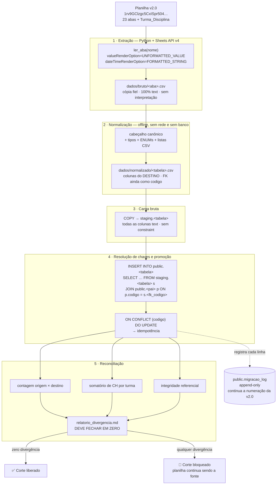

# Plano de Migração e ETL — CIAARA-11 v2.1

## Nota de migração (v2.1)

Este documento descreve o **Épico 2** da v2.1: o transporte integral da base de produção da v2.0
— a planilha Google Sheets `Banco de dados CIAARA-11 v2.0` — para o PostgreSQL do Supabase, cujo
schema já existe, já foi escrito e **já aplicou limpo em um PostgreSQL 16 real** (arquivos `00` a
`05` em `supabase/migrations/`).

Três coisas precisam ficar claras logo de saída, porque mudam a natureza do trabalho:

1. **Esta migração não redesenha nada.** O redesenho aconteceu na v2.0, e está documentado em
   `docs/arquitetura/01-schema.md` §6. Aquilo foi uma migração *de conteúdo*: recategorizou 663
   eventos, fundiu 111 agendamentos com 186 execuções, despivotou uma aba, corrigiu chaves órfãs.
   Esta aqui é uma migração *de plataforma*: o mesmo dado, já saneado, muda de motor. Se alguma
   linha precisar de decisão semântica durante o ETL, isso é sintoma de que algo escapou do Épico C
   da v2.0 — e a resposta correta é registrar em `migracao_log` e **perguntar ao Bernardo**, nunca
   inferir. **[PRESERVADO]** todo o saneamento da v2.0.

2. **O ponto difícil não é o volume, é a chave.** São ~5.400 linhas no total (BRIEF §10) — uma base
   pequena, que carrega em segundos. O que exige rigor é que **toda FK da origem é o `ID_*` textual**
   (`CUR-000001`, `VIN-000123`, `TDI-000045`) e **todo alvo é `uuid`**, com o código legado
   preservado ao lado em `codigo text unique not null` (BRIEF §2). A §2 deste documento é sobre isso,
   e é a seção que decide se o ETL funciona ou produz 5.400 linhas com FK plausível e errada.

3. **O ETL roda sem sessão autenticada, e isso já quebrou duas coisas.** Ele executa como
   `service_role` / dono do schema, contexto em que `auth.uid()` é `NULL`. Dois defeitos reais
   nasceram exatamente daí, foram encontrados na validação do schema contra o PostgreSQL 16 e
   corrigidos. A §3 os registra como **armadilha conhecida**, com o que o ETL precisa verificar
   depois da carga para provar que a correção continua no lugar. **[NOVO — v2.1]**

**Ordem no roteiro (BRIEF §8):** Épico 2 vem **antes** do Épico 3 (Auth/RBAC). Sem dado migrado não
há o que proteger, e testar RLS contra uma base vazia aprova qualquer policy.

---

## 1. Estratégia geral

### 1.1 As cinco etapas, e por que são cinco e não três

A tentação é colapsar em três ("lê, transforma, grava"), e deve ser resistida: cada fronteira aqui
produz um **artefato inspecionável**, que é o que permite responder "onde exatamente errou?" sem
reexecutar tudo.

| # | Etapa | Entrada | Saída (artefato) | Reexecutável sozinha? |
|---|---|---|---|---|
| 1 | **Extração** | Google Sheets API v4 | `dados/bruto/<aba>.csv` — cópia fiel, tudo texto | Sim (é a única etapa que depende da rede) |
| 2 | **Normalização** | `bruto/*.csv` | `dados/normalizado/<tabela>.csv` — colunas de destino, tipos textuais canônicos | Sim, offline |
| 3 | **Carga (staging)** | `normalizado/*.csv` | Tabelas `staging.*` no PostgreSQL, tudo `text` | Sim (`truncate` + `COPY`) |
| 4 | **Resolução e promoção** | `staging.*` | Tabelas `public.*` com FK `uuid` resolvidas | Sim (idempotente por `codigo`) |
| 5 | **Reconciliação** | `public.*` × `staging.*` | `relatorio_divergencia.md` + saída SQL | Sim, é só leitura |

A etapa 3 é a que mais gente corta, e é a que mais paga. Colocar o CSV bruto dentro do banco, como
texto, antes de qualquer conversão, transforma toda a §7 (reconciliação) em consulta SQL de duas
tabelas no mesmo motor — em vez de uma comparação entre um `dict` Python e um `SELECT`, que é
justamente o tipo de comparação que passa quando não deveria.

### 1.2 Diagrama do pipeline



### 1.3 Por que Python, e por que não Apps Script nem `psql` puro

**[PRESERVADO]** O BRIEF §1 já decidiu: ETL em Python, reaproveitando o padrão de `migracao/*.py`
da v2.0, que tem um `_util_migracao.py` compartilhado e ~15 scripts de missão única, cada um com
backup, execução e gravação em `_Migracao_Log`. Esse padrão funcionou para **1.060+ linhas de log**
sem um único incidente de dado perdido. Reaproveitá-lo é preservar disciplina comprovada, não
economia de esforço.

Apps Script está fora porque a v2.1 está justamente saindo dele, e porque `UrlFetchApp` contra o
Supabase teria de reimplementar autenticação de service role sem biblioteca. `psql` puro com `\copy`
está fora porque as transformações da §6 (listas CSV → `uuid[]`, mapeamento de ENUM com valor
inesperado, fuso horário) são lógica condicional, e lógica condicional em SQL de migração é o
caminho mais curto para uma migração que ninguém consegue ler seis meses depois.

---

## 2. O problema central: `codigo` textual → `id uuid`

### 2.1 O que exatamente é o problema

Na planilha, `Registro_Aulas_E_Atividades.ID_Turma` contém a string `TUR-000017`. No PostgreSQL,
`registros_aula.turma_id` é `uuid NOT NULL REFERENCES turmas(id)`. A string `TUR-000017` **não é** o
`uuid` — ela vive em `turmas.codigo`, que é `text unique not null` (BRIEF §2; documento 21 §9.1).

Isso vale para **todas** as FKs do sistema. São 5.400 linhas em que pelo menos uma coluna precisa
trocar de domínio antes de poder ser gravada. E há um agravante: `turmas.id` só existe **depois** de
`turmas` ser carregada, porque é `gen_random_uuid()` — o valor não é conhecido por ninguém antes do
`INSERT`.

Três desenhos resolvem isso. Vale comparar os três antes de escolher.

### 2.2 Estratégia 1 — duas passadas (carrega com `codigo`, resolve a FK depois)

A ideia: carregar `registros_aula` com uma coluna auxiliar `turma_codigo text` e `turma_id` nulo;
depois `UPDATE … SET turma_id = t.id FROM turmas t WHERE t.codigo = r.turma_codigo`; por fim,
remover a coluna auxiliar.

**Por que não.** `registros_aula.turma_id` é `NOT NULL`. Para a primeira passada funcionar seria
preciso `DROP NOT NULL` antes e `SET NOT NULL` depois — **desligar durante a carga exatamente a
garantia que a migração existe para instalar**. E não é uma coluna: são 19 FKs `NOT NULL` no schema.
Uma janela em que o banco aceita FK nula é uma janela em que o erro de resolução não é detectado
quando acontece; vira linha nula que alguém descobre semanas depois. Pior: o `SET NOT NULL` final
varre a tabela inteira e falha *no fim*, quando já não se sabe qual passada errou.

A variante menos ruim — colunas auxiliares temporárias em vez de relaxar `NOT NULL` — exige
`ALTER TABLE` de ida e volta em 12 tabelas, deixando o schema temporariamente diferente do que está
versionado. Migração que altera o schema alvo para poder rodar é migração que não roda de novo igual.

### 2.3 Estratégia 2 — tabela de mapeamento explícita

Uma tabela `staging.mapa_chave (tabela, codigo_v1, id uuid)`, populada na carga de cada pai e
consultada na de cada filha.

**É correta**, e é a escolha certa quando o alvo *não* preserva a chave legada. Aqui é redundante, e
a redundância custa: o mapa é uma **segunda fonte de verdade** sobre `codigo → id`, que diverge da
tabela real se alguém rodar carga parcial (BRIEF §2; documento 21 §9.3).

### 2.4 Estratégia 3 — `uuid` determinístico (`uuid5`) — **rejeitada**

`id = uuid5(NAMESPACE_CIAARA, f"turmas:{codigo}")`, calculado em Python. FK resolve sem tocar o
banco e reexecutar produz o mesmo `uuid`.

**Por que não**, apesar de elegante: acopla a chave substituta ao código legado. O documento 21 §9.1
escolheu `uuid` + `codigo` justamente para que **corrigir um código não propague**. Com `uuid5`,
corrigir `ID_Curso` mudaria o `uuid` — o defeito que a decisão evitava, reintroduzido pela porta dos
fundos. Fica registrada como alternativa considerada, não como opção viva.

### 2.5 **Escolha: Estratégia 2, na forma em que ela já existe** — `codigo` *é* o mapa

A decisão é a Estratégia 2, com uma observação que simplifica tudo:

> **`codigo text unique not null` já é a tabela de mapeamento.** Ela existe em toda tabela migrada,
> está indexada por `UNIQUE`, e não pode divergir da linha porque **é** a linha.

Consequência prática: não se cria `staging.mapa_chave`. Cada tabela-filha é carregada com um
`INSERT ... SELECT` que faz `JOIN` da staging contra a tabela-pai **por `codigo`**, e a FK resolve
dentro do próprio comando, na mesma transação. Uma passada por tabela, sem coluna auxiliar, sem
`ALTER TABLE`, sem `NOT NULL` relaxado, com o motor recusando qualquer linha cujo pai não exista.

E o ganho decisivo: um `JOIN` (não `LEFT JOIN`) **descarta silenciosamente** a linha órfã, o que
seria péssimo — então o padrão obrigatório é `LEFT JOIN` + um `SELECT` de verificação prévio que
lista os órfãos e **aborta a transação** se houver algum. A §7.3 traz essa consulta.

**Único requisito de ordem:** a tabela-pai tem de estar carregada antes da filha. É a §4.

### 2.6 O código, comentado

```python
# scripts/etl/_comum.py  (trecho — resolução de chaves)
# ---------------------------------------------------------------------------------
# O QUÊ  : promove uma tabela de `staging` (tudo texto, FK como código legado) para
#          `public` (tipada, FK como uuid), resolvendo as chaves estrangeiras por JOIN.
# PARA QUÊ: é o coração do ETL. Toda tabela do sistema passa por esta função — o que
#          garante que a política de resolução de chave, idempotência e log seja
#          EXATAMENTE a mesma nas 24 tabelas, e não 24 variações parecidas.
# COMO   : monta um INSERT ... SELECT ... LEFT JOIN por código, precedido de uma
#          verificação de órfãos que aborta a transação antes de gravar qualquer linha.
# ---------------------------------------------------------------------------------

from dataclasses import dataclass, field
from typing import Iterable
import psycopg


@dataclass(frozen=True)
class ChaveEstrangeira:
    """Descreve UMA FK a resolver: 'a coluna X do destino sai do código guardado em Y'."""
    coluna_destino: str      # ex.: 'turma_id'      — coluna uuid em public.<tabela>
    coluna_staging: str      # ex.: 'turma_codigo'  — coluna text em staging.<tabela>
    tabela_pai: str          # ex.: 'turmas'        — onde procurar o `codigo`
    obrigatoria: bool = True # False = código vazio é legítimo (ex.: fiscal_id, turma_id global)


@dataclass(frozen=True)
class Promocao:
    """Descreve a promoção completa de UMA tabela: staging -> public."""
    tabela: str                                  # nome idêntico nos dois schemas
    colunas_diretas: tuple[str, ...]             # copiadas 1:1, com CAST pelo tipo do destino
    fks: tuple[ChaveEstrangeira, ...] = ()
    expressoes: dict[str, str] = field(default_factory=dict)
    # `expressoes` = coluna do destino -> expressão SQL sobre o alias `s` (a staging).
    # É o escape para tudo que não é cópia direta: ENUM mapeado, data com fuso,
    # `Status` vazio virando 'ativo'. Fica em SQL, à vista, e não escondido em Python.


def _verificar_orfaos(cur: psycopg.Cursor, p: Promocao) -> list[str]:
    """
    O QUÊ  : lista os códigos de FK que NÃO encontram pai.
    PARA QUÊ: um LEFT JOIN sem esta verificação grava `NULL` numa FK opcional e
              ESTOURA numa FK obrigatória — mas estoura no meio da carga, sem dizer
              QUAIS linhas. Aqui a resposta vem antes, completa e legível.
    COMO   : uma consulta por FK, `where pai.id is null and s.<col> <> ''`.
    """
    problemas: list[str] = []
    for fk in p.fks:
        cur.execute(f"""
            select s.{fk.coluna_staging} as codigo_orfao, count(*) as linhas
              from staging.{p.tabela} s
              left join public.{fk.tabela_pai} pai
                     on pai.codigo = nullif(btrim(s.{fk.coluna_staging}), '')
             where nullif(btrim(s.{fk.coluna_staging}), '') is not null
               and pai.id is null
             group by 1
             order by 2 desc
        """)
        for codigo_orfao, linhas in cur.fetchall():
            problemas.append(
                f"{p.tabela}.{fk.coluna_staging} = '{codigo_orfao}' "
                f"não existe em {fk.tabela_pai}.codigo ({linhas} linha(s))"
            )
    return problemas


def promover(cur: psycopg.Cursor, p: Promocao) -> int:
    """
    O QUÊ  : executa a promoção de uma tabela e devolve o número de linhas afetadas.
    PARA QUÊ: ponto ÚNICO em que dado entra em `public`. Um só lugar para auditar.
    COMO   : verifica órfãos -> monta INSERT ... SELECT -> ON CONFLICT (codigo) DO UPDATE.
    """
    # --- 1. Portão de órfãos ------------------------------------------------------
    # Roda ANTES de qualquer INSERT. Como toda a carga vive numa transação única
    # (ver executar.py), levantar aqui desfaz tudo e a base fica intocada.
    orfaos = _verificar_orfaos(cur, p)
    if orfaos:
        raise ValueError(
            f"[{p.tabela}] {len(orfaos)} chave(s) estrangeira(s) órfã(s). "
            "A carga foi abortada ANTES de gravar. Detalhe:\n  - " + "\n  - ".join(orfaos)
        )

    # --- 2. Colunas do destino, na ordem em que serão listadas no INSERT ----------
    destino: list[str] = [*p.colunas_diretas, *p.expressoes.keys(),
                          *(fk.coluna_destino for fk in p.fks)]

    # --- 3. Expressões do SELECT, na MESMA ordem ---------------------------------
    #   - coluna direta  : `nullif(btrim(s.col), '')` — a planilha entrega '' onde
    #     deveria haver NULL; sem o `nullif`, um `''::date` estoura e um `''::text`
    #     grava string vazia, que passa em `NOT NULL` e é mentira.
    #   - expressão      : SQL literal, escrito no módulo da tabela.
    #   - FK             : `pai_<n>.id`, vindo do LEFT JOIN abaixo.
    select: list[str] = [f"nullif(btrim(s.{c}), '')" for c in p.colunas_diretas]
    select += list(p.expressoes.values())
    select += [f"pai_{i}.id" for i, _ in enumerate(p.fks)]

    joins = "\n".join(
        f"left join public.{fk.tabela_pai} pai_{i} "
        f"on pai_{i}.codigo = nullif(btrim(s.{fk.coluna_staging}), '')"
        for i, fk in enumerate(p.fks)
    )

    # --- 4. Idempotência ---------------------------------------------------------
    # `codigo` é UNIQUE. Rodar duas vezes NÃO duplica: a segunda execução cai no
    # DO UPDATE e reescreve as mesmas colunas com os mesmos valores.
    # `id`, `codigo`, `criado_em` e `criado_por` ficam FORA do SET de propósito:
    #   - `id`/`codigo`  : mudar a identidade da linha não é atualizar, é trocar de linha;
    #   - `criado_*`     : o gatilho `app.set_auditoria()` já os força de volta ao valor
    #                      de OLD em qualquer UPDATE (documento 21 §8.1). Listá-los aqui
    #                      seria escrever o que o motor vai desescrever — ruído.
    atualizaveis = [c for c in destino if c not in ("id", "codigo", "criado_em", "criado_por")]
    set_clause = ", ".join(f"{c} = excluded.{c}" for c in atualizaveis)

    sql = f"""
        insert into public.{p.tabela} ({", ".join(destino)})
        select {", ".join(select)}
          from staging.{p.tabela} s
          {joins}
        on conflict (codigo) do update set {set_clause}
    """
    cur.execute(sql)
    return cur.rowcount
```

**O que este desenho garante, e que vale enunciar:** a FK nunca é resolvida em Python. Ela é
resolvida pelo `JOIN`, dentro da mesma transação em que a linha é gravada, contra o estado real do
banco naquele instante. Não existe um `dict` em memória que possa estar desatualizado, e não existe
o cenário — clássico e caro — de um mapa carregado no início da execução que já não descreve o banco
no fim dela.

### 2.7 As duas FKs que **não** são resolvidas por `codigo`

Duas colunas fogem do padrão e precisam de tratamento nomeado:

**(a) `disciplinas.instrutores_atribuidos uuid[]`** — a origem é `Cad_Disciplinas.ID_Instrutor`,
uma **lista CSV de códigos** (achado (i) da v2.0: é a única fonte bruta da atribuição). Não há
`JOIN` que resolva um array; o gatilho `trg_disciplinas_instrutores_fk` valida o resultado, mas não
o produz. A resolução é uma subconsulta agregada, e o valor bruto vai para
`instrutores_atribuidos_legado_v1` (C-07):

```sql
-- Expressão usada em `expressoes['instrutores_atribuidos']` no módulo t10_disciplinas.py.
-- O QUÊ  : converte 'INS-0007,INS-0031, INS-0044' em ARRAY[uuid, uuid, uuid].
-- COMO   : quebra a string, limpa espaço, descarta vazio, resolve cada código contra
--          `instrutores` e agrega. `coalesce(..., '{}')` porque a coluna é NOT NULL
--          DEFAULT '{}' e uma disciplina sem instrutor atribuído é legítima.
-- RISCO  : um código que não resolve DESAPARECE silenciosamente do array. Por isso a
--          §7.4 tem uma consulta dedicada que compara a contagem de elementos do array
--          com a contagem de itens do CSV bruto legado — divergência é bloqueio.
coalesce(
  (select array_agg(i.id order by i.codigo)
     from unnest(string_to_array(s.instrutores_atribuidos_csv, ',')) as cod(valor)
     join public.instrutores i on i.codigo = btrim(cod.valor)
    where btrim(cod.valor) <> ''),
  '{}'::uuid[]
)
```

**(b) `criado_por` / `editado_por uuid`** — a origem é `Registrado_Por` / `Editado_Por`, que na
planilha são **e-mails**, não códigos. O destino é `uuid` **sem FK física** (documento 21 §9.4,
D-05). A resolução é contra `usuarios.email`, e o que não resolve vira `NULL` **com o e-mail bruto
registrado em `migracao_log.valor_antes`** — nunca descartado em silêncio. Isso implica que
`usuarios` seja carregada antes de qualquer tabela de fato, o que a §4 já garante.

---

## 3. Armadilha conhecida: o ETL roda como `service_role`, sem sessão autenticada

O ETL se conecta com a chave `service_role` do Supabase (ou como dono do schema, via `psql` no
ambiente de preview). Nesse contexto **`auth.uid()` devolve `NULL`**, porque não há JWT — não há
usuário logado, há um processo. Isso é normal e desejado: um ETL não é uma pessoa.

O problema é que quase todo mecanismo de segurança e auditoria do banco foi escrito assumindo que
existe alguém do outro lado. Dois defeitos reais nasceram exatamente dessa suposição, foram
encontrados durante a validação do schema contra um PostgreSQL 16 real, e **já estão corrigidos** —
mas a correção precisa continuar lá, e o ETL é quem tem de provar isso.

### 3.1 Armadilha A — `app.set_auditoria()` descartava os carimbos em silêncio

**O defeito.** `app.set_auditoria()` (arquivo `00_extensoes_e_tipos.sql`, Bloco 6) preenche o
quarteto de auditoria montando a linha como `jsonb` e aplicando `jsonb_set()` chave por chave.
Acontece que **`jsonb_set()` é `STRICT`**: se qualquer argumento for SQL `NULL`, o resultado inteiro
é `NULL`. E `to_jsonb(NULL::uuid)` devolve SQL `NULL`, não o `jsonb` `null`.

Consequência: `jsonb_set(acumulador, '{editado_por}', to_jsonb(v_uid))` com `v_uid` nulo não gravava
`null` naquela chave — **anulava o acumulador inteiro**, descartando todos os carimbos já aplicados.
E `v_uid` é nulo exatamente no caminho mais importante: **ETL, cron e `psql`**. Sem exceção, sem
aviso, sem log.

**A correção, já aplicada.** O invólucro `app.jsonb_valor(p_valor jsonb)`, que devolve
`coalesce(p_valor, 'null'::jsonb)` e é chamado em **todos** os oito pontos de `jsonb_set` da função.
Isso elimina a classe inteira, não a ocorrência.

**O que o ETL tem de verificar depois da carga — e por quê.** Este defeito não se manifesta como
erro. Ele se manifesta como linha gravada com auditoria em branco, que passa em qualquer teste que
só conte linhas. A verificação é uma asserção, não uma inspeção:

```sql
-- V-AUD-01 · Canário do jsonb_set STRICT.
-- O QUÊ  : nenhuma linha migrada pode ter `criado_em` nulo.
-- POR QUÊ: `criado_em` é `NOT NULL DEFAULT now()` — então, se o gatilho tivesse anulado
--          o acumulador, o INSERT teria FALHADO com violação de NOT NULL, não gravado nulo.
--          Ou seja: esta consulta devolver 0 prova que o gatilho rodou E devolveu registro
--          íntegro. É o canário mais barato que existe para esta classe de defeito.
-- ESPERADO: 0 em todas as linhas.
select 'criado_em nulo' as verificacao, count(*) as deve_ser_zero
  from public.cursos where criado_em is null
union all select 'registros_aula', count(*) from public.registros_aula where criado_em is null
union all select 'avaliacoes',     count(*) from public.avaliacoes     where criado_em is null
union all select 'atividades',     count(*) from public.atividades_nao_letivas where criado_em is null;

-- V-AUD-02 · O carimbo de EDIÇÃO tem de nascer vazio numa carga nova.
-- O QUÊ  : `editado_em`/`editado_por` nulos em 100% das linhas recém-inseridas.
-- POR QUÊ: numa criação não existe edição (documento 21 §8.1). Se vier preenchido, o
--          gatilho está confundindo INSERT com UPDATE — e um `criado_por` sobrescrito
--          num UPDATE futuro seria perda de histórico irrecuperável.
-- ATENÇÃO: numa REEXECUÇÃO do ETL (idempotência) o caminho é UPDATE, e aí `editado_em`
--          PASSA a vir preenchido, corretamente. Esta asserção vale só na 1ª execução —
--          o `executar.py` a roda apenas quando `--primeira-carga` é passado.
select count(*) as deve_ser_zero
  from public.registros_aula
 where editado_em is not null or editado_por is not null;

-- V-AUD-03 · `criado_por` explicitamente informado pelo ETL foi RESPEITADO.
-- POR QUÊ: o gatilho só preenche `criado_por` quando ele vem NULL (documento 21 §8.1) —
--          é a porta deliberada para o ETL informar o autor histórico. Se estas linhas
--          vierem nulas, a porta foi fechada por alguma alteração do gatilho.
select count(*) as deve_ser_zero
  from public.registros_aula r
  join staging.registros_aula s on s.codigo = r.codigo
  join public.usuarios u on lower(btrim(u.email)) = lower(btrim(s.registrado_por))
 where r.criado_por is null;
```

### 3.2 Armadilha B — o gatilho anti-escalonamento bloqueava a própria carga de `usuarios`

**O defeito.** `app.impedir_autoescalonamento()` (arquivo `05_rls_policies.sql`, Parte IV.1) existe
para fechar o buraco clássico de RLS em tabela de usuário: a policy `usuarios_editar` permite que a
pessoa mantenha o próprio cadastro, e sem o gatilho ela poderia rodar
`update usuarios set perfil = 'admin' where id = <o próprio>` — a policy aprovaria, porque a linha
continua sendo a dela. Só um gatilho enxerga `OLD` e `NEW` ao mesmo tempo.

Na primeira versão, o gatilho comparava `perfil`/`escopo_curso`/`status` e levantava exceção sempre
que mudassem e quem executava não fosse admin. **`app.eh_admin()` consulta o perfil da sessão — e
não há sessão no ETL.** Resultado: `app.eh_admin()` devolvia falso, e o gatilho barrava a gravação
do perfil dos usuários migrados. O teste **T-11** da suíte negativa (Parte VI) falhou exatamente
por isso.

**Por que isso morde o ETL mesmo sendo um gatilho de `UPDATE`.** A primeira execução é `INSERT` e
passa. A **segunda** — a que prova a idempotência (§5.4) — entra pelo `ON CONFLICT DO UPDATE`, e é
aí que o gatilho dispara. Ou seja: o defeito não aparece na carga, aparece na *reexecução*. Que é
justamente a operação que o plano de corte depende de poder fazer com segurança.

**A correção, já aplicada.** Um portão explícito no topo do gatilho:

```sql
-- Contexto de servidor (ETL, `service_role`, painel do Supabase, script de manutenção):
-- não há JWT, logo não há "próprio usuário" a proteger de si mesmo.
if app.uid_atual() is null then
  return new;
end if;
```

Isso é **necessário, não frouxidão**: sem ele nem o ETL grava o perfil dos 4 usuários migrados, nem
o Admin desativa uma conta pelo painel do Supabase. E o caminho continua fechado para quem tem
sessão, porque `anon` não recebe `GRANT` algum nesta tabela — a única forma de chegar sem JWT é já
estar do lado do servidor.

**O que o ETL tem de verificar depois da carga.** Este é o ponto mais delicado do documento: o ETL
depende de um portão que, se for alargado por engano, vira escalonamento de privilégio. A
verificação, portanto, é **dupla** — que o portão está aberto para o servidor e fechado para a
sessão:

```sql
-- V-ESC-01 · Lado do servidor: a reexecução do ETL não é barrada.
-- Executar como service_role. Esperado: sucesso, 1 linha afetada, perfil inalterado.
update public.usuarios
   set perfil = perfil          -- gravação idempotente, deliberadamente sem efeito
 where codigo = 'USR-01';
```

```sql
-- V-ESC-02 · Lado da sessão: o portão continua fechado (é o teste T-05 da Parte VI).
-- Executar numa transação descartável, com sessão autenticada de um Operador.
-- Esperado: exceção 42501 vinda do GATILHO (não da policy — a policy APROVA a linha,
--           porque ela é dele; é o gatilho que barra). Sucesso aqui = falha de segurança.
begin;
  set local role authenticated;
  set local request.jwt.claims to '{"sub":"<auth_user_id de um Operador>"}';
  update public.usuarios set perfil = 'admin' where id = app.usuario_atual();
rollback;
```

**Regra de operação, sem exceção:** `V-ESC-02` faz parte do relatório de corte. Um ETL que rodou e
uma tabela `usuarios` populada não liberam o corte se este teste não tiver sido executado com
resultado negativo. É a única forma de provar que a acomodação feita para o ETL não virou porta.

### 3.3 Corolário — a armadilha que o ETL **esconde** em vez de sofrer

Vale registrar junto, porque é a mesma família e afeta o julgamento sobre o que o ETL prova: no
Supabase, `unaccent`, `btree_gist` e `pg_trgm` vivem no schema `extensions`, e
`app.normalizar_texto()` chama `extensions.unaccent()` **no contexto de quem faz o `INSERT`**. Sem
`grant usage on schema extensions to authenticated`, todo `INSERT` de usuário autenticado numa
tabela com normalização de texto falha com `permission denied for schema extensions`.

O detalhe cruel: **o ETL roda como dono do schema e passa.** A migration aplica, o seed passa, a
reconciliação fecha em zero — e o primeiro cadastro real do primeiro Encarregado quebra em produção.
Foi assim que o defeito apareceu no teste T-04 da suíte.

**Consequência para este plano, dita com todas as letras:** *um ETL bem-sucedido não é evidência de
que o sistema funciona para usuários.* Por isso a §8 coloca o **teste de fumaça com sessão
autenticada real** dentro da janela de corte, como item de aceite — e não como validação posterior.

---

## 4. Ordem de carga

A ordem sai do grafo de FK, da raiz às folhas. Toda a carga roda numa **transação única**: ou as 24
tabelas entram, ou nenhuma entra. Numa base de 5.400 linhas isso custa segundos e elimina por
construção o estado intermediário — o pior estado possível numa migração, porque é o único em que
não se sabe se o certo é continuar ou voltar.

| # | Tabela | Linhas esperadas | Depende de | Observação |
|---|---|---|---|---|
| 1 | `config_listas` | 13 → formato longo | — | Precisa vir antes de `registros_aula` e `avaliacoes`: os gatilhos `trg_reg_aula_*` e `trg_avaliacoes_*` validam contra ela |
| 2 | `config_parametros` | seed + `PRIORIDADE_DISCIPLINA_*` | — | ⚠️ ver §6.8 — colisão real com o `CHECK` de `chave` |
| 3 | `perfil_permissao` | ~180 | — | Já semeada por `05_rls_policies.sql`; o ETL apenas confere |
| 4 | `cursos` | 24 | — | Raiz de quase tudo |
| 5 | `configuracoes_horario` | 5 | — | Cabeçalho. `substituida_por_id` fica nulo na carga |
| 6 | `horarios_tempos_aula` | ~40 | 5 | Despivotado; FK `ON DELETE CASCADE` |
| 7 | `curso_regime_historico` | 29 | 4, 5 | `EXCLUDE` de sobreposição pode recusar — ver §6.5 |
| 8 | `turmas` | 29 | 4 | — |
| 9 | `instrutores` | 177 | — | ⚠️ cinco `NOT NULL` (D-08) — ver §6.4 |
| 10 | `disciplinas` | 175 | 4, 9 | 9 antes de 10 por causa do `uuid[]` (§2.7a) |
| 11 | `turma_disciplina` | **210** | 8, 10 | 89 com período herdado · 121 `nao_informado` |
| 12 | `instrutor_disciplina` | 798 | 9, 10 | — |
| 13 | `usuarios` | 3 (de 4 linhas) | 9 | ⚠️ armadilha B (§3.2). `USR-04` é linha-fantasma |
| 14 | `usuario_curso` | — | 13, 4 | Nasce vazia se não houver Encarregado de Curso cadastrado |
| 15 | `responsaveis_curso` | 2 (semente) | 4, 9, 13 | `curso_id NULL` substitui o literal `GERAL` (D-04) |
| 16 | `avaliacoes_planejadas` | 118 | 4 | Sem FK para `disciplinas`, deliberadamente (RN-AVAL-01) |
| 17 | `registros_aula` | 1.566 | 8, 10, 9 | Perde as 186 de avaliação |
| 18 | `avaliacoes` | 111 + órfãs | 8, 10, 9, 16 | Fusão já feita na v2.0; aqui é transporte |
| 19 | `arquivo_avaliacoes_v1` | 186 | 18 | Append-only. FK para `avaliacoes` |
| 20 | `atividades_nao_letivas` | 664 | 8 | `turma_id` nulo quando `escopo = 'global'` |
| 21 | `feriados` | 26 | — | `Eventos_Globais` + `Calendario_Feriados` |
| 22 | `janelas_curso` | conforme PROENS | 4 | `turma_prevista` é texto, sem FK (deliberado) |
| 23 | `reservas_proens` | conforme PROENS | 4 | — |
| 24 | `planejamento_anual` | **0** | 4, 8, 10 | Nasce vazia — o motor a preenche na 1ª execução |
| 25 | `migracao_log` | ≥ origem + 1 por linha migrada | — | **Última**. Continua a numeração da v2.0 |

**Três notas de ordem que não são óbvias:**

- **`config_listas` é a nº 1, não uma tabela de configuração qualquer.** Os gatilhos
  `trg_reg_aula_tipo_atividade`, `trg_reg_aula_metodologia`, `trg_avaliacoes_tipo` e
  `trg_avaliacoes_metodologia` validam valor contra ela. Carregá-la depois faz 1.566 registros de
  aula falharem com "valor fora do domínio" — e a mensagem não diz que o problema é a ordem.
- **`instrutores` antes de `disciplinas`**, ainda que não haja FK declarada entre elas. A dependência
  é o `uuid[]` de `instrutores_atribuidos`, validado por gatilho (§2.7a).
- **`migracao_log` por último, e apenas por último.** Ela é *append-only* por gatilho
  (`trg_migracao_log_imutavel`, `FOR EACH STATEMENT`). Escrever nela durante a carga significaria que
  um `ROLLBACK` levaria o log junto — o que está correto (o log descreve uma carga que não
  aconteceu), mas confunde na hora de ler. Acumular em memória e gravar em bloco no fim deixa o log
  descrevendo exatamente a carga que ficou.

---

## 5. Estrutura de `scripts/etl/`

### 5.1 Árvore

```
scripts/etl/
├── _comum.py                  # Sheets API · conversões · promover() · log · Contexto
├── _tipos.py                  # ChaveEstrangeira · Promocao · MapaEnum — sem I/O
├── executar.py                # ORQUESTRADOR — o único ponto de entrada
├── credenciais/
│   └── .gitkeep               # service_account.json e .env NUNCA versionados
├── dados/
│   ├── bruto/                 # 1 CSV por aba — cópia fiel, tudo texto
│   ├── normalizado/           # 1 CSV por TABELA de destino
│   └── relatorios/            # relatorio_divergencia.md + saídas SQL datadas
├── sql/
│   ├── 00_staging.sql         # create schema staging + tabelas espelho (tudo text)
│   ├── 90_reconciliacao.sql   # as consultas da §7, executáveis em bloco
│   └── 99_limpeza.sql         # drop schema staging cascade — só após o corte
└── tabelas/                   # UM módulo por tabela, numerado pela ORDEM DE CARGA (§4)
    ├── t01_config_listas.py           t02_config_parametros.py
    ├── t04_cursos.py                  t05_configuracoes_horario.py
    ├── t06_horarios_tempos_aula.py    t07_curso_regime_historico.py
    ├── t08_turmas.py                  t09_instrutores.py
    ├── t10_disciplinas.py             t11_turma_disciplina.py
    ├── t12_instrutor_disciplina.py    t13_usuarios.py
    ├── t15_responsaveis_curso.py      t16_avaliacoes_planejadas.py
    ├── t17_registros_aula.py          t18_avaliacoes.py
    ├── t19_arquivo_avaliacoes_v1.py   t20_atividades_nao_letivas.py
    ├── t21_feriados.py                t22_janelas_curso.py
    └── t23_reservas_proens.py         t25_migracao_log.py
```

**Um módulo por tabela, numerado pela ordem de carga.** O número no nome não é decoração: é o que
faz a ordem da §4 ser visível no `ls`, e o que impede que alguém insira uma tabela nova no meio sem
pensar em dependência. É o mesmo padrão dos `migracao/*.py` da v2.0.

### 5.2 O módulo de tabela — exemplo completo e comentado

```python
# scripts/etl/tabelas/t11_turma_disciplina.py
# =================================================================================
# O QUÊ  : migra a aba `Turma_Disciplina` (210 linhas) para `public.turma_disciplina`.
# PARA QUÊ: esta tabela é a FONTE DE VERDADE do período previsto de cada disciplina
#          DENTRO DE CADA TURMA (achado LIQ-1, aprovado por Bernardo em 2026-08-20).
#          `disciplinas.previsao_inicio/termino` continua existindo, mas é o PADRÃO DA
#          GRADE — a semente. Quatro cursos rodam duas turmas no mesmo ano com janelas
#          distintas; sem esta tabela, a LIQ de qualquer trimestre com segunda turma sai
#          com o período da T1. É o Épico 11 inteiro dependendo destas 210 linhas.
# COMO   : promoção padrão, com duas FKs resolvidas por código e uma expressão de ENUM.
# =================================================================================

from .._tipos import ChaveEstrangeira, Promocao

# --- Aba de origem e cabeçalho real ----------------------------------------------
# Confirmado contra a planilha ao vivo (spec 038 releu o cabeçalho em 2026-08-25).
ABA_ORIGEM = "Turma_Disciplina"

# --- Mapa de coluna: cabeçalho da planilha -> coluna da staging -------------------
# A staging usa o nome do DESTINO sempre que ele existe, e o sufixo `_codigo` na coluna
# que guarda um `ID_*` a resolver. Isso faz a `Promocao` abaixo se ler quase como prosa.
COLUNAS = {
    "ID_Turma_Disciplina": "codigo",
    "ID_Turma":            "turma_codigo",
    "ID_Grade":            "disciplina_codigo",
    "Previsao_Inicio":     "previsao_inicio",
    "Previsao_Termino":    "previsao_termino",
    "Origem_Periodo":      "origem_periodo",
    "Status":              "status",
    "Origem_Migracao_v1":  "origem_migracao_v1",
    # --- Colunas SEM DESTINO no schema v2.1 — ver §6.9 e a pendência P-6 ----------
    # `ID_Instrutor` (spec 029) é a seleção EFETIVA de instrutor por turma, e
    # `CH_Prevista_Por_Instrutor` (spec 032, coluna Q) é o rateio de carga. Nenhuma das
    # duas tem coluna correspondente em `public.turma_disciplina`. Elas são LIDAS e
    # levadas à staging mesmo assim, para que a §7 possa PROVAR que nada foi perdido e
    # para que o `migracao_log` registre a ausência de destino. NÃO são promovidas.
    "ID_Instrutor":              "instrutor_codigo_sem_destino",
    "CH_Prevista_Por_Instrutor": "ch_prevista_sem_destino",
    # Leitura humana da planilha, revogadas no destino (documento 21 §4.7): resolvidas
    # por JOIN, não guardadas. Vão à staging só para a reconciliação de §7.5 conferir
    # que o JOIN devolve o mesmo texto que a planilha exibia.
    "ID_Curso":        "curso_codigo_conferencia",
    "Cod_Disciplina":  "cod_disciplina_conferencia",
    "Nome_Disciplina": "nome_disciplina_conferencia",
}

# --- Mapa de ENUM: valor da planilha -> valor do tipo PostgreSQL ------------------
# O ENUM `public.origem_periodo` é ('herdado_grade','manual','nao_informado').
# A planilha grava em PascalCase com underscore. O mapeamento é explícito e FECHADO:
# valor não previsto NÃO vira default silencioso — ver a expressão abaixo.
MAPA_ORIGEM_PERIODO = {
    "Herdado_Grade":  "herdado_grade",
    "Manual":         "manual",
    "Nao_Informado":  "nao_informado",
    "Não_Informado":  "nao_informado",   # variante acentuada observada na base
    "":               "nao_informado",   # vazio é legítimo aqui (121 das 210 linhas)
}

PROMOCAO = Promocao(
    tabela="turma_disciplina",
    colunas_diretas=("codigo", "origem_migracao_v1"),
    fks=(
        ChaveEstrangeira("turma_id",      "turma_codigo",      "turmas"),
        ChaveEstrangeira("disciplina_id", "disciplina_codigo", "disciplinas"),
    ),
    expressoes={
        # Datas: a planilha entrega 'dd/mm/aaaa' ou '' (ver §6.1).
        # `to_date` com '' estoura; por isso o `nullif` antes.
        "previsao_inicio":  "to_date(nullif(btrim(s.previsao_inicio),  ''), 'DD/MM/YYYY')",
        "previsao_termino": "to_date(nullif(btrim(s.previsao_termino), ''), 'DD/MM/YYYY')",

        # ENUM com mapeamento fechado. `case` explícito, sem `else` genérico:
        # um valor inesperado cai no `else` que levanta EXCEÇÃO, não que assume default.
        # Assumir default aqui seria inventar dado — e o BRIEF §9 é claro: alerta, nunca
        # invenção. A exceção aborta a transação inteira, e a linha aparece nomeada.
        "origem_periodo": """
            case btrim(coalesce(s.origem_periodo, ''))
              when 'Herdado_Grade' then 'herdado_grade'::public.origem_periodo
              when 'Manual'        then 'manual'::public.origem_periodo
              when 'Nao_Informado' then 'nao_informado'::public.origem_periodo
              when 'Não_Informado' then 'nao_informado'::public.origem_periodo
              when ''              then 'nao_informado'::public.origem_periodo
              else (select public.app_erro_dominio('turma_disciplina.origem_periodo',
                                                    s.codigo, s.origem_periodo))
            end
        """,

        # `Status` vazio -> 'ativo' EXPLÍCITO (BRIEF §2; C-05 da v2.0).
        # Isto é uma DECISÃO de migração, não uma leitura — e por isso cada linha em que
        # ela se aplica gera um evento `migracao_log` com acao='corrigido'.
        "status": """
            case lower(btrim(coalesce(s.status, '')))
              when 'inativo' then 'inativo'::public.status_registro
              else 'ativo'::public.status_registro
            end
        """,
    },
)

# --- Invariante local: o que ESTA tabela promete ---------------------------------
# Verificado pelo executar.py logo após a promoção. Falhar aqui aborta a transação.
INVARIANTES = [
    ("linhas totais",            "select count(*) from public.turma_disciplina",              210),
    ("pares turma+disciplina",   "select count(distinct (turma_id, disciplina_id)) "
                                 "from public.turma_disciplina",                              210),
    ("com período herdado",      "select count(*) from public.turma_disciplina "
                                 "where origem_periodo = 'herdado_grade'",                     89),
    ("sem período informado",    "select count(*) from public.turma_disciplina "
                                 "where origem_periodo = 'nao_informado'",                    121),
]
```

### 5.3 O orquestrador

```python
# scripts/etl/executar.py
# =================================================================================
# O QUÊ  : ponto de entrada ÚNICO do ETL. Executa as cinco etapas na ordem, dentro de
#          UMA transação, e escreve o relatório de reconciliação.
# PARA QUÊ: garantir que ninguém rode uma tabela isolada em produção "só para corrigir
#          uma coisinha". Correção isolada é o que produz base meio migrada.
# COMO   : importa os módulos da §5.1 na ordem da §4, roda `promover()` em cada um,
#          verifica invariantes, reconcilia e faz COMMIT — ou levanta e faz ROLLBACK.
# USO    : python -m scripts.etl.executar --ambiente preview --primeira-carga
#          python -m scripts.etl.executar --ambiente preview --somente-reconciliar
# =================================================================================

import argparse
import importlib
import sys
from datetime import datetime, timezone

import psycopg

from . import _comum

# Ordem da §4. É a ÚNICA definição da ordem de carga no repositório — nenhum módulo
# conhece a ordem, só esta lista. Reordenar aqui é a forma suportada de reordenar.
ORDEM = [
    "t01_config_listas", "t02_config_parametros", "t04_cursos",
    "t05_configuracoes_horario", "t06_horarios_tempos_aula",
    "t07_curso_regime_historico", "t08_turmas", "t09_instrutores",
    "t10_disciplinas", "t11_turma_disciplina", "t12_instrutor_disciplina",
    "t13_usuarios", "t15_responsaveis_curso", "t16_avaliacoes_planejadas",
    "t17_registros_aula", "t18_avaliacoes", "t19_arquivo_avaliacoes_v1",
    "t20_atividades_nao_letivas", "t21_feriados", "t22_janelas_curso",
    "t23_reservas_proens", "t25_migracao_log",
]


def main() -> int:
    ap = argparse.ArgumentParser(description="ETL CIAARA-11 v2.0 (Sheets) → v2.1 (PostgreSQL)")
    ap.add_argument("--ambiente", choices=["preview", "producao"], required=True)
    ap.add_argument("--primeira-carga", action="store_true",
                    help="Habilita as asserções que só valem antes de qualquer UPDATE (V-AUD-02).")
    ap.add_argument("--somente-reconciliar", action="store_true",
                    help="Pula a carga e só roda a §7 contra o que já está no banco.")
    ap.add_argument("--pular-extracao", action="store_true",
                    help="Reaproveita dados/bruto/ — usar quando só a normalização mudou.")
    args = ap.parse_args()

    inicio = datetime.now(timezone.utc)
    ctx = _comum.Contexto.abrir(args.ambiente)   # lê .env, valida a conexão, imprime o alvo

    # --- Trava de segurança de produção ------------------------------------------
    # Rodar contra produção exige que o ambiente de preview tenha fechado em zero antes.
    # O carimbo fica em `migracao_log` — não é honra, é evidência.
    if args.ambiente == "producao" and not ctx.reconciliacao_preview_fechou_em_zero():
        print("🛑 Recusado: não há reconciliação de PREVIEW fechada em zero registrada.", file=sys.stderr)
        return 2

    with psycopg.connect(ctx.dsn) as conn:
        conn.autocommit = False                  # TRANSAÇÃO ÚNICA — a §4 depende disso
        with conn.cursor() as cur:
            try:
                if not args.somente_reconciliar:
                    # --- Etapas 1 e 2 (fora do banco) ---------------------------
                    if not args.pular_extracao:
                        _comum.extrair_todas_as_abas(ctx)      # → dados/bruto/*.csv
                    _comum.normalizar_todas(ctx)               # → dados/normalizado/*.csv

                    # --- Etapa 3 --------------------------------------------------
                    _comum.recriar_staging(cur)                # drop/create schema staging
                    _comum.copiar_normalizado_para_staging(cur, ctx)

                    # --- Etapa 4 --------------------------------------------------
                    for nome in ORDEM:
                        modulo = importlib.import_module(f".tabelas.{nome}", __package__)
                        linhas = _comum.promover(cur, modulo.PROMOCAO)
                        _comum.conferir_invariantes(cur, modulo)   # levanta se divergir
                        ctx.log_memoria.append(
                            _comum.evento_migracao(modulo, linhas)  # acumula, grava no fim
                        )
                        print(f"  ✓ {modulo.PROMOCAO.tabela:<24} {linhas:>6} linha(s)")

                    # --- Etapa 4b: armadilhas da §3 -------------------------------
                    _comum.verificar_armadilhas_contexto_servidor(
                        cur, primeira_carga=args.primeira_carga
                    )

                    # --- `migracao_log` por último (§4, nota 3) -------------------
                    _comum.gravar_log_acumulado(cur, ctx)

                # --- Etapa 5 -------------------------------------------------------
                divergencias = _comum.reconciliar(cur, ctx)

                if divergencias:
                    raise RuntimeError(
                        f"{len(divergencias)} divergência(s) na reconciliação. "
                        "Nada foi gravado. Ver dados/relatorios/relatorio_divergencia.md"
                    )

                conn.commit()
                print(f"\n✅ Carga concluída e reconciliada em "
                      f"{(datetime.now(timezone.utc) - inicio).total_seconds():.1f}s")
                return 0

            except Exception as erro:                        # noqa: BLE001 — queremos TUDO
                conn.rollback()
                # O relatório é escrito MESMO no caminho de falha: é o artefato que diz
                # o que consertar. Escrevê-lo só no sucesso é escrevê-lo quando não serve.
                _comum.escrever_relatorio_falha(ctx, erro)
                print(f"\n🛑 ROLLBACK. Base intocada. Motivo: {erro}", file=sys.stderr)
                return 1


if __name__ == "__main__":
    raise SystemExit(main())
```

### 5.4 Idempotência — rodar duas vezes não duplica

A propriedade vem de três mecanismos combinados, e nenhum deles sozinho basta:

| Mecanismo | Onde | O que garante |
|---|---|---|
| `codigo text unique not null` | schema (BRIEF §2) | Existe uma chave de negócio estável para o `ON CONFLICT` mirar |
| `on conflict (codigo) do update` | `_comum.promover()` | A 2ª execução atualiza a mesma linha em vez de criar outra |
| `truncate` do `staging` a cada execução | `_comum.recriar_staging()` | A staging nunca acumula resto de execução anterior |

**Três tabelas fogem do padrão e precisam ser ditas:**

- **`migracao_log`** não tem `ON CONFLICT` — é *append-only* por gatilho. A idempotência dela é
  outra: o ETL **continua a numeração** da v2.0 (`select max(codigo)` e segue), e uma reexecução
  gera eventos **novos** descrevendo a reexecução. Isso é correto e desejado: o log é o histórico da
  migração, não o estado dela. **[PRESERVADO]** BRIEF §9 — nenhuma linha já gravada é reescrita.
- **`arquivo_avaliacoes_v1`** é *append-only* pelo mesmo gatilho, mas **tem** `codigo unique`. O
  `ON CONFLICT ... DO NOTHING` (não `DO UPDATE`, que o gatilho recusaria) resolve.
- **`perfil_permissao`** já vem semeada pela migration `05`. O ETL não a carrega; apenas confere a
  contagem e falha se estiver vazia — porque uma matriz vazia faz `app.pode()` negar tudo, e o
  sistema sobe funcional, autenticado e inútil.

**Teste da propriedade, obrigatório no preview:** rodar `executar.py` **duas vezes seguidas** e
conferir que a contagem de toda tabela é idêntica e que `V-ESC-01` (§3.2) passou na segunda. A
segunda execução é a que exercita o caminho `UPDATE` — e é ela, não a primeira, que prova que a
armadilha B continua fechada.

---

## 6. Transformações por tabela

### 6.1 Datas — `string` → `date`, e o fuso que importa em uma coluna só

A planilha tem o fuso fixado em `America/Sao_Paulo` (C-03). A extração usa
`dateTimeRenderOption=FORMATTED_STRING`, entregando `'19/06/2026'` em vez do serial numérico do
Sheets. **Deliberado:** o serial é um `float` contado a partir de 30/12/1899, e convertê-lo em
Python é uma linha a mais para errar — sobretudo com o bug do ano bissexto de 1900, que produziu as
duas células corrompidas (`1900-03-15`, `1900-01-10`) já saneadas na v2.0.

| Origem | Destino | Conversão | Nota |
|---|---|---|---|
| `'19/06/2026'` | `date` | `to_date(nullif(btrim(x),''), 'DD/MM/YYYY')` | O grosso das colunas |
| `''` | `date NULL` | `nullif` antes do `to_date` | Sem o `nullif`, `to_date('')` estoura |
| `'19/06/2026 14:30:00'` | `timestamptz` | `to_timestamp(x,'DD/MM/YYYY HH24:MI:SS') at time zone 'America/Sao_Paulo'` | Só em `Timestamp_*` |
| `'08:00'` / `'08:00:00'` | `time` | `x::time` | `horarios_tempos_aula` |

**A regra do fuso, uma vez para valer para tudo:** `date` não tem fuso e não precisa de conversão —
`19/06/2026` é o dia 19 em qualquer lugar, e tratá-lo como meia-noite em algum fuso é o erro que faz
a data "andar" um dia. Só as colunas `timestamptz` (os carimbos de auditoria) passam pelo
`at time zone 'America/Sao_Paulo'`, porque ali o instante **é** o dado. O banco guarda em UTC e a
apresentação converte de volta (BRIEF §2).

### 6.2 Colunas-fórmula — quando viram valor e quando viram view

A v2.0 usava `FORMULA` para duas coisas diferentes, e o destino delas é diferente:

| Coluna-fórmula (v2.0) | Destino v2.1 | Por quê |
|---|---|---|
| `Cad_Disciplinas.CH_Semanal` · `Semanas` | **coluna `GENERATED … STORED`** | Depende só de colunas da própria linha. O motor recalcula; não pode divergir |
| `Eventos_Extracurriculares.Compoe_CHT` | **coluna `GENERATED … STORED`** | Idem: `categoria_normativa <> 'Estudo_Individual'` |
| `Cad_Cursos` — as 7 de regime | **view `vw_cursos_regime_vigente`** | Depende de OUTRA tabela (`curso_regime_historico`) |
| `Turmas_Ativas.Nome_Completo_Curso` | **view `vw_turmas_rotulo`** | Depende de `cursos` |
| `Instrutor_Disciplina` — as 3 de rótulo | **view `vw_instrutor_disciplina_rotulada`** | Depende de `instrutores` e `disciplinas` |
| `Avaliacoes.Status_Vista` | **função `app.fn_status_vista()`** | Depende de `CURRENT_DATE` — ver abaixo |
| `Cad_Disciplinas.Instrutores_Selecionados` | **nada** | Já removida da planilha ao vivo (spec 033) — estava `#ERROR!` |

**A distinção que decide os três casos** (documento 21 §9.3): coluna gerada só pode depender da
própria linha. `Status_Vista` depende de "hoje" — gravá-la em disco significaria que uma linha
correta hoje estaria errada amanhã sem ninguém tocá-la. Por isso é função, não coluna.

**Consequência direta:** o ETL **não escreve** nenhuma dessas colunas. As colunas-fórmula da
planilha são lidas para a staging **apenas para conferência** (§7.5) — comparar o que a fórmula do
Sheets calculava com o que a coluna gerada calcula é o teste de não regressão mais barato do plano.

### 6.3 `Status` vazio → `ativo` explícito

Convenção C-05, elevada a invariante da v2.1 (BRIEF §2). O caso emblemático são os **177 instrutores
com `Status` vazio em 100%** da base auditada em 02/08/2026 — a v2.0 atribuiu `Ativo` a todos, com a
decisão registrada no log como *valor atribuído pela migração, não observado*. **[PRESERVADO]**

A expressão é sempre a mesma, e sempre gera evento de log quando se aplica:

```sql
case lower(btrim(coalesce(s.status, '')))
  when 'inativo'     then 'inativo'::public.status_registro
  when 'cancelado'   then 'inativo'::public.status_registro   -- só onde o domínio antigo tinha
  else                    'ativo'::public.status_registro
end
```

**O que NÃO fazer, e por quê:** deixar `status` no `DEFAULT 'ativo'` da coluna e simplesmente não
enviá-la. Funciona, produz o mesmo dado — e não deixa rastro. A diferença entre "a planilha disse
ativo" e "a migração decidiu ativo" é a informação que o `migracao_log` existe para guardar, e ela
se perde para sempre se o `DEFAULT` for quem decidir.

### 6.4 Os cinco `NOT NULL` de `instrutores` (D-08) — a transformação que pode falhar

`instrutores` tem cinco colunas `NOT NULL` que na v2.0 eram validadas apenas no formulário, e
portanto contornáveis editando a planilha: `posto_graduacao`, `esp_hab_obs`, `nome_completo`,
`categoria`, `om`. É a RN-INST-03 saindo do código e entrando no motor.

**O documento 21 §9.4 (D-08) já avisou: "nulos legados farão a carga falhar — e devem."** Isto está
correto e não deve ser contornado com `coalesce(x, 'A DEFINIR')`. O procedimento é:

1. Rodar a **sondagem** (§7.6) **antes** do corte, contra a planilha, listando toda linha em que
   qualquer das cinco esteja vazia.
2. Levar a lista ao Bernardo. São 177 instrutores; se houver buraco, são poucos, e são nominais.
3. **Corrigir na planilha v2.0**, com script versionado e `_Migracao_Log`, exatamente como se fez
   com o `Status` dos 177. A correção pertence à origem, não ao ETL.
4. Reextrair e recarregar.

Corrigir no ETL criaria dado que existe no PostgreSQL e não existe na planilha — e a §7 deixaria de
fechar, corretamente.

### 6.5 `curso_regime_historico` — o `EXCLUDE` que pode recusar dado legítimo

**[NOVO — v2.1]** A restrição
`EXCLUDE USING gist (curso_id WITH =, tipo_regime WITH =, daterange(vigente_de, vigente_ate + 1) WITH &&) WHERE (status = 'ativo')`
torna impossível duas vigências ativas sobrepostas para o mesmo curso e tipo. É o que faz
`app.fn_regime_vigente()` ser não ambígua por construção.

**Risco real:** a v2.0 gerou as 29 linhas ancorando `Vigente_A_Partir_De` na menor `Data_Inicio`
entre as turmas do curso, ou `01/01/2020` quando não havia turma. Se dois cursos-linha tiverem sido
gerados com a mesma âncora e `Vigente_Ate` vazio, a sobreposição existe na origem e o `INSERT` será
recusado — corretamente, mas no meio da carga.

**Mitigação:** sondar antes (§7.6, consulta S-03). Se houver sobreposição, é achado de dado, vai
para o Bernardo, e a correção é na planilha.

### 6.6 Listas CSV → `uuid[]`

Já detalhada em §2.7a. Duas notas operacionais:

- O separador observado é a vírgula, com espaço irregular. `string_to_array(x, ',')` + `btrim` cobre.
  **Se aparecer ponto-e-vírgula** em alguma linha, o `array_agg` devolve menos elementos e a
  verificação V-ARR-01 (§7.4) acusa. Não se conserta chutando separadores; conserta-se olhando a
  linha que a verificação nomeou.
- O valor bruto vai **íntegro** para `instrutores_atribuidos_legado_v1` (C-07). Isso é o que torna a
  conversão reversível sem nova arqueologia.

### 6.7 ENUMs — e o que fazer com valor inesperado

Onze ENUMs recebem valor vindo da planilha. Todos seguem o mesmo padrão: `case` explícito, valor
por valor, **sem `else` genérico**.

| ENUM destino | Valores da planilha | Mapeamento |
|---|---|---|
| `status_registro` | `Ativo`/`Inativo`/`''` | `''` → `ativo` (§6.3) |
| `status_turma` | `Planejada`/`Ativa`/`Concluida`/`Cancelada`/`''` | `''` → classificada na v2.0 por `Data_Termino` |
| `status_avaliacao` | `Planejada`/`Aplicada`/`Vista Realizada` | → `pendente`/`em_andamento`/`concluida` |
| `categoria_normativa` | `AEC`/`TAD`/`TR`/`Estudo_Individual` | 1:1 — o ENUM preserva a caixa da v2.0 |
| `escopo_atividade` | `Turma`/`Global` | → `turma`/`global`. 100% `turma` na base |
| `categoria_registro_aula` | `Aula`/`Atividade_Extraclasse` | → `aula`/`atividade_extraclasse` |
| `tipo_regime` | `Padrao`/`Excecao` | → `padrao`/`excecao` |
| `periodo_dia` | `Manha`/`Tarde` | → `manha`/`tarde` |
| `tipo_tempo` | `Normal`/`Excepcional` | → `normal`/`excepcional` |
| `impacto_feriado` | `Dia Inteiro`/`Parcial`/`Nenhum (informativo)` | → `dia_inteiro`/`parcial`/`informativo` |
| `origem_periodo` | `Herdado_Grade`/`Manual`/`Nao_Informado`/`''` | → §5.2 |
| `perfil_usuario` | `Admin`/`Visualizacao`/… | → `admin`/`visualizacao`/… |
| `conciliacao_migracao` | `Par_Exato`/`Par_Inferido`/`Sem_Execucao`/`Execucao_Orfa` | → minúsculo |

**Valor inesperado: a política, e por que é essa.**

```sql
-- scripts/etl/sql/00_staging.sql (trecho)
-- O QUÊ  : função que ABORTA a carga nomeando o valor de domínio desconhecido.
-- PARA QUÊ: é o `else` de todo `case` de ENUM. Existe para que a alternativa preguiçosa
--          — `else 'ativo'` — seja impossível de escrever por descuido.
-- POR QUÊ NÃO um default: assumir um valor para um dado que não se entendeu é inventar
--          histórico. O sistema tem 40 anos de norma naval por trás; um `Status` mal
--          adivinhado num registro de 2024 vira um número errado numa LIQ de 2027.
--          Abortar custa uma reexecução de 15 minutos. Adivinhar custa confiança.
create or replace function public.app_erro_dominio(
  p_coluna text, p_codigo_linha text, p_valor text
) returns text
language plpgsql as $$
begin
  raise exception
    'Valor fora do domínio em %: linha %, valor recebido %. '
    'Nenhuma linha foi gravada. Decida o mapeamento com o responsável e acrescente-o '
    'ao módulo da tabela — NUNCA a um default genérico.',
    p_coluna, p_codigo_linha, coalesce(quote_literal(p_valor), 'NULL')
    using errcode = '22P02';   -- invalid_text_representation
end;
$$;
```

**Uma exceção deliberada e única:** `Status` vazio → `ativo` (§6.3). Ela é exceção porque tem
decisão registrada e datada na v2.0, e porque gera evento no `migracao_log`. É o padrão de como uma
exceção a esta regra deve ser feita, caso alguma outra apareça: com nome, com data, com log.

### 6.8 ⚠️ `config_parametros` — colisão real entre a chave legada e o `CHECK`

**Achado desta análise, que precisa de decisão antes do corte.**

A prioridade de alocação por disciplina **não é coluna de `Cad_Disciplinas`** — ela vive em
`Config_Parametros` como linhas de chave `PRIORIDADE_DISCIPLINA_{ID_Grade}` (confirmado na
spec 036). E `ID_Grade` **não** segue `PREFIXO-NNNNNN`: é a string composta
`"{ID_Disciplina} - {ID_Curso} - {Cod_Disciplina}"`, com espaços e hifens.

A chave resultante é, por exemplo:
`PRIORIDADE_DISCIPLINA_042 - C-Ap-FR - NAV-II`

O destino tem:

```sql
constraint config_param_chave_snake check (chave ~ '^[a-z][a-z0-9_.]*$')
```

Essa chave **viola o `CHECK` em quatro pontos** de uma vez: começa com maiúscula, tem maiúsculas no
meio, tem espaços e tem hifens. **A carga falha.**

Três saídas, e a recomendação:

| Saída | O que implica | Avaliação |
|---|---|---|
| (a) Relaxar o `CHECK` | Aceita a chave como está | ❌ Desfaz a convenção `snake_case` do BRIEF §2 por causa de um caso |
| (b) Normalizar a chave no ETL | `prioridade_disciplina.<slug>` | ⚠️ Rompe a rastreabilidade 1:1 com a chave legada |
| (c) **Promover a coluna** | `disciplinas.prioridade_alocacao_peso smallint` | ✅ **Recomendada** |

**Por que (c).** Prioridade de alocação de disciplina é atributo **da disciplina**, não parâmetro
normativo do sistema. Ela vivia em `Config_Parametros` porque o Sheets não tinha como acrescentar
coluna sem mexer no layout — é o mesmo tipo de contorno que a v2.1 existe para aposentar. Uma
coluna `smallint` em `disciplinas` resolve o `CHECK`, resolve a rastreabilidade (o `ID_Grade` já é
`disciplinas.codigo`) e alinha o modelo ao domínio. Custo: um `ALTER TABLE` aditivo em
`01_tabelas_cadastro.sql`, que é migration nova e não altera nada já aplicado.

**Isto exige decisão do Bernardo antes do corte** — está na lista de pendências ao final.

### 6.9 ⚠️ `turma_disciplina` — duas colunas de produção sem destino

Também achado desta análise. A aba `Turma_Disciplina` da planilha ao vivo tem duas colunas que
**não existem** em `public.turma_disciplina`:

| Coluna da planilha | Origem | O que é | Situação no destino |
|---|---|---|---|
| `ID_Instrutor` | spec 029 (2026-08-20) | **Seleção efetiva do instrutor por turma** — fonte de verdade desde a spec 029; a spec 034 corrigiu um bug em produção justamente por a LIQ ler `Instrutor_Disciplina` (habilitação) em vez desta | **Ausente** |
| `CH_Prevista_Por_Instrutor` | spec 032 (2026-08-20, coluna `Q`) | Rateio de carga horária prevista entre instrutores | **Ausente** |

O BRIEF §2.1 menciona as duas explicitamente ao justificar a inclusão de `turma_disciplina`
("carrega `id_instrutor` (spec 029) e `ch_prevista_por_instrutor` (spec 032)"), mas o schema físico
não as modelou. É uma lacuna entre o BRIEF e as migrations, não entre o BRIEF e a planilha.

**Impacto se não resolvido:** o Épico 11 (LIQ / OS de Instrutoria) migra sem a seleção real de
instrutor por turma e volta a ler a habilitação — reintroduzindo em v2.1 o bug que a spec 034
corrigiu em produção na v2.0. Regressão de plataforma, do tipo que a §7 não pega, porque a coluna
simplesmente não existe para ser comparada.

**Recomendação:** `ALTER TABLE public.turma_disciplina ADD COLUMN instrutor_id uuid REFERENCES
public.instrutores(id) ON DELETE RESTRICT, ADD COLUMN ch_prevista_por_instrutor numeric(8,2);` em
migration aditiva, antes do corte. Enquanto não houver decisão, o ETL **lê as duas para a staging**
(§5.2) para que nada se perca e para que o `migracao_log` registre a ausência de destino.

### 6.10 Transformações restantes, em uma tabela

| Tabela | Transformação | Nota |
|---|---|---|
| `cursos` | Descarta as 7 colunas-fórmula de regime | → `vw_cursos_regime_vigente` |
| `configuracoes_horario` | Extrai o cabeçalho (`ID_Config`, `Nome_Config`, `Status`) distinto das ~40 linhas de TA | Um `SELECT DISTINCT` sobre a staging |
| `horarios_tempos_aula` | Já despivotado na v2.0 | O ETL só transporta |
| `responsaveis_curso` | Literal `GERAL` → `curso_id = NULL` | D-04. `case when s.curso_codigo = 'GERAL' then null` **antes** do JOIN |
| `atividades_nao_letivas` | `escopo = 'global'` → `turma_id = NULL` | `CHECK ativ_escopo_coerente` recusa a combinação errada |
| `avaliacoes` | `Status_Vista` não é migrada | É função (§6.2) |
| `feriados` | Fusão `Eventos_Globais` + `Calendario_Feriados`; `ano` derivado de `data` | `CHECK feriados_ano_bate_data` valida a derivação |
| `usuarios` | `USR-04` (linha-fantasma vazia) **descartada** com evento no log | `auth_user_id` fica NULL — o convite do Épico 3 o preenche |
| `config_listas` | Formato longo já aplicado na v2.0 | `lista` precisa passar no `CHECK` snake_case — conferir na sondagem |
| `migracao_log` | Numeração **continuada**, nunca reiniciada | `max(codigo)` da origem + 1 |
| `planejamento_anual` | **Nada a migrar** | Nasce vazia; o motor grava `Versao = 1` na 1ª execução |

---

## 7. Reconciliação

**Esta é a seção mais importante do documento.** Um ETL que roda sem erro não provou nada: o
PostgreSQL só recusa o que viola constraint, e uma linha com a FK errada mas existente é aceita sem
protesto. O que separa uma migração de uma perda de dados silenciosa é o relatório abaixo — e o
compromisso de que **ele precisa fechar em zero antes do corte**, sem exceção negociada.

Todas as consultas rodam contra o banco depois da carga, no mesmo `commit` pendente, e vivem em
`scripts/etl/sql/90_reconciliacao.sql`.

### 7.1 Contagem origem × destino, por tabela

```sql
-- =====================================================================================
-- R-01 · CONTAGEM ORIGEM × DESTINO
-- O QUÊ  : compara, tabela a tabela, quantas linhas saíram da planilha e quantas
--          entraram no PostgreSQL.
-- PARA QUÊ: é a primeira e mais grosseira prova de que nada foi perdido nem duplicado.
--          Não prova que o CONTEÚDO está certo — prova que a QUANTIDADE está.
-- COMO   : `staging.*` é a cópia fiel do CSV bruto; `public.*` é o resultado. A
--          comparação é entre duas tabelas do MESMO motor, o que elimina toda a classe
--          de erro de comparar um `len(lista)` Python com um `count(*)` SQL.
-- ACEITE : `diferenca` = 0 em TODAS as linhas, com as três exceções explicadas abaixo.
-- =====================================================================================
-- NOTA: a contagem é dinâmica de propósito. Escrever 20 `union all` à mão é escrever
--       uma lista que envelhece: acrescentar uma tabela ao ETL e esquecer de acrescentá-la
--       aqui produz um relatório verde sobre uma tabela nunca conferida. O `format` abaixo
--       lê o catálogo e cobre, por construção, TODA tabela que existir nos dois schemas.
create or replace function public.etl_contagem_origem_destino()
returns table (tabela text, origem bigint, destino bigint, diferenca bigint, situacao text)
language plpgsql as $$
declare r record; o bigint; d bigint;
begin
  for r in
    select c.relname::text as t
      from pg_class c join pg_namespace n on n.oid = c.relnamespace
     where n.nspname = 'staging' and c.relkind = 'r'
       and exists (select 1 from pg_class c2 join pg_namespace n2 on n2.oid = c2.relnamespace
                    where n2.nspname = 'public' and c2.relname = c.relname)
     order by 1
  loop
    execute format('select count(*) from staging.%I', r.t) into o;
    execute format('select count(*) from public.%I',  r.t) into d;
    tabela := r.t; origem := o; destino := d; diferenca := d - o;
    situacao := case when d - o = 0 then 'OK' else '🛑 DIVERGE' end;
    return next;
  end loop;
end; $$;

select * from public.etl_contagem_origem_destino()
 order by case when diferenca = 0 then 1 else 0 end, tabela;
```

**As três exceções esperadas, e apenas elas** — qualquer outra diferença é bloqueio:

| Tabela | Diferença esperada | Motivo |
|---|---|---|
| `usuarios` | `-1` (4 → 3) | `USR-04` é linha-fantasma totalmente vazia, descartada com evento no log |
| `config_parametros` | `> 0` | Recebe o seed normativo do arquivo `03`, que não vem da planilha |
| `configuracoes_horario` | `= 5` contra ~40 | É o cabeçalho distinto das linhas de TA (§3.2 do documento 21) |

### 7.2 Somatório de carga horária por turma — a verificação que realmente importa

Contagem de linha não pega troca de FK: mover um registro de aula da turma A para a turma B mantém
o total geral. **O somatório de TA por turma pega** — e é a grandeza de que todo o sistema depende
(CHD, CHT, tetos, LIQ).

```sql
-- =====================================================================================
-- R-02 · SOMATÓRIO DE TEMPOS DE AULA POR TURMA — ORIGEM × DESTINO
-- O QUÊ  : para cada turma, soma os TA de aula, de aplicação de avaliação, de vista de
--          prova e de atividade não letiva, dos dois lados, e compara.
-- PARA QUÊ: é a prova de que nenhuma linha trocou de turma na resolução de FK. Contagem
--          total não pega troca; somatório POR TURMA pega. Esta é a consulta que eu
--          rodaria primeiro se tivesse de escolher uma só.
-- POR QUÊ inclui avaliação e vista: RN-EVT-03 — CHD = aula + extraclasse + avaliação +
--          vista. Somar só aula infla o saldo exibido no DSA (é o achado A-5).
-- ACEITE : `divergencia_ta` = 0 nas 29 turmas. Sem tolerância.
-- =====================================================================================
with origem as (
  select t.codigo as turma,
         coalesce(sum(x.ta), 0) as ta_origem
    from staging.turmas t
    left join lateral (
        select sum(nullif(btrim(r.tempos_consumidos), '')::int) as ta
          from staging.registros_aula r
         where r.turma_codigo = t.codigo
           and lower(btrim(coalesce(r.status, 'ativo'))) <> 'inativo'
      union all
        select sum(coalesce(nullif(btrim(a.tempos_consumidos), '')::int, 0)
                 + coalesce(nullif(btrim(a.tempos_consumidos_vista), '')::int, 0))
          from staging.avaliacoes a
         where a.turma_codigo = t.codigo
      union all
        select sum(nullif(btrim(e.tempos_consumidos), '')::int)
          from staging.atividades_nao_letivas e
         where e.turma_codigo = t.codigo
           and lower(btrim(coalesce(e.status, 'ativo'))) <> 'inativo'
    ) x on true
   group by t.codigo
),
destino as (
  select t.codigo as turma,
         coalesce((select sum(r.tempos_consumidos) from public.registros_aula r
                    where r.turma_id = t.id and r.status = 'ativo'), 0)
       + coalesce((select sum(coalesce(a.tempos_consumidos, 0)
                            + coalesce(a.tempos_consumidos_vista, 0))
                     from public.avaliacoes a where a.turma_id = t.id), 0)
       + coalesce((select sum(e.tempos_consumidos) from public.atividades_nao_letivas e
                    where e.turma_id = t.id and e.status = 'ativo'), 0)
         as ta_destino
    from public.turmas t
)
select coalesce(o.turma, d.turma)               as turma,
       o.ta_origem,
       d.ta_destino,
       d.ta_destino - o.ta_origem               as divergencia_ta,
       case when d.ta_destino - o.ta_origem = 0 then 'OK' else '🛑 DIVERGE' end as situacao
  from origem o
  full outer join destino d on d.turma = o.turma
 where coalesce(d.ta_destino, -1) is distinct from coalesce(o.ta_origem, -1)
    or o.turma is null or d.turma is null
 order by abs(coalesce(d.ta_destino, 0) - coalesce(o.ta_origem, 0)) desc;
```

**Zero linha devolvida = aprovado.** A consulta filtra deliberadamente só as divergentes: um
relatório que lista 29 linhas "OK" é um relatório que ninguém lê até o fim.

### 7.3 Integridade referencial

```sql
-- =====================================================================================
-- R-03 · INTEGRIDADE REFERENCIAL — FK NULA ONDE HAVIA CÓDIGO NA ORIGEM
-- O QUÊ  : encontra linhas cuja FK ficou NULL no destino apesar de a origem ter código.
-- PARA QUÊ: o LEFT JOIN de `promover()` produz NULL quando o pai não existe. Nas FKs
--          NOT NULL o INSERT falha (bom); nas OPCIONAIS ele grava NULL em silêncio —
--          e é exatamente esse silêncio que esta consulta quebra.
-- ACEITE : 0 linhas.
-- =====================================================================================
select 'registros_aula.instrutor_id' as fk, r.codigo, s.instrutor_codigo as codigo_origem
  from public.registros_aula r
  join staging.registros_aula s on s.codigo = r.codigo
 where r.instrutor_id is null and nullif(btrim(s.instrutor_codigo), '') is not null
union all
select 'avaliacoes.fiscal_id', a.codigo, s.fiscal_codigo
  from public.avaliacoes a join staging.avaliacoes s on s.codigo = a.codigo
 where a.fiscal_id is null and nullif(btrim(s.fiscal_codigo), '') is not null
union all
select 'avaliacoes.item_planejado_id', a.codigo, s.item_planejado_codigo
  from public.avaliacoes a join staging.avaliacoes s on s.codigo = a.codigo
 where a.item_planejado_id is null and nullif(btrim(s.item_planejado_codigo), '') is not null
union all
select 'atividades_nao_letivas.turma_id', e.codigo, s.turma_codigo
  from public.atividades_nao_letivas e
  join staging.atividades_nao_letivas s on s.codigo = e.codigo
 where e.turma_id is null and nullif(btrim(s.turma_codigo), '') is not null;
-- Mesmo padrão para as demais FK OPCIONAIS: `responsaveis_curso.instrutor_id`,
-- `responsaveis_curso.curso_id` (atenção: aqui NULL é legítimo — é o antigo literal
-- `GERAL`, D-04 — então a condição extra é `and s.curso_codigo <> 'GERAL'`),
-- `curso_regime_historico.configuracao_horario_id` e `planejamento_anual.turma_prevista_id`.
```

```sql
-- =====================================================================================
-- R-04 · A FK APONTA PARA O PAI CERTO — não apenas para "um" pai
-- O QUÊ  : reconstrói o código do pai a partir do uuid gravado e compara com o código
--          que estava na planilha.
-- PARA QUÊ: R-03 pega FK nula. ESTA pega FK preenchida e ERRADA — que é o defeito que
--          um mapa `codigo → uuid` desatualizado produziria, e o único que a contagem
--          da R-01 jamais acusaria.
-- ACEITE : 0 linhas.
-- =====================================================================================
select 'registros_aula.turma_id' as fk, r.codigo,
       s.turma_codigo as esperado, t.codigo as gravado
  from public.registros_aula r
  join staging.registros_aula s on s.codigo = r.codigo
  join public.turmas t          on t.id     = r.turma_id
 where t.codigo is distinct from btrim(s.turma_codigo)
union all
select 'registros_aula.disciplina_id', r.codigo, s.disciplina_codigo, d.codigo
  from public.registros_aula r
  join staging.registros_aula s on s.codigo = r.codigo
  join public.disciplinas d     on d.id     = r.disciplina_id
 where d.codigo is distinct from btrim(s.disciplina_codigo)
union all
select 'turma_disciplina.turma_id', td.codigo, s.turma_codigo, t.codigo
  from public.turma_disciplina td
  join staging.turma_disciplina s on s.codigo = td.codigo
  join public.turmas t            on t.id     = td.turma_id
 where t.codigo is distinct from btrim(s.turma_codigo)
union all
select 'instrutor_disciplina.instrutor_id', v.codigo, s.instrutor_codigo, i.codigo
  from public.instrutor_disciplina v
  join staging.instrutor_disciplina s on s.codigo = v.codigo
  join public.instrutores i           on i.id     = v.instrutor_id
 where i.codigo is distinct from btrim(s.instrutor_codigo);
```

### 7.4 Verificações específicas de transformação

```sql
-- =====================================================================================
-- V-ARR-01 · O `uuid[]` de instrutores atribuídos não perdeu elemento
-- O QUÊ  : compara a quantidade de elementos do array com a quantidade de itens do CSV
--          bruto preservado em `instrutores_atribuidos_legado_v1`.
-- PARA QUÊ: a subconsulta agregada de §2.7a DESCARTA em silêncio o código que não
--          resolve. Sem esta verificação, uma disciplina perderia instrutores sem que
--          nenhuma constraint reclamasse.
-- ACEITE : 0 linhas.
-- =====================================================================================
select d.codigo, d.nome_disciplina,
       cardinality(d.instrutores_atribuidos)          as no_array,
       array_length(
         array_remove(string_to_array(
           regexp_replace(coalesce(d.instrutores_atribuidos_legado_v1, ''), '\s', '', 'g'),
         ','), ''), 1)                                as no_csv_legado
  from public.disciplinas d
 where cardinality(d.instrutores_atribuidos) is distinct from
       coalesce(array_length(
         array_remove(string_to_array(
           regexp_replace(coalesce(d.instrutores_atribuidos_legado_v1, ''), '\s', '', 'g'),
         ','), ''), 1), 0);

-- =====================================================================================
-- V-DAT-01 · Nenhuma data "andou" um dia na conversão
-- O QUÊ  : compara a data gravada com a string original da planilha, reformatada.
-- PARA QUÊ: é o erro clássico de fuso — `date` tratado como `timestamptz` à meia-noite
--          num fuso a oeste de UTC volta um dia. Numa base acadêmica, uma aula que anda
--          para domingo é um erro que ninguém percebe até imprimir o DSA.
-- ACEITE : 0 linhas. Repetir o padrão para TODA coluna `date` migrada.
-- =====================================================================================
select 'registros_aula.data' as coluna, r.codigo,
       s.data as origem_texto, to_char(r.data, 'DD/MM/YYYY') as destino_texto
  from public.registros_aula r
  join staging.registros_aula s on s.codigo = r.codigo
 where to_char(r.data, 'DD/MM/YYYY') is distinct from btrim(s.data)
union all
select 'avaliacoes.data_avaliacao', a.codigo, s.data_avaliacao,
       to_char(a.data_avaliacao, 'DD/MM/YYYY')
  from public.avaliacoes a join staging.avaliacoes s on s.codigo = a.codigo
 where to_char(a.data_avaliacao, 'DD/MM/YYYY') is distinct from btrim(s.data_avaliacao);
-- Demais: `turmas.data_inicio/data_termino`, `turma_disciplina.previsao_*`,
-- `disciplinas.previsao_*`, `atividades_nao_letivas.data`, `feriados.data`.

-- V-STA-01 · Nenhum `status` nulo. `status` é NOT NULL em toda tabela migrada, então esta
-- consulta devolver 0 é garantia do motor, não do ETL — vale como canário do mesmo tipo
-- da V-AUD-01: se devolvesse linha, algo estaria muito errado antes daqui.
select 'cursos' as tabela, count(*) as sem_status from public.cursos where status is null
union all select 'turmas', count(*) from public.turmas where status is null
union all select 'disciplinas', count(*) from public.disciplinas where status is null
union all select 'instrutores', count(*) from public.instrutores where status is null;

-- =====================================================================================
-- V-CHV-01 · Todo `codigo` do destino existe na origem, e vice-versa
-- O QUÊ  : simetria total de chaves de negócio, tabela a tabela.
-- PARA QUÊ: R-01 compara QUANTIDADES; esta compara CONJUNTOS. Duas linhas perdidas e
--           duas linhas inventadas dariam diferença zero na R-01 e apareceriam aqui.
-- ACEITE : 0 linhas.
-- =====================================================================================
-- Também dinâmica, pelo mesmo motivo da R-01: cobre toda tabela que tenha `codigo`
-- nos dois schemas, sem lista manual que possa ficar para trás.
create or replace function public.etl_simetria_de_chaves()
returns table (tabela text, lado text, codigo text)
language plpgsql as $$
declare r record;
begin
  for r in
    select c.relname::text as t
      from pg_class c join pg_namespace n on n.oid = c.relnamespace
      join pg_attribute a on a.attrelid = c.oid and a.attname = 'codigo' and a.attnum > 0
     where n.nspname = 'staging' and c.relkind = 'r'
     order by 1
  loop
    return query execute format($f$
      select %L::text, 'faltando no destino'::text, s.codigo::text
        from staging.%I s left join public.%I p on p.codigo = s.codigo
       where p.codigo is null
      union all
      select %L::text, 'sobrando no destino'::text, p.codigo::text
        from public.%I p left join staging.%I s on s.codigo = p.codigo
       where s.codigo is null
    $f$, r.t, r.t, r.t, r.t, r.t, r.t);
  end loop;
end; $$;

select * from public.etl_simetria_de_chaves();
```

### 7.5 Colunas-fórmula — o destino calcula o que o Sheets calculava?

```sql
-- =====================================================================================
-- V-GEN-01 · A coluna GERADA reproduz o valor da FÓRMULA da planilha
-- O QUÊ  : compara `disciplinas.semanas`/`ch_semanal` (GENERATED STORED) com o valor
--          que a fórmula do Sheets tinha calculado e que foi levado à staging.
-- PARA QUÊ: é o teste de NÃO REGRESSÃO mais barato do plano inteiro. Se a expressão
--          da coluna gerada divergir da fórmula, todo cálculo derivado muda de valor
--          no dia seguinte à migração — que é precisamente o que o Épico C da v2.0
--          trabalhou para evitar.
-- TOLERÂNCIA: 0,01 em `ch_semanal`, porque a fórmula do Sheets arredonda na exibição.
--             `semanas` é inteiro: tolerância ZERO.
-- ACEITE : 0 linhas.
-- =====================================================================================
select d.codigo, d.nome_disciplina,
       s.semanas_formula, d.semanas       as semanas_gerada,
       s.ch_semanal_formula, d.ch_semanal as ch_semanal_gerada
  from public.disciplinas d
  join staging.disciplinas s on s.codigo = d.codigo
 where (nullif(btrim(s.semanas_formula), '')::int is distinct from d.semanas)
    or (abs(coalesce(nullif(btrim(s.ch_semanal_formula), '')::numeric, 0)
          - coalesce(d.ch_semanal, 0)) > 0.01);

-- =====================================================================================
-- V-GEN-02 · `compoe_cht` reproduz a fórmula `Compoe_CHT` da v2.0
-- REGRA  : Estudo_Individual fica FORA da soma CHT = CHD + AEC + TAD + TR (RN-EVT-01).
-- ACEITE : 0 linhas.
-- =====================================================================================
select e.codigo, e.categoria_normativa, s.compoe_cht_formula, e.compoe_cht
  from public.atividades_nao_letivas e
  join staging.atividades_nao_letivas s on s.codigo = e.codigo
 where e.compoe_cht is distinct from
       (lower(btrim(coalesce(s.compoe_cht_formula, 'true'))) in ('true', 'verdadeiro', 'sim'));
```

### 7.6 Sondagem prévia — o que rodar **antes** do corte, contra a planilha

Três consultas que a §6 pediu, rodadas contra a **staging** num ensaio de preview, dias antes do
corte. Elas não bloqueiam a carga: elas evitam que a carga chegue ao corte para descobrir problema.

```sql
-- S-01 · Os cinco NOT NULL de `instrutores` (D-08, §6.4).
-- ESPERADO idealmente: 0 linhas. Se houver, é lista nominal para o Bernardo.
select codigo, nome_completo,
       case when nullif(btrim(posto_graduacao), '') is null then 'posto_graduacao ' else '' end
    || case when nullif(btrim(esp_hab_obs),     '') is null then 'esp_hab_obs '     else '' end
    || case when nullif(btrim(nome_completo),   '') is null then 'nome_completo '   else '' end
    || case when nullif(btrim(categoria),       '') is null then 'categoria '       else '' end
    || case when nullif(btrim(om),              '') is null then 'om '              else '' end
       as colunas_vazias
  from staging.instrutores
 where nullif(btrim(posto_graduacao), '') is null
    or nullif(btrim(esp_hab_obs),     '') is null
    or nullif(btrim(nome_completo),   '') is null
    or nullif(btrim(categoria),       '') is null
    or nullif(btrim(om),              '') is null;

-- S-02 · Valores de ENUM não previstos no mapeamento (§6.7).
-- ESPERADO: 0 linhas. Cada linha aqui é uma decisão de mapeamento pendente.
select 'turmas.status' as coluna, btrim(status) as valor, count(*) as linhas
  from staging.turmas
 where btrim(coalesce(status, '')) not in ('Planejada','Ativa','Concluida','Cancelada','')
 group by 2
union all
select 'atividades.categoria_normativa', btrim(categoria_normativa), count(*)
  from staging.atividades_nao_letivas
 where btrim(coalesce(categoria_normativa, '')) not in ('AEC','TAD','TR','Estudo_Individual')
 group by 2
union all
select 'avaliacoes.status', btrim(status), count(*)
  from staging.avaliacoes
 where btrim(coalesce(status, '')) not in ('Planejada','Aplicada','Vista Realizada','')
 group by 2;

-- S-03 · Sobreposição de vigência de regime (§6.5) — o EXCLUDE recusaria estas.
-- ESPERADO: 0 linhas.
select a.codigo as regime_a, b.codigo as regime_b, a.curso_codigo, a.tipo_regime,
       a.vigente_de as a_de, a.vigente_ate as a_ate,
       b.vigente_de as b_de, b.vigente_ate as b_ate
  from staging.curso_regime_historico a
  join staging.curso_regime_historico b
    on b.curso_codigo = a.curso_codigo
   and b.tipo_regime  = a.tipo_regime
   and b.codigo      >  a.codigo
 where lower(btrim(coalesce(a.status,'Ativo'))) = 'ativo'
   and lower(btrim(coalesce(b.status,'Ativo'))) = 'ativo'
   and daterange(to_date(a.vigente_de,'DD/MM/YYYY'),
                 coalesce(to_date(nullif(a.vigente_ate,''),'DD/MM/YYYY') + 1, 'infinity'::date))
    && daterange(to_date(b.vigente_de,'DD/MM/YYYY'),
                 coalesce(to_date(nullif(b.vigente_ate,''),'DD/MM/YYYY') + 1, 'infinity'::date));

-- S-04 · Chaves de `Config_Parametros` que violam o CHECK snake_case (§6.8).
-- ESPERADO: as linhas `PRIORIDADE_DISCIPLINA_*`. Se aparecerem, a pendência P-7
--           está aberta e o corte NÃO pode ser marcado.
select chave, count(*) as linhas
  from staging.config_parametros
 where chave !~ '^[a-z][a-z0-9_.]*$'
 group by 1 order by 1;
```

### 7.7 O relatório de divergência

`_comum.reconciliar()` executa R-01 a R-04, V-* e as verificações de armadilha da §3, e escreve
`dados/relatorios/relatorio_divergencia.md` com um cabeçalho de veredito:

```markdown
# Relatório de reconciliação — CIAARA-11 v2.1
Ambiente: preview · Execução: 2026-08-26 14:03:11 -03 · Duração: 11,4 s

## Veredito: 🛑 BLOQUEADO — 2 divergência(s)

| Verificação | Situação | Detalhe |
|---|---|---|
| R-01 contagem origem × destino | ✅ | 20/20 tabelas |
| R-02 somatório de TA por turma | 🛑 | 1 turma diverge: `TUR-000017` (-6 TA) |
| R-03 integridade referencial    | ✅ | 0 FK nula indevida |
| R-04 FK aponta para o pai certo | ✅ | 0 divergência |
| V-ARR-01 uuid[] de instrutores  | 🛑 | 1 disciplina perdeu 1 elemento |
| V-DAT-01 datas                  | ✅ | 0 |
| V-GEN-01 colunas geradas        | ✅ | 0 |
| V-AUD-01/02/03 auditoria (§3.1) | ✅ | canário íntegro |
| V-ESC-01 reexecução de usuarios | ✅ | portão de servidor aberto |
| V-ESC-02 escalonamento negado   | ✅ | 42501 como esperado |
```

**A regra é literal: veredito diferente de ✅ significa que o corte não acontece.** Não existe
"divergência aceitável documentada" nesta migração — as três exceções da §7.1 são conhecidas de
antemão e já estão embutidas nas consultas. Qualquer coisa além delas é achado.

---

## 8. Plano de corte (cutover)

### 8.1 Dimensionamento honesto

São ~5.400 linhas. A tentação, num documento como este, é reservar um fim de semana e escrever um
plano de guerra. Seria desonesto: o BRIEF §10 diz, com todas as letras, que a base é pequena e que
a v2.1 não deve fingir que desempenho é um problema deste sistema.

Medições esperadas, com base no volume e no que o preview já demonstrou:

| Etapa | Duração estimada | O que domina o tempo |
|---|---|---|
| Congelamento e comunicação | 10 min | Pessoas, não máquina |
| Snapshot da planilha | 5 min | Cópia do Drive + export `.xlsx` |
| Extração (24 abas via API) | 2–3 min | Latência de rede, ~24 chamadas |
| Normalização | < 10 s | CPU local |
| Carga em staging + promoção | < 60 s | 5.400 `INSERT` em transação única |
| Reconciliação completa | ~1 min | As consultas da §7 |
| Leitura humana do relatório | 15 min | **A etapa mais longa da parte técnica** |
| Teste de fumaça com sessão real | 20 min | §3.3 — login, um DSA, uma impressão |
| Congelamento definitivo + comunicado | 10 min | Pessoas |
| **Total** | **≈ 1h05** | — |

**Janela reservada: 2 horas**, num dia útil, fora do horário de aula (sugestão: 14h–16h em uma
terça ou quarta). A folga de ~55 minutos não é para a máquina: é para a conversa que acontece se o
relatório vier com uma linha vermelha. **Não é preciso fim de semana, não é preciso madrugada, e
propor isso para 5.400 linhas seria teatro.**

### 8.2 Roteiro

| # | Passo | Responsável | Duração | Critério para seguir |
|---|---|---|---|---|
| 0 | **D-7 · Ensaio completo em preview** | Eng. de Dados | 1h | Reconciliação ✅ e sondagens S-01..S-04 limpas |
| 1 | **D-1 · Segundo ensaio, com a extração do dia** | Eng. de Dados | 30 min | ✅ de novo, com dado fresco |
| 2 | **D0 T+00 · Comunicado de congelamento** | Bernardo | 10 min | Todos avisados; ninguém lançando |
| 3 | **T+10 · Planilha em somente-leitura** | Bernardo | 5 min | Proteção de intervalo em todas as abas, exceto para a conta de serviço |
| 4 | **T+15 · Snapshot** | Eng. de Dados | 5 min | Cópia datada no Drive + `.xlsx` fora do Drive (RNF-BKP-02) |
| 5 | **T+20 · `executar.py --ambiente producao --primeira-carga`** | Eng. de Dados | 5 min | Saída `0`, sem `ROLLBACK` |
| 6 | **T+25 · Leitura do relatório de divergência** | Eng. de Dados + Bernardo | 15 min | **Veredito ✅.** Vermelho ⇒ passo 11 |
| 7 | **T+40 · Teste de fumaça autenticado** | Bernardo | 20 min | Login real; abrir DSA de uma turma ativa; imprimir; **cadastrar uma disciplina de teste e desativá-la** (§3.3) |
| 8 | **T+60 · `V-ESC-02` com sessão de Operador** | Eng. de Dados | 5 min | Erro `42501` — sucesso aqui é falha de segurança |
| 9 | **T+65 · Congelamento definitivo + comunicado** | Bernardo | 10 min | Planilha permanece somente-leitura; equipe informada da nova URL |
| 10 | **T+75 · Liberação** | Bernardo | — | v2.1 é a fonte de verdade |
| 11 | **(se necessário) Aborto** | Eng. de Dados | 5 min | §9 |

**O passo 7 não é formalidade.** É o único momento do roteiro que exercita o caminho que o ETL
esconde (§3.3): uma sessão autenticada real fazendo `INSERT` numa tabela com normalização de texto.
Pular esse passo é aceitar descobrir o defeito na segunda-feira, com o Encarregado do outro lado.

### 8.3 Congelamento da planilha — o que significa na prática

"Somente-leitura" no Google Sheets tem armadilha: `Ver` remove a capacidade de conferir fórmulas e
irrita quem só quer consultar. O congelamento correto é **proteção de intervalo**, aba por aba, com
a conta de serviço do Apps Script como única exceção — que é, aliás, o mecanismo que a convenção
C-09 da v2.0 já prescreve. A equipe continua vendo tudo; ninguém escreve.

**E o Apps Script?** O Web App da v2.0 continua no ar durante a janela, e continua conseguindo
escrever, porque a conta de serviço é a exceção. **Isso é risco.** O congelamento tem de incluir
**desativar a implantação** (`clasp` → remover o deployment ativo, ou trocar o acesso para "somente
eu"), senão alguém com o link antigo lança um DSA às 15h e produz exatamente o dado divergente que a
§9 teria de reconciliar à mão.

---

## 9. Rollback

### 9.1 Até quando é admissível

**Rollback pleno — sem perda, sem reconciliação manual — é admissível até a primeira escrita real
de um usuário na v2.1.** Antes disso, "voltar" é uma decisão sem custo: a planilha nunca deixou de
ser a fonte de verdade, o congelamento é revertido, o comunicado é desfeito, e o PostgreSQL é
esvaziado com `truncate ... restart identity cascade` no schema `public` — ou, mais limpo, o projeto
de produção é recriado a partir das migrations, o que leva minutos.

Na prática isso dá uma janela de **algumas horas a alguns dias**: da liberação (T+75) até o primeiro
lançamento de DSA feito na v2.1. Depois disso, rollback deixa de ser gratuito.

| Momento | Rollback | Custo |
|---|---|---|
| Durante a carga (antes do `commit`) | Automático | Zero. A transação única (§4) garante |
| Entre `commit` e liberação (passos 6–9) | `truncate` + reabrir a planilha | ~15 min |
| Depois da liberação, antes da 1ª escrita | Idem + comunicado | ~30 min |
| **Depois da 1ª escrita de usuário** | **Não é mais rollback — é migração reversa** | Ver §9.2 |

### 9.2 Dado escrito depois do corte

Se for necessário voltar **depois** de a v2.1 receber escrita real, o dado novo não pode ser
descartado — a integridade do histórico é invariável (BRIEF §9). O procedimento é:

1. **Congelar a v2.1** imediatamente (revogar `GRANT` de `authenticated`, que é uma linha de SQL e
   surte efeito instantâneo).
2. **Extrair o delta**: toda linha com `criado_em > <instante do commit da carga>`. É consulta
   trivial, porque o carimbo é confiável — e é confiável porque a armadilha A (§3.1) foi corrigida.
   Sem aquela correção, `criado_em` poderia estar nulo e este passo seria impossível.
3. **Reinserir na planilha** manualmente ou por script, com evento em `_Migracao_Log` marcando
   `Acao = Corrigido` e a origem `v2.1`.
4. Só então reabrir a planilha para escrita.

**Estimativa realista:** com a janela de rollback medida em dias e o volume de lançamento diário do
CIAARA-11, o delta seria de dezenas de linhas, não milhares. É trabalho de uma tarde, não de uma
semana. Mas é trabalho manual, e é por isso que a §10 recomenda um período de transição curto e
vigiado, em vez de um longo e relaxado.

### 9.3 Por que a escrita dupla foi considerada e rejeitada

A alternativa clássica para eliminar o risco de rollback é **escrita dupla**: durante um período, a
aplicação v2.0 grava tanto na planilha quanto no PostgreSQL, e a v2.1 lê do PostgreSQL. Se algo der
errado, basta parar de ler do novo. Foi considerada. Foi rejeitada, por quatro motivos que se somam:

1. **Exige alterar o sistema que está sendo aposentado.** Cada função de escrita do Apps Script
   (`crudCriar`, `crudAtualizar`, `atualizarTurmaDisciplina`, e as demais) teria de ganhar uma
   chamada `UrlFetchApp` para o Supabase. São mudanças em código de produção estável, cujo único
   propósito é serem descartadas semanas depois. É a pior relação risco/retorno do plano.
2. **Cria duas fontes de verdade durante o período — que é exatamente o que o projeto proíbe.**
   BRIEF §2, documento 21 §9.3. Duas fontes que precisam concordar exigem um reconciliador, que é
   software novo, que precisa de testes, que ninguém escreveu.
3. **A escrita dupla não é atômica entre os dois sistemas.** Apps Script não tem transação
   distribuída. Uma escrita que funciona no Sheets e falha no PostgreSQL (rede, RLS, constraint)
   deixa divergência silenciosa — e uma que falha no Sheets depois de suceder no PostgreSQL deixa a
   pior divergência de todas: o "novo" à frente do "velho".
4. **O custo que ela evita é pequeno aqui.** Escrita dupla se justifica quando o corte é longo, o
   volume é grande e a indisponibilidade é cara. Aqui o corte técnico é de **cinco minutos** e a
   base tem 5.400 linhas. Pagar complexidade permanente para encurtar uma janela que já cabe num
   intervalo de café é má engenharia.

**O que se faz no lugar:** janela curta (§8), reconciliação obrigatória em zero (§7), congelamento
real da origem (§8.3) e um período de transição com a planilha viva e somente-leitura (§10). A
planilha *é* o backup, e é um backup que a equipe sabe ler.

---

## 10. Período de transição

### 10.1 O regime

A partir do corte, a planilha `Banco de dados CIAARA-11 v2.0` fica **somente-leitura, viva e
acessível** — não arquivada, não escondida. Ela continua sendo a referência que qualquer pessoa
abre para conferir "como estava antes". É o mesmo tratamento que a v1.0 recebeu quando a v2.0
entrou (`docs/arquitetura/01-schema.md` §6, pré-condição).

**Duração mínima recomendada: 60 dias.** Não é número mágico; é o intervalo que cobre um ciclo
completo de operação do CIAARA-11 — pelo menos um trimestre parcial, com DSA semanal, uma LIQ e um
fechamento de relatório de curso.

### 10.2 Critério para aposentar

A planilha só passa de "somente-leitura viva" para "arquivo histórico" quando **todos** forem
verdadeiros:

| # | Critério | Como se verifica |
|---|---|---|
| 1 | Um **trimestre completo** operado só na v2.1 | Registros de aula lançados na v2.1 cobrindo 12 semanas |
| 2 | Uma **LIQ trimestral** emitida pela v2.1 e aceita | Documento assinado, comparado com a LIQ anterior |
| 3 | Um **DSA impresso** com paridade de layout confirmada | Teste e2e de impressão + conferência visual do Bernardo |
| 4 | Reconciliação **zero por 4 semanas consecutivas** | `executar.py --somente-reconciliar` semanal contra o snapshot |
| 5 | Nenhum pedido de rollback registrado | — |
| 6 | Nenhum campo consultado só na planilha | Ver §10.3 |

### 10.3 O critério nº 6, que é o que costuma escapar

Os critérios 1 a 5 são de processo. O 6 é de dado, e é o que decide de verdade: **enquanto houver
alguém abrindo a planilha para ver uma coluna que a v2.1 não tem, a migração não terminou.**

Hoje há três candidatas conhecidas a esse papel, e as três estão nas pendências ao final:
`Turma_Disciplina.ID_Instrutor` e `CH_Prevista_Por_Instrutor` (§6.9) e a prioridade por disciplina
(§6.8). Se elas forem resolvidas antes do corte, o critério 6 nasce satisfeito. Se não forem, ele
sozinho estende o período de transição indefinidamente — e com razão.

### 10.4 O que nunca acontece

**A planilha não é apagada. Nunca.** Ela vira um arquivo somente-leitura em pasta arquivada do
Drive, com o snapshot `.xlsx` guardado fora do Drive. É a mesma disciplina de `migracao_log` e de
`arquivo_avaliacoes_v1`: no CIAARA-11, nada é apagado — muda de status (BRIEF §9; C-05).

---

## 11. Riscos e mitigação

Ordenados por risco residual, não por probabilidade. Sem inflar e sem esconder.

| # | Risco | Prob. | Impacto | Mitigação | Residual |
|---|---|---|---|---|---|
| R-1 | **Colunas de produção sem destino** (§6.9): `ID_Instrutor` e `CH_Prevista_Por_Instrutor` de `turma_disciplina` | **Alta** — já confirmado | **Alto** — Épico 11 regride ao bug da spec 034 | Migration aditiva antes do corte; ETL já leva à staging | **Aberto** — depende de decisão |
| R-2 | **`Config_Parametros` viola o `CHECK`** (§6.8) | **Alta** — já confirmado | **Alto** — a carga falha | Promover a coluna em `disciplinas` (saída c) | **Aberto** — depende de decisão |
| R-3 | Divergência entre a contagem documentada (23 abas, 503 linhas de log) e a planilha ao vivo (`Turma_Disciplina` criada em 20/08; log em `LOG-001060`+) | Alta | Médio — o ETL erra o inventário | O `executar.py` **enumera** as abas pela API e falha se o conjunto diferir do esperado, em vez de assumir | Baixo |
| R-4 | `NOT NULL` de `instrutores` recusando linha legada (D-08, §6.4) | Média | Médio — carga falha no meio | Sondagem S-01 no ensaio D-7; correção **na planilha** | Baixo |
| R-5 | Sobreposição de vigência recusada pelo `EXCLUDE` (§6.5) | Média | Médio | Sondagem S-03 | Baixo |
| R-6 | O gatilho anti-escalonamento voltar a barrar o ETL numa alteração futura do arquivo `05` (§3.2) | Baixa | **Alto** — só aparece na 2ª execução | `V-ESC-01`/`V-ESC-02` no relatório de corte, obrigatórias | Baixo |
| R-7 | Carimbos de auditoria descartados em silêncio por um `jsonb_set` sem `app.jsonb_valor` (§3.1) | Baixa | **Alto** — perde a base do rollback da §9.2 | Canário `V-AUD-01` | Baixo |
| R-8 | `GRANT` de `extensions` ausente — ETL passa, usuário quebra (§3.3) | Baixa | Alto | Teste de fumaça autenticado no passo 7 do corte | Baixo |
| R-9 | Alguém lança na planilha durante a janela pelo Web App antigo | Média | Médio | Desativar o deployment do `clasp`, não só proteger intervalos (§8.3) | Baixo |
| R-10 | Elemento perdido no `uuid[]` de instrutores (§2.7a) | Média | Médio | `V-ARR-01` | Muito baixo |
| R-11 | Data "andando" um dia por fuso (§6.1) | Baixa | Alto se acontecer | `date` sem conversão de fuso + `V-DAT-01` | Muito baixo |
| R-12 | Cota da Sheets API durante a extração | Baixa | Baixo | 24 chamadas; muito abaixo de qualquer cota. `--pular-extracao` reaproveita o bruto | Muito baixo |
| R-13 | Coluna nova na planilha entre o ensaio e o corte | Média | Baixo | Extração compara o cabeçalho com o esperado e **avisa** — coluna nova não migrada é achado, não falha | Muito baixo |

**Dois riscos que este plano deliberadamente NÃO mitiga, e por quê:**

- **Desempenho da carga.** 5.400 linhas em transação única. Não há particionamento, não há
  `COPY` em lotes, não há paralelismo. BRIEF §10: clareza sobre desempenho.
- **Migração incremental / por fases.** Migrar `cursos` numa semana e `registros_aula` na outra
  parece prudente e é o contrário: cria semanas de base parcialmente migrada, em que a
  reconciliação da §7 não pode fechar por construção. A migração é atômica porque a base é pequena
  o bastante para isso ser possível — e quando é possível, é sempre a escolha certa.

---

## 12. Rastreabilidade

| Item deste plano | Origem |
|---|---|
| Estratégia `codigo` como mapa (§2.5) | BRIEF §2; documento 21 §9.1 |
| Armadilha A — `jsonb_set` STRICT (§3.1) | `00_extensoes_e_tipos.sql` Bloco 6; documento 21 §8.1 |
| Armadilha B — anti-escalonamento (§3.2) | `05_rls_policies.sql` Parte IV.1; teste T-11, Parte VI |
| Corolário `extensions` (§3.3) | `05_rls_policies.sql` Parte III; teste T-04 |
| Ordem de carga (§4) | Grafo de FK dos arquivos 01–03; documento 21 §3 |
| Reaproveitar `migracao/*.py` (§5) | BRIEF §1 |
| `Status` vazio → `ativo` (§6.3) | BRIEF §2; C-05 da v2.0; RN-INST-05 |
| Cinco `NOT NULL` de instrutor (§6.4) | Documento 21 §9.4 D-08; RN-INST-03 |
| `EXCLUDE` de vigência (§6.5) | Documento 21 §4.4; RN-2027-09 |
| `uuid[]` de instrutores (§2.7a, §6.6) | Achado (i) da v2.0; documento 21 §9.4 D-06 |
| CHD inclui avaliação e vista (§7.2) | RN-EVT-03; documento 21 §7.3 |
| Reconciliação bloqueia o corte (§7.7) | `01-schema.md` §6.7 da v2.0 |
| Não usar CAHO 2026 como padrão-ouro | BRIEF §7; decisão de 2026-08-10 |
| Escrita dupla rejeitada (§9.3) | Decisão deste documento |
| Planilha nunca apagada (§10.4) | BRIEF §9; C-05 |
| `turma_disciplina` obrigatória | BRIEF §2.1 (correção de 26/08/2026); achado LIQ-1 |
| Épico 2 antes do Épico 3 | BRIEF §8 |

---

## 13. Pendências que exigem decisão do Bernardo

| # | Pendência | Bloqueia o corte? |
|---|---|---|
| **P-6** | `turma_disciplina.instrutor_id` e `ch_prevista_por_instrutor` não existem no schema (§6.9). Recomendação: migration aditiva | **Sim** — sem elas o Épico 11 regride |
| **P-7** | `Config_Parametros` guarda `PRIORIDADE_DISCIPLINA_{ID_Grade}`, que viola `config_param_chave_snake` (§6.8). Recomendação: promover a coluna em `disciplinas` | **Sim** — a carga falha |
| **P-8** | Inventário: 23 abas / 503 linhas de log são de 02/08/2026; a planilha ao vivo tem `Turma_Disciplina` (20/08) e log em `LOG-001060`+ (§11, R-3). Confirmar o inventário real | Sim — o ETL precisa saber o que esperar |
| **P-9** | Data e janela do corte. Sugestão: terça ou quarta, 14h–16h, com ensaio em D-7 e D-1 | Sim |
| **P-10** | Quem opera o corte, e quem tem a chave `service_role` de produção | Sim |
| P-3 (herdada) | Coluna `Estado` de instrutor (spec 025) sem definição semântica — documento 21 §9.6 | Não — vai à staging e ao log |
| P-2, P-4, P-5 (herdadas) | Domínios de `criterio_prioridade_alocacao`, `modalidade_ensino` e `cursos.classificacao` — documento 21 §9.6 | Não, se S-02 vier limpa |

---

*Documento 30 da v2.1. Par obrigatório: `31-Mapa-De-Para-Sheets-PostgreSQL.md`, que traz o de-para
coluna a coluna das 23 abas. Épico 2 do BRIEF §8 — roda **antes** do Épico 3.*
